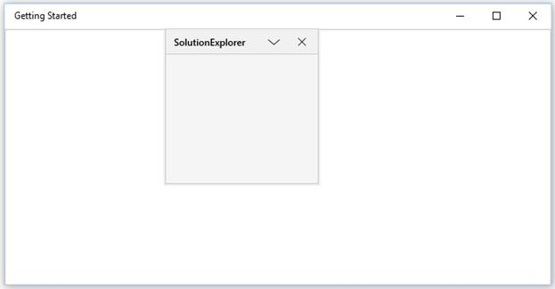

# Floating Window in UWP Docking (SfDockingManager)

Floating window is one of the state in the `SfDockingManager`. To make children of the `SfDockingManager` as Float, set the `SfDockingManager` child’s `DockState` values as Float.





<layout:SfDockingManager>

<ContentControl layout:SfDockingManager.Header="SolutionExplorer"
                layout:SfDockingManager.DockState="Float"/>

</layout:SfDockingManager>





## Enabling or Disabling the Float functionality

The `CanFloat` AttachedProperty helps to enable or disable the floating functionality by setting its value as true or false respectively. By default, `CanFloat` value is true. This functionality can be disabled by setting its value as false. While setting CanFloat property as false, it disables the dragging functionality of dock window. So, changing the window position by Mouse interaction will be restricted. Still DockWindow position can be changed through code behind.





<layout:SfDockingManager>

<ContentControl Name="SolutionExplorer" layout:SfDockingManager.Header="SolutionExplorer"
                layout:SfDockingManager.CanFloat="false"/>

<ContentControl Name="ToolBox" layout:SfDockingManager.Header="ToolBox"
                layout:SfDockingManager.CanFloat="false"/>
                
<ContentControl Name="ErrorList" layout:SfDockingManager.Header="ErrorList"
                layout:SfDockingManager.CanFloat="false"/>

</layout:SfDockingManager>





### Change Dock Window position through code behind

By using `SetSideInDockMode` property, we can set the side and `SetTargetNameInDockedMode` property for changing the target of desired dock window.




 
SfDockingManager.SetSideInDockedMode(ToolBox, Dock.Tabbed);
 
SfDockingManager.SetTargetNameInDockedMode(ToolBox, "SolutionExplorer");
 
SfDockingManager.SetSideInDockedMode(ErrorList, Dock.Top);





## Positioning on Desire Location

The `FloatWindow` can be placed at any desired location. To position the `FloatWindow` at the desired location with the required rectangle bounds, invoke `SetFloatingWindowRect` method of the `SfDockingManager`.





<layout:SfDockingManager x:Name="docking">

<ContentControl x:Name="child1" layout:SfDockingManager.Header="SolutionExplorer"
                                layout:SfDockingManager.DockState="Float"/>

</layout:SfDockingManager>





SfDockingManager.SetFloatingWindowRect(child1, new Rect(200, 0, 200, 200));





