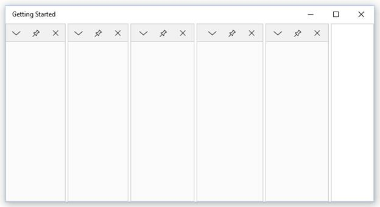
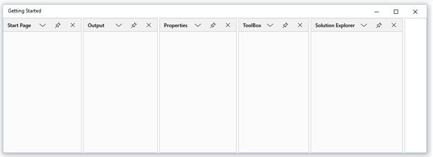
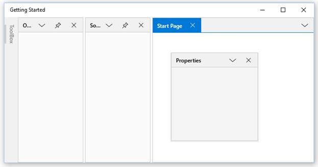
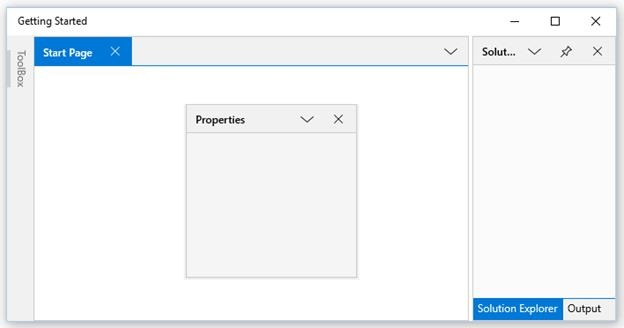

# Getting Started with UWP Docking (SfDockingManager)

This section explains how to implement a similar UI as Visual Studio using the `SfDockingManager`.

## Add SfDockingManager

There are several ways to add Syncfusion control in to the Visual Studio UWP project. The following will help to add a `SfDockingManager` control through XAML Code.

* Create a UWP project in Visual Studio and refer to the following assemblies.

1. Syncfusion.SfDockingManager.UWP

2. Syncfusion.SfShared.UWP

* Include an XML namespace for the above assemblies to the Main page.





<Page

x:Class="DockingManager_GettingStarted.MainPage"

xmlns="http://schemas.microsoft.com/winfx/2006/xaml/presentation"

xmlns:x="http://schemas.microsoft.com/winfx/2006/xaml"

xmlns:local="using:DockingManager_GettingStarted"

xmlns:layout="using:Syncfusion.UI.Xaml.Controls.Layout">





* Now add the `SfDockingManager` control with a required optimal name by using the included namespace.





<layout:SfDockingManager x:Name="docking"/>





## Add Children to SfDockingManager

`SfDockingManager` can accept any control as its children. Here five ContentControls have been added as the children of the `SfDockingManager`.





<layout:SfDockingManager x:Name="docking">

<ContentControl x:Name="SolutionExplorer"/>

<ContentControl x:Name="ToolBox"/>

<ContentControl x:Name="Properties"/>

<ContentControl x:Name="Output"/>

<ContentControl x:Name="StartPage"/>

</layout:SfDockingManager>





## Set Header for the Children

`SfDockingManger` provides an AttachedProperty `Header`, that helps to set the header for a child window. Set the Header Property value as “Solution Explorer” for the first child and repeat the same procedure for the remaining children with values "Toolbox", “Properties”, ”Output” and ”Start Page”.





<layout:SfDockingManager x:Name="docking">

<ContentControl x:Name="SolutionExplorer" layout:SfDockingManager.Header="Solution Explorer"/>

<ContentControl x:Name="ToolBox" layout:SfDockingManager.Header="ToolBox"/>

<ContentControl x:Name="Properties" layout:SfDockingManager.Header="Properties"/>

<ContentControl x:Name="Output" layout:SfDockingManager.Header="Output"/>

<ContentControl x:Name="StartPage" layout:SfDockingManager.Header="Start Page"/>

</layout:SfDockingManager>





## Set State for the Children

`SfDockingManager` provides an AttachedProperty `DockState`, that helps to set the State of child windows. Since Dock is the default value of DockState, initially all the children will stay as Docking Window.

To Auto hide the “ToolBox” window, set its `DockState` property as `AutoHidden`. Repeat the same procedure with the `DockState` value as Float and Document for “Properties” and “Start Page” windows respectively to make them as Floating Window and Document Window.





<layout:SfDockingManager x:Name="docking">

<ContentControl x:Name="SolutionExplorer" layout:SfDockingManager.Header="Solution Explorer"/>

<ContentControl x:Name="ToolBox" layout:SfDockingManager.Header="ToolBox" layout:SfDockingManager.DockState="AutoHidden"/>

<ContentControl x:Name="Properties" layout:SfDockingManager.Header="Properties" layout:SfDockingManager.DockState="Float"/>

<ContentControl x:Name="Output" layout:SfDockingManager.Header="Output"/>

<ContentControl x:Name="StartPage" layout:SfDockingManager.Header="Start Page" layout:SfDockingManager.DockState="Document"/>

</layout:SfDockingManager>





## Set Sides for the Children

`SfDockingManager` provides an attached property `SideInDockedMode`, that helps to dock a window at the required side. Since Left is the default value, initially all the windows are docked to left side.

Set the `SideInDockedMode` value as Right for “Solution Explorer” window to dock it on the right side.

The `SideInDockedMode` property’s Tabbed option is used to tab a window on another window. The tabbing windows need to be aware of the target window’s name. Set “Output” window’s `TargetNameInDockedMode` as “SolutionExplorer” to tab it on the “SolutionExplorer” window.





<layout:SfDockingManager x:Name="docking">

<ContentControl x:Name="SolutionExplorer" layout:SfDockingManager.Header="Solution Explorer"
                                          layout:SfDockingManager.SideInDockedMode="Right"/>

<ContentControl x:Name="ToolBox" layout:SfDockingManager.Header="ToolBox"
                                 layout:SfDockingManager.DockState="AutoHidden"/>

<ContentControl x:Name="Properties" layout:SfDockingManager.Header="Properties"
                                    layout:SfDockingManager.DockState="Float"/>

<ContentControl x:Name="Output" layout:SfDockingManager.Header="Output"
                layout:SfDockingManager.SideInDockedMode="Tabbed"
				layout:SfDockingManager.TargetNameInDockedMode="SolutionExplorer"/>

<ContentControl x:Name="StartPage" layout:SfDockingManager.Header="Start Page"
                                   layout:SfDockingManager.DockState="Document"/>

</layout:SfDockingManager>





