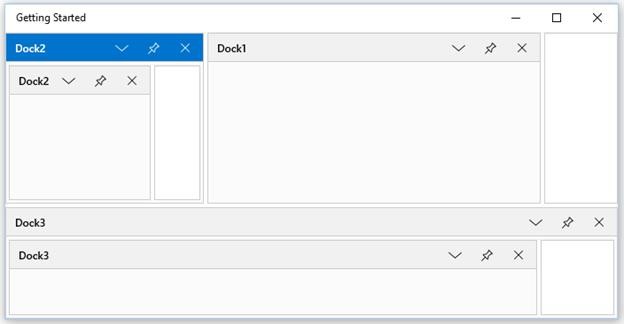

# Nested DockingManager in UWP Docking (SfDockingManager)

`SfDockingManager` provides the Nested DockingManager support, that allows to add `SfDockingManager` as a child window to another `SfDockingManager`.





<layout:SfDockingManager x:Name="DockingManager1" layout:SfDockingManager.Header="Dock1">

<ContentControl x:Name="Content1" layout:SfDockingManager.Header="Dock1"/>

<layout:SfDockingManager x:Name="DockingManager2" SideInDockedMode="Left"
                         layout:SfDockingManager.Header="Dock2"  >

<ContentControl layout:SfDockingManager.Header="Dock2"
                layout:SfDockingManager.DesiredWidthInDockedMode="600" />

</layout:SfDockingManager>

<layout:SfDockingManager x:Name="DockingManager3"
                         SideInDockedMode="Bottom"
						 layout:SfDockingManager.Header="Dock3">

<ContentControl layout:SfDockingManager.Header="Dock3"
                layout:SfDockingManager.DesiredWidthInDockedMode="600"/>

</layout:SfDockingManager>

</layout:SfDockingManager>





