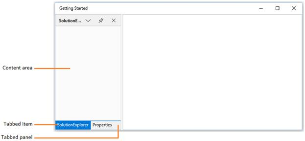
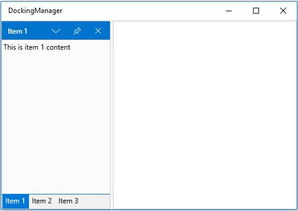
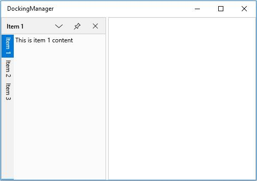

# Tabbed Window in UWP Docking (SfDockingManager)

Child window can be arranged as Tabbed window by setting `TargetName` and side value as Tabbed using the property `SideInDockedMode`.





<layout:SfDockingManager>

<ContentControl layout:SfDockingManager.Header="SolutionExplorer" Name="SolutionExplorer"
                layout:SfDockingManager.SideInDockedMode="Top"
				/>

<ContentControl layout:SfDockingManager.Header="Properties"
                layout:SfDockingManager.SideInDockedMode="Tabbed"
				layout:SfDockingManager.TargetNameInDockedMode="SolutionExplorer"/>

</layout:SfDockingManager>





## Tab Alignments

By default, tabs of the docked windows are placed at bottom. To place the tabs of the docked window at different sides, set the property `DockTabPlacement` with desired values such as `Top`, `Bottom`, `Left` and `Right`.

* Setting `DockTabPlacement` as `Bottom`





<syncfusion:SfDockingManager DockTabPlacement="Bottom" x:Name="dockingManager">

<ContentControl x:Name="dock1" syncfusion:SfDockingManager.Header="Item 1"
                               syncfusion:SfDockingManager.DockState="Dock">

<TextBlock Text="This is item 1 content"/>

</ContentControl>

<ContentControl syncfusion:SfDockingManager.Header="Item 2"
                syncfusion:SfDockingManager.DockState="Dock"
				syncfusion:SfDockingManager.SideInDockedMode="Tabbed"
				syncfusion:SfDockingManager.TargetNameInDockedMode="dock1">

<TextBlock Text="This is item 2 content"/>

</ContentControl>

<ContentControl syncfusion:SfDockingManager.Header="Item 3"
                syncfusion:SfDockingManager.DockState="Dock"
				syncfusion:SfDockingManager.SideInDockedMode="Tabbed"
				syncfusion:SfDockingManager.TargetNameInDockedMode="dock1">

<TextBlock Text="This is item 3 content"/>

</ContentControl>

</syncfusion:SfDockingManager>





dockingManager.DockTabPlacement = Syncfusion.UI.Xaml.Controls.Layout.TabPlacement.Bottom;





* Setting `DockTabPlacement` as `Top`





<syncfusion:SfDockingManager DockTabPlacement="Top" x:Name="dockingManager">

<ContentControl x:Name="dock1" syncfusion:SfDockingManager.Header="Item 1"
                               syncfusion:SfDockingManager.DockState="Dock">

<TextBlock Text="This is item 1 content"/>

</ContentControl>

<ContentControl syncfusion:SfDockingManager.Header="Item 2"
                syncfusion:SfDockingManager.DockState="Dock"
				syncfusion:SfDockingManager.SideInDockedMode="Tabbed"
				syncfusion:SfDockingManager.TargetNameInDockedMode="dock1">

<TextBlock Text="This is item 2 content"/>

</ContentControl>

<ContentControl syncfusion:SfDockingManager.Header="Item 3"
                syncfusion:SfDockingManager.DockState="Dock"
				syncfusion:SfDockingManager.SideInDockedMode="Tabbed"
				syncfusion:SfDockingManager.TargetNameInDockedMode="dock1">

<TextBlock Text="This is item 3 content"/>

</ContentControl>

</syncfusion:SfDockingManager>





dockingManager.DockTabPlacement = Syncfusion.UI.Xaml.Controls.Layout.TabPlacement.Top;





* Setting `DockTabPlacement` as `Left`





<syncfusion:SfDockingManager DockTabPlacement="Left" x:Name="dockingManager">

<ContentControl x:Name="dock1" syncfusion:SfDockingManager.Header="Item 1"
                               syncfusion:SfDockingManager.DockState="Dock">

<TextBlock Text="This is item 1 content"/>

</ContentControl>

<ContentControl syncfusion:SfDockingManager.Header="Item 2"
                syncfusion:SfDockingManager.DockState="Dock"
				syncfusion:SfDockingManager.SideInDockedMode="Tabbed"
				syncfusion:SfDockingManager.TargetNameInDockedMode="dock1">

<TextBlock Text="This is item 2 content"/>

</ContentControl>

<ContentControl syncfusion:SfDockingManager.Header="Item 3"
                syncfusion:SfDockingManager.DockState="Dock"
				syncfusion:SfDockingManager.SideInDockedMode="Tabbed"
				syncfusion:SfDockingManager.TargetNameInDockedMode="dock1">

<TextBlock Text="This is item 3 content"/>

</ContentControl>

</syncfusion:SfDockingManager>





dockingManager.DockTabPlacement= Syncfusion.UI.Xaml.Controls.Layout.TabPlacement.Left;





* Setting `DockTabPlacement` as `Right`





<syncfusion:SfDockingManager DockTabPlacement="Right" x:Name="dockingManager">

<ContentControl x:Name="dock1" syncfusion:SfDockingManager.Header="Item 1"
                               syncfusion:SfDockingManager.DockState="Dock">

<TextBlock Text="This is item 1 content"/>

</ContentControl>

<ContentControl syncfusion:SfDockingManager.Header="Item 2"
                syncfusion:SfDockingManager.DockState="Dock"
				syncfusion:SfDockingManager.SideInDockedMode="Tabbed"
				syncfusion:SfDockingManager.TargetNameInDockedMode="dock1">

<TextBlock Text="This is item 2 content"/>

</ContentControl>

<ContentControl syncfusion:SfDockingManager.Header="Item 3"
                syncfusion:SfDockingManager.DockState="Dock"
				syncfusion:SfDockingManager.SideInDockedMode="Tabbed"
				syncfusion:SfDockingManager.TargetNameInDockedMode="dock1">

<TextBlock Text="This is item 3 content"/>

</ContentControl>

</syncfusion:SfDockingManager>





dockingManager.DockTabPlacement = Syncfusion.UI.Xaml.Controls.Layout.TabPlacement.Right;





## TabbedWindow Customization

`DockWindow` have an internal `DockTabControl` for Tabbed Windows in `SfDockingManager` and its `DockTabItem` Background and Foreground can be customized. The following table lists the details of the customization properties in DockTabControl.

### Customization Properties

<table>
<tr>
<th>Property</th>
<th>Data Type</th>
<th>Type</th>
<th>Description</th></tr>
<tr>
<td>
DockTabItemSelectedBackground    </td><td>
Brush  </td><td>
Dependency property  </td><td>
Used to set the background of a Selected Tab Item in the tabbed Dock Window.  </td></tr>
<tr>
<td>
DockTabItemSelectedForeground    </td><td>
Brush  </td><td>
Dependency property  </td><td>
Used to set the foreground of a Selected Tab Item in the tabbed Dock Window.  </td></tr>
<tr>
<td>
DockTabItemBackground  </td><td>
Brush  </td><td>
Dependency property  </td><td>
Used to set the background of a Tab Items in the tabbed Dock Window.  </td></tr>
<tr>
<td>
DockTabItemForeground    </td><td>
Brush  </td><td>
Dependency property  </td><td>
Used to set the foreground of a Tab Items in the tabbed Dock Window.  </td></tr>
<tr>
<td>
DockTabItemMouseOverBackground    </td><td>
Brush  </td><td>
Dependency property  </td><td>
Used to set the background of a mouse hovered tab Items in the tabbed Dock Window.  </td></tr>
<tr>
<td>
DockTabItemMouseOverForeground    </td><td>
Brush  </td><td>
Dependency property  </td><td>
Used to set the foreground of a mouse hovered tab Items in the tabbed Dock Window.  </td></tr>
<tr>
<td>
DockTabPanelBackground  </td><td>
Brush  </td><td>
Dependency property  </td><td>
Used to set the background for Items Panel of the tabbed Dock Window  </td></tr>
</table>


<syncfusion:SfDockingManager DockTabPanelBackground="GreenYellow"   DockTabItemBackground="Yellow"              DockTabItemForeground="Red" DockTabItemSelectedBackground="Orange" DockTabItemSelectedForeground="White" DockTabItemMouseOverBackground="Green" DockTabItemMouseOverForeground="Red">
    <ContentControl syncfusion:SfDockingManager.Header="Dock1" Name="Dock1" syncfusion:SfDockingManager.DockState="Dock"/>
    <ContentControl syncfusion:SfDockingManager.Header="Dock2" syncfusion:SfDockingManager.SideInDockedMode="Tabbed" syncfusion:SfDockingManager.TargetNameInDockedMode="Dock1" syncfusion:SfDockingManager.DockState="Dock"/>
</syncfusion:SfDockingManager>


## Set icon to TabbedWindow 

[SetIcon](https://help.syncfusion.com/cr/uwp/Syncfusion.UI.Xaml.Controls.Layout.SfDockingManager.html#Syncfusion_UI_Xaml_Controls_Layout_SfDockingManager_SetIcon_Windows_UI_Xaml_UIElement_System_Object_) method can be used to set the icon/image for the TabbedWindow. 





<!--Setting icon in Tabbed Window -->

<ContentControl x:Name="SolutionExplorer" Layout:SfDockingManager.Header="Solution Explorer"  Layout:SfDockingManager.DesiredWidthInDockedMode="300"  Layout:SfDockingManager.SideInDockedMode="Right" Layout:SfDockingManager.DockState="Dock"  >

	<Layout:SfDockingManager.Icon>

		<Image Source="/Assets/image1.png" />

	</Layout:SfDockingManager.Icon>

</ContentControl>

<ContentControl Name="Properties" Layout:SfDockingManager.Header="Properties" Layout:SfDockingManager.DesiredWidthInDockedMode="300" Layout:SfDockingManager.SideInDockedMode="Tabbed" Layout:SfDockingManager.TargetNameInDockedMode="Solution Explorer" >

	<Layout:SfDockingManager.Icon>

		<Image Source="/Assets/image2.png" />

	</Layout:SfDockingManager.Icon>

</ContentControl>





//Initialize image 
		
Image image = new Image();

Image image1 = new Image();

//Get Image 

image.Source = new BitmapImage(new Uri("ms-appx:///Assets/image1.png", UriKind.Absolute));

image1.Source = new BitmapImage(new Uri("ms-appx:///Assets/image2.png", UriKind.Absolute));

//Set Image to Tabbed Control
			
SfDockingManager.SetIcon(Properties,image1);

SfDockingManager.SetIcon(SolutionExplorer, image);





