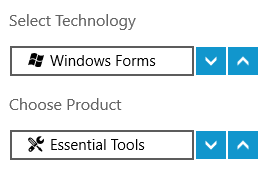

# UWP Domain UpDown (SfDomainUpDown) Overview

SfDomainUpDown is an up-down control which spins the collection of objects up or down.

## Key Features

Items Source – Any business object collection can be bound to the control.

Spin Buttons Alignment – The position of up and down repeat buttons can be customized.

Up Down Button Style – The control allows you to customize the style of the up and down repeat buttons.

