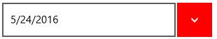
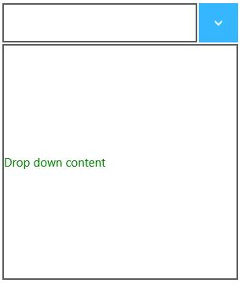

# Appearance and Styling in UWP DropDown Button (SfDropDownButton)

## Accent brush

AccentBrush property is used to decorate the hot spots of a control with a solid color.


<input:SfDropDownButton Content="5/24/2016" AccentBrush="Red" x:Name="dropdownbutton

"/>



## ContentTemplate

ContentTemplate property is used to decorate the content of the SfDropDownButton.


<input:SfDropDownButton Content="5/24/2016" x:Name="dropdownbutton">

<input:SfDropDownButton.ContentTemplate>

<DataTemplate>

<TextBlock Foreground="Green" Text="{Binding}"/>

</DataTemplate>

</input:SfDropDownButton.ContentTemplate>

</input:SfDropDownButton>



## DropdownContentTemplate

DropDownContentTemplate is used to decorate the drop down content of SfDropDownButton.


<input:SfDropDownButton DropDownContent="Drop down content">

<input:SfDropDownButton.DropDownContentTemplate>

<DataTemplate>

<TextBlock Foreground="Green" HorizontalAlignment="Center" Text="{Binding}"/>

</DataTemplate>

</input:SfDropDownButton.DropDownContentTemplate>

</input:SfDropDownButton>



