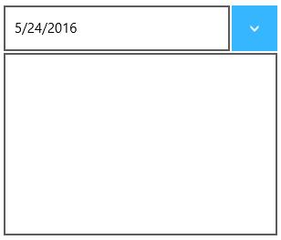
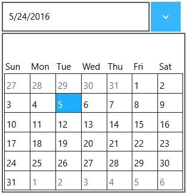

# Configuring Content in UWP DropDown Button (SfDropDownButton)

Content and DropDownContent can be added to the SfDropDownButton control as follows:

## Content

Set the Content property to display a content with both dropdown open and close.





<input:SfDropDownButton x:Name="dropDownButton" Content="5/24/2016"/>









dropDownButton.Content =" 5 / 24 / 2016";





dropDownButton.Content =" 5 / 24 / 2016"





## DropDownContent

Set the DropDownContent property to display a content when the dropdown is open.




<input:SfDropDownButton Content="5/24/2016">

<input:SfDropDownButton.DropDownContent>

<input:SfCalendar x:Name="calendar"/>

</input:SfDropDownButton.DropDownContent>

</input:SfDropDownButton>









SfCalendar calendar = new SfCalendar();

dropDownButton.DropDownContent = calendar;





Dim calendar As New SfCalendar()

dropDownButton.DropDownContent = calendar





