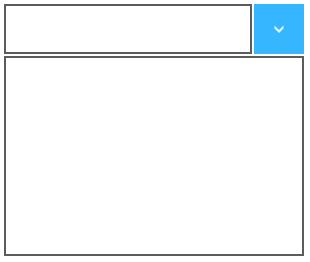

# Getting Started with UWP DropDown Button (SfDropDownButton)

This section explains how to create the UWP DropDown Button control.

## Creating UWP DropDown Button control

Create a Universal Windows Platform project in Visual Studio and refer to the following assemblies.

1. Syncfusion. SfInput.UWP
2. Syncfusion.SfShared.UWP

###  Adding UWP DropDown Button control through XAML Code

1.Include the namespace for Syncfusion. SfInput.UWP assembly in MainPage.xaml



<Page xmlns="http://schemas.microsoft.com/winfx/2006/xaml/presentation"

xmlns:x="http://schemas.microsoft.com/winfx/2006/xaml"

xmlns:input="using:Syncfusion.UI.Xaml.Controls.Input">



2.Now add the UWP DropDown Button control with a required optimal name using the included namespace



<input:SfDropDownButton x:Name="dropDownButton"/>



### Adding UWP DropDown Button control through C# Code

1.Include the namespace for Syncfusion. SfInput.UWP assembly in MainPage.xaml.cs





using Syncfusion.UI.Xaml.Controls.Input;





Imports Syncfusion.UI.Xaml.Controls.Input





2.Now add the UWP DropDown Button control with an optimal name 





SfDropDownButton dropDownButton = new SfDropDownButton();





Dim dropDownButton As New SfDropDownButton()





This will create an empty UWP DropDown Button control.

