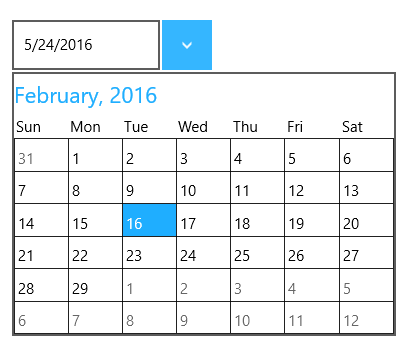

# About Syncfusion® UWP DropDown Button (SfDropDownButton) Control

UWP DropDown Button is used as a content holder that shows content in a drop down popup on demand. 

## Key Features

* Support for complete customization 
* Allows to show a content and drop down content

