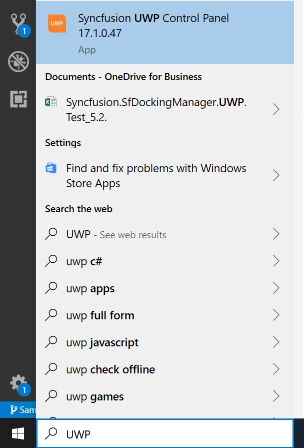
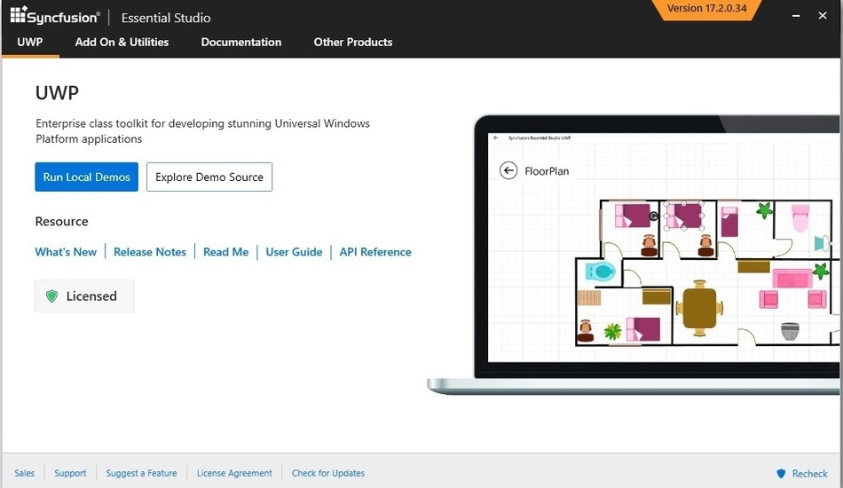

# Featured Samples

## Guide to run the samples

To run the samples, search it from Start by name of “UWP Control”

To execute SampleBrowser, select the corresponding product and click “RUN LOCAL SAMPLES” button.

## SampleBrowser

Sample Browser is available under following folder location:

“[Installed Drive]:\Users\Public\Documents\Syncfusion\Universal Windows\{{ site.releaseversion }}\SampleBrowser”

N> In above section, Latest Essential Studio&reg; version details has been provided. User can refer installed Essential Studio&reg; version instead of mentioned version.

