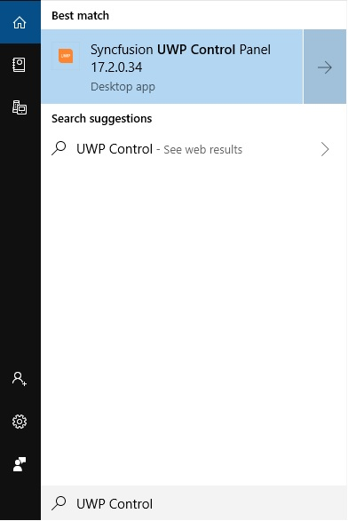

# Featured Samples

## Guide to run the samples

To run the samples, search it from Start by name of “Dashboard”

To execute SampleBrowser, select the corresponding product and click “RUN LOCAL SAMPLES” button.

## SampleBrowser

Sample Browser is available under following folder location:

“[Installed Drive]:C:\Users\Public\Documents\Syncfusion\Universal Windows\17.1.0.38\SampleBrowser”

N> In above section, Latest Essential Studio version details has been provided. User can refer installed Essential Studio version instead of mentioned version.

