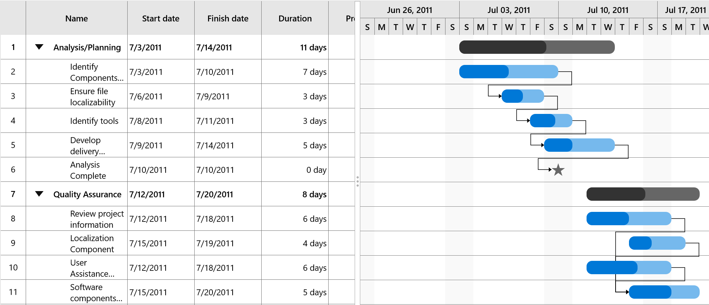

# Appearance in UWP Gantt (SfGantt)

The Gantt control provides options to customize the look and feel of the task visual in the Gantt chart. 

**Visual customization**
The colors of parent taskbar, taskbar, milestone, and progress bar can be customized using the following properties:

* [`ParentTaskBarBrush`](https://help.syncfusion.com/cr/uwp/Syncfusion.UI.Xaml.Gantt.SfGantt.html#Syncfusion_UI_Xaml_Gantt_SfGantt_ParentTaskBarBrushProperty) – Specifies the color for the parent taskbar.
* [`ParentProgressIndicatorBrush`](https://help.syncfusion.com/cr/uwp/Syncfusion.UI.Xaml.Gantt.SfGantt.html#Syncfusion_UI_Xaml_Gantt_SfGantt_ParentProgressIndicatorBrushProperty) – Specifies the color for the parent progress bar.
* [`TaskBarBrush`](https://help.syncfusion.com/cr/uwp/Syncfusion.UI.Xaml.Gantt.SfGantt.html#Syncfusion_UI_Xaml_Gantt_SfGantt_TaskBarBrushProperty) – Specifies the color for the taskbar.
* [`TaskProgressIndicatorBrush`](https://help.syncfusion.com/cr/uwp/Syncfusion.UI.Xaml.Gantt.SfGantt.html#Syncfusion_UI_Xaml_Gantt_SfGantt_TaskProgressIndicatorBrushProperty) – Specifies the color for task progress bar.
* [`MilestoneBrush`](https://help.syncfusion.com/cr/uwp/Syncfusion.UI.Xaml.Gantt.SfGantt.html#Syncfusion_UI_Xaml_Gantt_SfGantt_MilestoneBrushProperty) – Specifies the color for the milestone.

The following code sample demonstrates how to customize the visual of a task.




        <gantt:SfGantt x:Name="GanttControl" ItemsSource="{Binding TaskCollection}"
                       ParentTaskBarBrush="#33ffbe06" 
                       ParentProgressIndicatorBrush="#FFffbe06"
                       TaskBarBrush="#3390a84e" 
                       TaskProgressIndicatorBrush="#FF90a84e"
                       MilestoneBrush="#999999">
        </gantt:SfGantt>





**Template customization**
You can customize the templates of the parent taskbar, taskbar, and milestone using the [`ParentTaskBarTemplate`](https://help.syncfusion.com/cr/uwp/Syncfusion.UI.Xaml.Gantt.SfGantt.html#Syncfusion_UI_Xaml_Gantt_SfGantt_ParentTaskBarTemplate), [`TaskBarTemplate`](https://help.syncfusion.com/cr/uwp/Syncfusion.UI.Xaml.Gantt.SfGantt.html#Syncfusion_UI_Xaml_Gantt_SfGantt_TaskBarTemplateProperty) and [`MilestoneTemplate`](https://help.syncfusion.com/cr/uwp/Syncfusion.UI.Xaml.Gantt.SfGantt.html#Syncfusion_UI_Xaml_Gantt_SfGantt_MilestoneTemplate) properties, respectively.

The following code sample demonstrates how to customize a template.




    <Grid>
        <Grid.Resources>
            <!--TaskBar Template-->
            <ControlTemplate x:Key="TaskBarTemplate">
                <Grid x:Name="PART_TaskGrid">
                    <Grid.ColumnDefinitions>
                        <ColumnDefinition Width="Auto"/>
                        <ColumnDefinition Width="Auto"/>
                        <ColumnDefinition Width="*"/>
                        <ColumnDefinition Width="Auto"/>
                        <ColumnDefinition Width="Auto"/>
                    </Grid.ColumnDefinitions>
                    <Rectangle x:Name="PART_LeftEllipse" HorizontalAlignment="Left" Visibility="Collapsed" Fill="Brown" Height="10" Width="10" Grid.Column="0" VerticalAlignment="Center"/>
                    <Thumb x:Name="PART_LeftTaskThumb" Visibility="Collapsed" Height="20" Width="20" Grid.Column="1" Background="Red" VerticalAlignment="Center">
                        <Thumb.Template>
                            <ControlTemplate>
                                <Path Data="M25.320001,0L25.320001,32 0,16z" Stretch="Uniform" Fill="#FF222222" Width="20" Height="20" Margin="0,0,0,0" RenderTransformOrigin="0.5,0.5">
                                    <Path.RenderTransform>
                                        <TransformGroup>
                                            <TransformGroup.Children>
                                                <RotateTransform Angle="0" />
                                                <ScaleTransform ScaleX="1" ScaleY="1" />
                                            </TransformGroup.Children>
                                        </TransformGroup>
                                    </Path.RenderTransform>
                                </Path>
                            </ControlTemplate>
                        </Thumb.Template>
                    </Thumb>
                    <Grid Grid.Column="2">
                        <!--Bound task height, task width and task brush-->
                        <Rectangle x:Name="PART_TaskBar" HorizontalAlignment="Left"
                                           Height="{Binding ActualTaskHeight}" Width="{Binding TaskWidth}"
                                           Fill="{Binding TaskBrush}" RadiusX="10" RadiusY="10" ></Rectangle>
                        <!--Bound task height, progress width and progress brush-->
                        <Rectangle x:Name="PART_ProgressBar" Width="{Binding ProgressWidth}"
                                           HorizontalAlignment="Left" RadiusX="10" RadiusY="10"
                                           Height="{Binding ActualTaskHeight}"
                                           Fill="{Binding ProgressBrush}"/>
                        <Canvas>
                            <Thumb x:Name="PART_ProgressThumb"
                               Canvas.Left="{Binding ProgressWidth}" Visibility="Collapsed" Canvas.Top="{Binding ActualTaskHeight}">
                                <Thumb.Template>
                                    <ControlTemplate>
                                        <Path Data="M16,0L32,19.745 0,19.745z" Stretch="Uniform" Fill="#FF222222" Width="10" Height="10" Margin="-5,0,0,0" RenderTransformOrigin="0.5,0.5">
                                            <Path.RenderTransform>
                                                <TransformGroup>
                                                    <TransformGroup.Children>
                                                        <RotateTransform Angle="0" />
                                                        <ScaleTransform ScaleX="1" ScaleY="1" />
                                                    </TransformGroup.Children>
                                                </TransformGroup>
                                            </Path.RenderTransform>
                                        </Path>
                                    </ControlTemplate>
                                </Thumb.Template>
                            </Thumb>
                        </Canvas>
                    </Grid>

                    <Thumb x:Name="PART_RightTaskThumb" Height="20" Width="20" Grid.Column="3" Visibility="Collapsed" Background="Red" VerticalAlignment="Center">
                        <Thumb.Template>
                            <ControlTemplate>
                                <Path Data="M0,0L25.194,16 0,32z" Stretch="Uniform" Fill="#FF222222" Width="20" Height="20" Margin="0,0,0,0" RenderTransformOrigin="0.5,0.5">
                                    <Path.RenderTransform>
                                        <TransformGroup>
                                            <TransformGroup.Children>
                                                <RotateTransform Angle="0" />
                                                <ScaleTransform ScaleX="1" ScaleY="1" />
                                            </TransformGroup.Children>
                                        </TransformGroup>
                                    </Path.RenderTransform>
                                </Path>
                            </ControlTemplate>
                        </Thumb.Template>
                    </Thumb>

                    <Rectangle x:Name="PART_RightEllipse" Fill="Brown" Height="10" HorizontalAlignment="Left" Visibility="Collapsed" Width="10" Grid.Column="4" VerticalAlignment="Center"/>
                </Grid>
            </ControlTemplate>
            
            <!--Milestone Template-->
            <ControlTemplate x:Key="MilestoneTemplate">
                <Grid>
                    <Grid.ColumnDefinitions>
                        <ColumnDefinition Width="Auto"/>
                        <ColumnDefinition Width="*"/>
                        <ColumnDefinition Width="Auto"/>
                    </Grid.ColumnDefinitions>
                    <Rectangle x:Name="PART_LeftEllipse" Visibility="Collapsed" Fill="Brown" Height="10" Width="10"/>
                    <!--Bound task height, task width and task brush-->
                    <Path x:Name="PART_TaskBar" HorizontalAlignment="Left" Grid.Column="1"
                                      Data="M1540.22,2082.07L1546.95,2102.78 1568.73,2102.78 1551.11,2115.58 1557.84,2136.29 1540.22,2123.49 1522.6,2136.29 1529.33,2115.58 1511.71,2102.78 1533.49,2102.78 1540.22,2082.07z"
                                      Stretch="Uniform" Width="{Binding TaskWidth}" Height="{Binding ActualTaskHeight}"
                                      Fill="{Binding TaskBrush}">
                    </Path>
                    <Rectangle x:Name="PART_RightEllipse" Visibility="Collapsed" Fill="Brown" Height="10" Width="10" Grid.Column="2"/>
                </Grid>
            </ControlTemplate>

            <!--Parent task template-->
            <ControlTemplate x:Key="ParentTaskBarTemplate">
                <Grid>
                    <!--Bound task height, task width and task brush-->
                    <Rectangle x:Name="PART_TaskBar" HorizontalAlignment="Left"
                                   Height="{Binding ActualTaskHeight}" Width="{Binding TaskWidth}"
                                   Fill="{Binding TaskBrush}" RadiusX="10" RadiusY="10" ></Rectangle>
                    <!--Bound task height, progress width and progress brush-->
                    <Rectangle x:Name="PART_ProgressBar" Width="{Binding ProgressWidth}"
                                   HorizontalAlignment="Left" RadiusX="10" RadiusY="10"
                                   Height="{Binding ActualTaskHeight}"
                                   Fill="{Binding ProgressBrush}"/>
                </Grid>
            </ControlTemplate>
        </Grid.Resources>

        <gantt:SfGantt x:Name="GanttControl" ItemsSource="{Binding TaskCollection}"
                       DisplayTaskNames="False" AllowEditing="True"
                       TaskBarTemplate="{StaticResource TaskBarTemplate}"
                       ParentTaskBarTemplate="{StaticResource ParentTaskBarTemplate}"
                       MilestoneTemplate="{StaticResource MilestoneTemplate}">
        </gantt:SfGantt>
    </Grid>





N> The thumbs and ellipses will be visible only when when [`AllowEditing`](https://help.syncfusion.com/cr/uwp/Syncfusion.UI.Xaml.Gantt.SfGantt.html#Syncfusion_UI_Xaml_Gantt_SfGantt_AllowEditing) is true.

