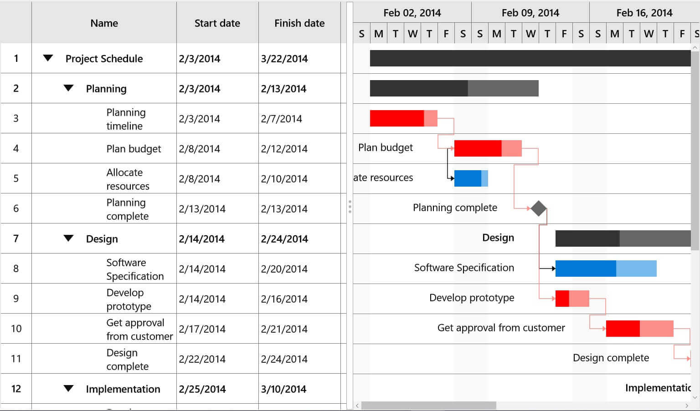
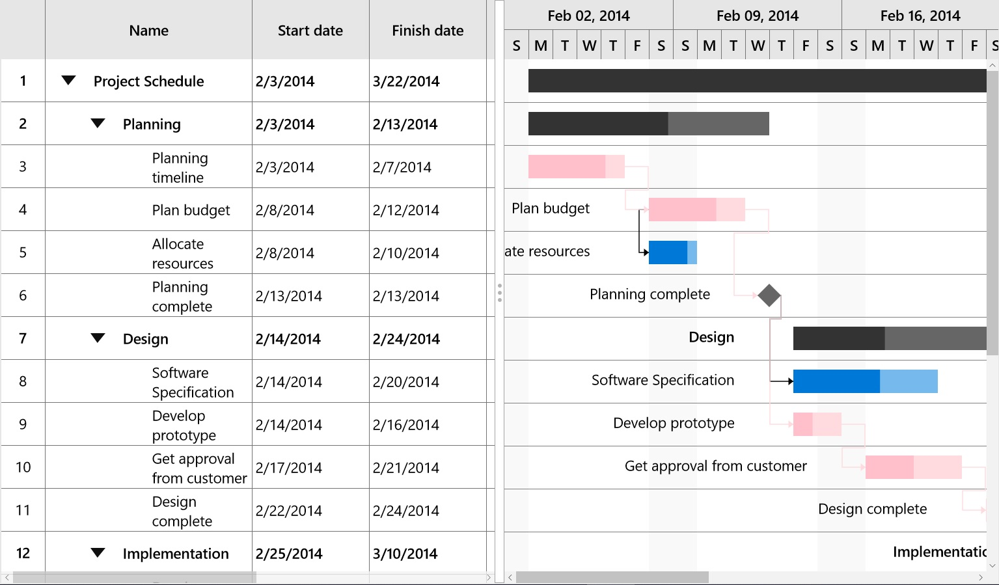

# Critical Path in UWP Gantt (SfGantt)

Critical path is a chain of linked critical tasks that defines the finish date of project. It can be highlighted by enabling the [`HighlightCriticalTasks`](https://help.syncfusion.com/cr/uwp/Syncfusion.UI.Xaml.Gantt.SfGantt.html#Syncfusion_UI_Xaml_Gantt_SfGantt_HighlightCriticalTasksProperty) property in SfGantt as demonstrated in the following code sample.





<gantt:SfGantt HighlightCriticalTasks="True"/>





SfGantt gantt = new SfGantt
{
    HighlightCriticalTasks = true
};





## Customization

You can customize the color of critical path using the following properties:

* [`CriticalTaskBarBrush`](https://help.syncfusion.com/cr/uwp/Syncfusion.UI.Xaml.Gantt.SfGantt.html#Syncfusion_UI_Xaml_Gantt_SfGantt_CriticalTaskBarBrushProperty): Specifies the color to highlight the critical task bar color.
* [`CriticalProgressBrush`](https://help.syncfusion.com/cr/uwp/Syncfusion.UI.Xaml.Gantt.SfGantt.html#Syncfusion_UI_Xaml_Gantt_SfGantt_CriticalProgressBarBrushProperty): Specifies the color to highlight the critical task bar progress color.

N> The same [`CriticalTaskBarBrush`](https://help.syncfusion.com/cr/uwp/Syncfusion.UI.Xaml.Gantt.SfGantt.html#Syncfusion_UI_Xaml_Gantt_SfGantt_CriticalTaskBarBrushProperty)  is applied to connector lines that connect two critical tasks.





<gantt:SfGantt HighlightCriticalTasks="True" CriticalTaskBarBrush="#ffdbe0" CriticalProgressBarBrush="Pink" />





SfGantt gantt = new SfGantt
    {
        HighlightCriticalTasks = true,
        CriticalTaskBarBrush = new SolidColorBrush(Color.FromArgb(255, 255, 219, 224)),
        CriticalProgressBarBrush = new SolidColorBrush(Colors.Pink)
    };





N> By default, the HighlightCriticalTasks property is disabled.
