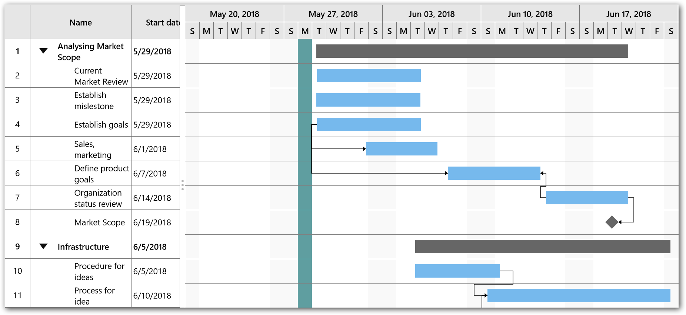

## Holidays

The holidays support is used to highlight the non-working days in the Gantt chart.

The holidays can be specified in a task using the [`Holidays`](https://help.syncfusion.com/cr/uwp/Syncfusion.UI.Xaml.Gantt.SfGantt.html#Syncfusion_UI_Xaml_Gantt_SfGantt_Holidays) property in the SfGantt, which holds a collection of [`GanttHoliday`](https://help.syncfusion.com/cr/uwp/Syncfusion.UI.Xaml.Gantt.SfGantt.html#Syncfusion_UI_Xaml_Gantt_SfGantt_Holidays).

The following properties in the [`GanttHoliday`](https://help.syncfusion.com/cr/uwp/Syncfusion.UI.Xaml.Gantt.SfGantt.html#Syncfusion_UI_Xaml_Gantt_SfGantt_Holidays) are used to define the holidays:

* [`Day`](https://help.syncfusion.com/cr/uwp/Syncfusion.UI.Xaml.Gantt.GanttHoliday.html#Syncfusion_UI_Xaml_Gantt_GanttHoliday_Day): Specifies the holiday date.
* [`Background`](https://help.syncfusion.com/cr/uwp/Syncfusion.UI.Xaml.Gantt.GanttHoliday.html#Syncfusion_UI_Xaml_Gantt_GanttHoliday_Background): Specifies the color to highlight the holiday.

The following code sample demonstrates how to define the holidays.





<gantt:SfGantt ItemsSource="{Binding TaskCollection}" ShowNonWorkingDays="True" >
    <gantt:SfGantt.Holidays>
        <gantt:GanttHolidayCollection>
            <gantt:GanttHoliday Day="5/28/2018"
                                Background="CadetBlue" />
        </gantt:GanttHolidayCollection>
    </gantt:SfGantt.Holidays>
</gantt:SfGantt>





SfGantt sfGantt = new SfGantt();

sfGantt.ItemsSource = (this.DataContext as ProjectTrackerViewModel).TaskCollection;

sfGantt.ShowNonWorkingDays = True;

sfGantt.Holidays = new GanttHolidayCollection()
{
    new GanttHoliday()
    {
        Day = new DateTime(2018, 5, 28),
        Background = new SolidColorBrush(Colors.CadetBlue)
    }
};





N> To highlight the holidays in the Gantt chart, the ['ShowNonWorkingDays'](https://help.syncfusion.com/cr/uwp/Syncfusion.UI.Xaml.Gantt.SfGantt.html#Syncfusion_UI_Xaml_Gantt_SfGantt_ShowNonWorkingDays) property must be enabled.
