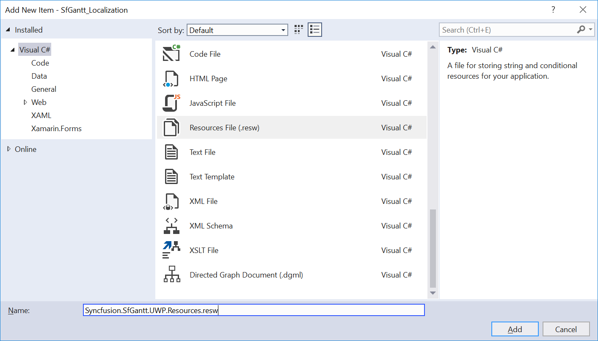
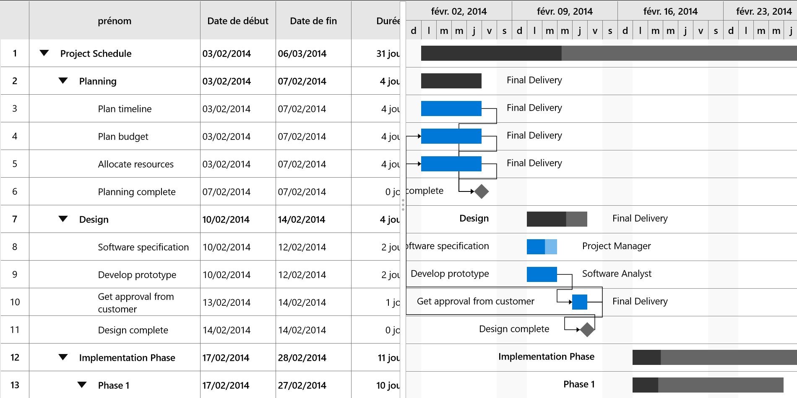

# Localization in UWP Gantt (SfGantt)

Localization is the process of translating the application resources into different languages for specific cultures. You can localize the SfGantt by adding a resource file. The application culture can be changed by setting the `PrimaryLanguageOverride` in the MainPage() constructor.

The following code sample demonstrates how to configure the application culture to French language.



public MainPage()
{
    this.InitializeComponent();
    ApplicationLanguages.PrimaryLanguageOverride = "fr";
}   



To localize the SfGantt based on `PrimaryLanguageOverride` using resource files, use the following steps:

1. Right-click the project, click **Add**, click **NewFolder**, and then name the folder as **Resources**.
2. Right-click the **Resources** folder, click **Add**, click **NewFolder**, and then name the folder as **[culture name]**. The culture name indicates name of the language and country.

For example, you will have to give name as **fr-FR** for French culture.

3. Right-click the **[culture name]** folder, click **Add**, and then click **NewItem**.

4. In the Add New Item dialog, click the Resource File, and then name the file name as **Syncfusion.SfGantt.UWP.Resources.resw**.

5. Add the Name/Value pair in Resource Designer of **Syncfusion.SfGantt.UWP.Resources.resw** file, and change its corresponding value to the corresponding culture.

You can get the SfGantt’s key from the default resource [Syncfusion.SfGantt.UWP.Resources.resw](http://www.syncfusion.com/downloads/support/directtrac/general/ze/Syncfusion.SfGantt.UWP.Resources845531575.zip).

You can download [the sample](http://www.syncfusion.com/downloads/support/directtrac/general/ze/SfGantt_Localization1607055000.zip) for localizing the Gantt.
