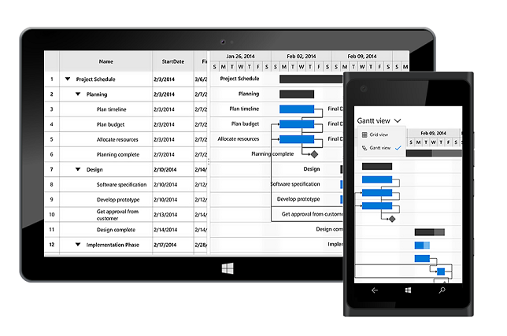

# UWP Gantt (SfGantt) Overview

The Gantt control has been designed to visualize and edit the project schedule and track the project progress. It helps to organize and schedule the projects. The project schedule can be updated through interactions such as editing, dragging, and resizing.

## Key features

* Task relationship
* Interactive editing
* Sorting
* Customizing timescale format
