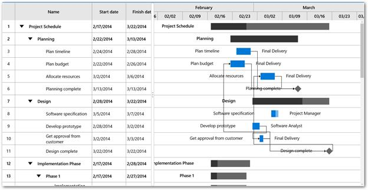
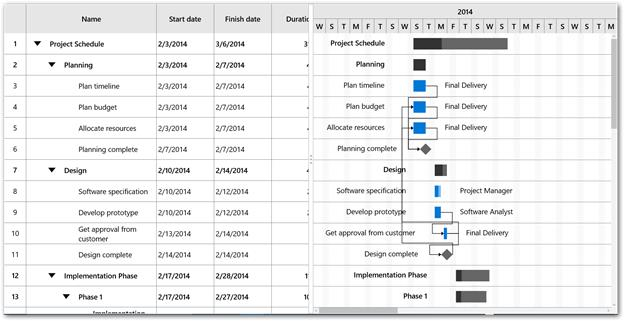
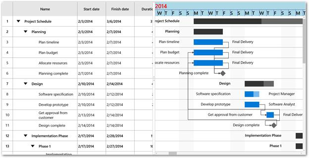
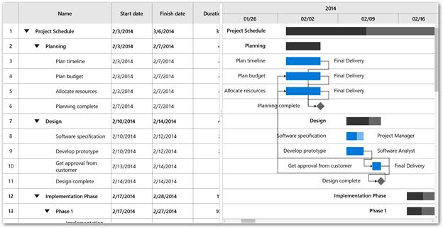
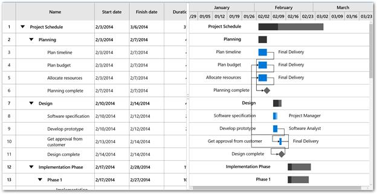

# Timescale of SfGantt

This section provides an overview on the features of timescale. The following properties are used for configuring the timescale in the [`TimescaleSettings`](https://help.syncfusion.com/cr/uwp/Syncfusion.UI.Xaml.Gantt.TimescaleSettings.html) class:

* [`TopTier`](https://help.syncfusion.com/cr/uwp/Syncfusion.UI.Xaml.Gantt.TimescaleSettings.html#Syncfusion_UI_Xaml_Gantt_TimescaleSettings_TopTier): Represents the top tier of the timescale.
* [`BottomTier`](https://help.syncfusion.com/cr/uwp/Syncfusion.UI.Xaml.Gantt.TimescaleSettings.html#Syncfusion_UI_Xaml_Gantt_TimescaleSettings_BottomTier): Represents the bottom tier of the timescale.



<Gantt:SfGantt.TimescaleSettings>
      <Gantt:TimescaleSettings>
         <Gantt:TimescaleSettings.TopTier>
             <Gantt:TimescaleTier></Gantt:TimescaleTier>
          </Gantt:TimescaleSettings.TopTier>
         <Gantt:TimescaleSettings.BottomTier>
              <Gantt:TimescaleTier IntervalType="Days"></Gantt:TimescaleTier>
          </Gantt:TimescaleSettings.BottomTier>
      </Gantt:TimescaleSettings>
 </Gantt:SfGantt.TimescaleSettings>



this.Gantt.TimescaleSettings.TopTier = new TimescaleTier();

this.Gantt.TimescaleSettings.BottomTier = new TimescaleTier();





By default, the interval type is set to Auto. You can change the interval type and interval using the following properties in `TimescaleTier` class:

* [`IntervalType`](https://help.syncfusion.com/cr/uwp/Syncfusion.UI.Xaml.Gantt.TimescaleTier.html#Syncfusion_UI_Xaml_Gantt_TimescaleTier_IntervalType): Defines the type of the interval as minutes, hours, days, weeks, quarter, and year.
* [`Interval`](https://help.syncfusion.com/cr/uwp/Syncfusion.UI.Xaml.Gantt.TimescaleTier.html#Syncfusion_UI_Xaml_Gantt_TimescaleTier_Interval): Sets a value that determines the interval between the timescale tier cells.

The following code sample demonstrates displaying the timescale as years and days.



<Gantt:SfGantt.TimescaleSettings>
    <Gantt:TimescaleSettings>
       <Gantt:TimescaleSettings.TopTier>
          <Gantt:TimescaleTier Interval="1" IntervalType="Years"></Gantt:TimescaleTier>
       </Gantt:TimescaleSettings.TopTier>
       <Gantt:TimescaleSettings.BottomTier>
          <Gantt:TimescaleTier Interval="4" IntervalType="Days"></Gantt:TimescaleTier>
       </Gantt:TimescaleSettings.BottomTier>
    </Gantt:TimescaleSettings>
  </Gantt:SfGantt.TimescaleSettings>




this.Gantt.TimescaleSettings.TopTier = new TimescaleTier()
            {
                Interval = 1,
                IntervalType = IntervalType.Years
            };

this.Gantt.TimescaleSettings.BottomTier = new TimescaleTier()
            {
                Interval = 4,
                IntervalType = IntervalType.Days
            };




N> The top tier’s interval and interval type must be greater than the bottom tier’s interval and interval type.

**Display formats**

The display formats can be defined for each interval type. You can set the default date-time format strings as display formats. The display formats can be defined using the following properties:

* [`YearsLabelFormat`](https://help.syncfusion.com/cr/uwp/Syncfusion.UI.Xaml.Gantt.TimescaleTier.html#Syncfusion_UI_Xaml_Gantt_TimescaleTier_YearsLabelFormat): Sets the the label format for year interval type.
* [`QuarterLabelFormat`](https://help.syncfusion.com/cr/uwp/Syncfusion.UI.Xaml.Gantt.TimescaleTier.html#Syncfusion_UI_Xaml_Gantt_TimescaleTier_QuarterLabelFormat): Sets the the label format for quarter interval type.
* [`WeeksLabelFormat`](https://help.syncfusion.com/cr/uwp/Syncfusion.UI.Xaml.Gantt.TimescaleTier.html#Syncfusion_UI_Xaml_Gantt_TimescaleTier_WeeksLabelFormat): Sets the the label format for week interval type.
* [`DaysLabelFormat`](https://help.syncfusion.com/cr/uwp/Syncfusion.UI.Xaml.Gantt.TimescaleTier.html#Syncfusion_UI_Xaml_Gantt_TimescaleTier_DaysLabelFormat): Sets the label format for days interval type.
* [`HoursLabelFormat`](https://help.syncfusion.com/cr/uwp/Syncfusion.UI.Xaml.Gantt.TimescaleTier.html#Syncfusion_UI_Xaml_Gantt_TimescaleTier_HoursLabelFormat): Sets the the label format for hours interval type.

## Visual customization

The default view of the timescale can be customized using the following properties:

* [`Background`](https://help.syncfusion.com/cr/uwp/Syncfusion.UI.Xaml.Gantt.TimescaleSettings.html#Syncfusion_UI_Xaml_Gantt_TimescaleSettings_Background): Sets the background color for timescale.
* [`BorderBrush`](https://help.syncfusion.com/cr/uwp/Syncfusion.UI.Xaml.Gantt.TimescaleSettings.html#Syncfusion_UI_Xaml_Gantt_TimescaleSettings_BorderBrush): Sets the color for the border for every timescale cell.
* [`Foreground`](https://help.syncfusion.com/cr/uwp/Syncfusion.UI.Xaml.Gantt.TimescaleSettings.html#Syncfusion_UI_Xaml_Gantt_TimescaleSettings_Foreground): Sets the color for the text in timescale.
* [`LabelAlignment`](https://help.syncfusion.com/cr/uwp/Syncfusion.UI.Xaml.Gantt.TimescaleTier.html#Syncfusion_UI_Xaml_Gantt_TimescaleTier_LabelAlignment): Changes the alignment of the label in timescale cell.

The following code sample demonstrates how to customize a timescale.




<Gantt:SfGantt x:Name="Gantt" ItemsSource="{Binding TaskCollection}" ProjectResources="{Binding ResourceCollection}">

     <Gantt:SfGantt.TimescaleSettings>

        <Gantt:TimescaleSettings  Background="LightBlue" BorderBrush="DarkBlue" Foreground="Blue">

           <Gantt:TimescaleSettings.TopTier>

               <Gantt:TimescaleTier LabelAlignment="Left"  IntervalType="Years" >

            </Gantt:TimescaleTier>

            </Gantt:TimescaleSettings.TopTier>

            <Gantt:TimescaleSettings.BottomTier>

                <Gantt:TimescaleTier LabelAlignment="Left" IntervalType="Days">

                </Gantt:TimescaleTier>

           </Gantt:TimescaleSettings.BottomTier>

       </Gantt:TimescaleSettings>

   </Gantt:SfGantt.TimescaleSettings>

</Gantt:SfGantt>




this.Gantt.TimescaleSettings.Background = new SolidColorBrush(Colors.LightBlue);
this.Gantt.TimescaleSettings.BorderBrush = new SolidColorBrush(Colors.DarkBlue);
this.Gantt.TimescaleSettings.Foreground = new SolidColorBrush(Colors.Blue);
this.Gantt.TimescaleSettings.TopTier.LabelAlignment = TextAlignment.Left;
this.Gantt.TimescaleSettings.BottomTier.LabelAlignment = TextAlignment.Left;





**Label template**

The default appearance of the label in timescale cell can be customized using the [`LabelTemplate`](https://help.syncfusion.com/cr/uwp/Syncfusion.UI.Xaml.Gantt.TimescaleTier.html#Syncfusion_UI_Xaml_Gantt_TimescaleTier_LabelTemplate) property in TimescaleTier class.




 <Gantt:SfGantt x:Name="Gantt" ItemsSource="{Binding TaskCollection}" AllowEditing="True" ProjectResources="{Binding ResourceCollection}">

      <Gantt:SfGantt.TimescaleSettings>

          <Gantt:TimescaleSettings >

             <Gantt:TimescaleSettings.TopTier>

                 <Gantt:TimescaleTier  IntervalType="Years" >

                     <Gantt:TimescaleTier.LabelTemplate>

                        <DataTemplate>

                            <TextBlock Text="{Binding Content}" Foreground="Red" FontSize="24"></TextBlock>

                         </DataTemplate>

                    </Gantt:TimescaleTier.LabelTemplate>

                  </Gantt:TimescaleTier>

               </Gantt:TimescaleSettings.TopTier>

         <Gantt:TimescaleSettings.BottomTier>

         <Gantt:TimescaleTier IntervalType="Days">

              <Gantt:TimescaleTier.LabelTemplate>

                   <DataTemplate>

                       <TextBlock Text="{Binding Content}" Width="30" Foreground="Black" FontSize="20"></TextBlock>

                   </DataTemplate>

                 </Gantt:TimescaleTier.LabelTemplate>

              </Gantt:TimescaleTier>

           </Gantt:TimescaleSettings.BottomTier>

       </Gantt:TimescaleSettings>

    </Gantt:SfGantt.TimescaleSettings>

</Gantt:SfGantt>





## Cell width customization

The width for the timescale cell in the bottom tier can be set using the [`CellSize`](https://help.syncfusion.com/cr/uwp/Syncfusion.UI.Xaml.Gantt.TimescaleSettings.html#Syncfusion_UI_Xaml_Gantt_TimescaleSettings_CellSize) property in [`TimescaleSettings`](https://help.syncfusion.com/cr/uwp/Syncfusion.UI.Xaml.Gantt.TimescaleSettings.html).

The following code sample demonstrates how to increase the width of a timescale cell.




<Gantt:SfGantt x:Name="Gantt" ItemsSource="{Binding TaskCollection}" ProjectResources="{Binding ResourceCollection}">

     <Gantt:SfGantt.TimescaleSettings>

        <Gantt:TimescaleSettings CellSize="350" >

        </Gantt:TimescaleSettings>

     </Gantt:SfGantt.TimescaleSettings>

</Gantt:SfGantt>





this.Gantt.TimescaleSettings.CellSize = 350;





N> The value for the cell width ranges between 25 and 1000.

## Range customization

The start or end range of a timescale can be explicitly defined using the [`TimescaleStartDate`](https://help.syncfusion.com/cr/uwp/Syncfusion.UI.Xaml.Gantt.SfGantt.html#Syncfusion_UI_Xaml_Gantt_SfGantt_TimescaleStartDate) and [`TimescaleEndDate`](https://help.syncfusion.com/cr/uwp/Syncfusion.UI.Xaml.Gantt.SfGantt.html#Syncfusion_UI_Xaml_Gantt_SfGantt_TimescaleEndDate) properties in [`SfGantt`](https://help.syncfusion.com/cr/uwp/Syncfusion.UI.Xaml.Gantt.SfGantt.html) class.

The following code sample demonstrates how to customize the range of a timescale.





<Gantt:SfGantt x:Name="Gantt" TimescaleStartDate="2014/1/1" 
               TimescaleEndDate="2014/4/1" 
               ItemsSource="{Binding TaskCollection}"
               ProjectResources="{Binding ResourceCollection}">

</Gantt:SfGantt>





this.Gantt.TimescaleStartDate = new DateTime(2014, 1, 1);

this.Gantt.TimescaleEndDate = new DateTime(2014, 5, 1);





## See also

[How to customize the time scale label format](https://www.syncfusion.com/kb/7750/how-to-customize-the-timescale-label-format)

[How to customize the time scale labels appearance](https://www.syncfusion.com/kb/7749/how-to-customize-the-timescale-labels-appearance)

[How to customize the time scale range](https://www.syncfusion.com/kb/7726/how-to-customize-the-timescale-range)

