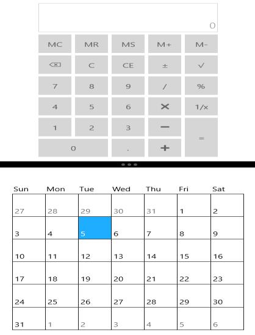

# Positioning GridSplitter in UWP Grid Splitter (SfGridSplitter)

`SfGridSplitter` can be positioned in Horizontal and Vertical orientation.

## Horizontal GridSplitter

To position a GridSplitter horizontally, split the container into rows and place it in the middle row as follows:





<Grid>

<Grid.RowDefinitions>

<RowDefinition MinHeight="50"/>

<RowDefinition Height="15"/>

<RowDefinition MinHeight="50"/>

</Grid.RowDefinitions>

<input:SfCalculator/>

<input:SfGridSplitter Grid.Row="1"/>

<input:SfCalendar Grid.Row="2"/>

</Grid>





## Vertical GridSplitter

To position a GridSplitter vertically, split the container into columns and place it in the middle column as follows:





<Grid>

<Grid.ColumnDefinitions>

<ColumnDefinition MinWidth="50"/>

<ColumnDefinition Width="25"/>

<ColumnDefinition MinWidth="50"/>

</Grid.ColumnDefinitions>

<input:SfCalculator/>

<input:SfGridSplitter Grid.Column="1" VerticalAlignment="Stretch"/>

<input:SfCalendar Grid.Column="2"/>

</Grid>





## Move splitter programmatically

MoveSplitter method is used to move the grid splitter programmatically for a specified value.





<input:SfGridSplitter x:Name="gridSplitter"/>









gridSplitter.MoveSplitter(30);





gridSplitter.MoveSplitter(30)





