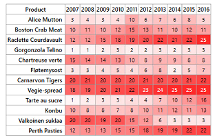

# Color Mapping in UWP HeatMap

Color mapping is used to represent values with colors instead of displaying the actual numerical values. For example, when a HeatMap displays data ranging from 0 to 100. [ColorMapping](https://help.syncfusion.com/cr/uwp/Syncfusion.UI.Xaml.HeatMap.ColorMapping.html) defines colors for the minimum and maximum values, and intermediate values are represented with corresponding colors. 

In color mapping, the value 0 is assigned the color white, and the value 30 is assigned the color red, as shown below.




<syncfusion:ColorMappingCollection x:Key="colorMapping">
	<syncfusion:ColorMapping Value="0" Color="White"/>
	<syncfusion:ColorMapping Value="30" Color="Red"/>
</syncfusion:ColorMappingCollection>




The resulting HeatMap will appear as shown below.

