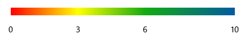
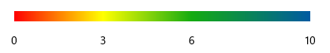
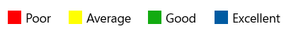
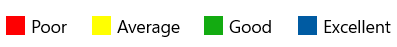
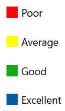

# Legend in UWP HeatMap (SfHeatMap) control
Legend is a control used to summarize the color ranges in a HeatMap, providing a visual guide for mapping values to their corresponding colors.

## Create Legend
Legend can be created with color mapping as shown below.




<syncfusion:ColorMappingCollection x:Key="colorMapping">
    <syncfusion:ColorMapping Value="0" Color="#fe0002" Label="Poor"/>
    <syncfusion:ColorMapping Value="3" Color="#ffff01" Label="Average"/>
    <syncfusion:ColorMapping Value="6" Color="#13ab11" Label="Good"/>
    <syncfusion:ColorMapping Value="10" Color="#005ba2 " Label="Excellent"/>
</syncfusion:ColorMappingCollection>

<syncfusion:SfHeatMapLegend ColorMappingCollection="{StaticResource colorMapping}"/>




The resulting legend will appear as shown in the following image.

## Legend Mode
There are two modes available for the legend:

* Gradient
* List

### Gradient



<syncfusion:SfHeatMapLegend 
	LegendMode="Gradient" 
	ColorMappingCollection="{StaticResource colorMapping}"/>



### List



<syncfusion:SfHeatMapLegend
	LegendMode="List" 
	ColorMappingCollection="{StaticResource colorMapping}"/>



## Orientation
There are two types of orientation available for both Gradient and List modes:
* Horizontal
* Vertical

### Horizontal



<syncfusion:SfHeatMapLegend 
	LegendMode="List" 
	Orientation="Horizontal" 
	ColorMappingCollection="{StaticResource colorMapping}"/>



### Vertical



<syncfusion:SfHeatMapLegend 
	LegendMode="List" 
	Orientation="Vertical" 
	ColorMappingCollection="{StaticResource colorMapping}"/>



