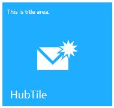

# SfHubTile in UWP Hub Tile (HubTiles)

`SfHubTile` control provides live updates and notifications similar to Windows 8 and Windows Phone. Hub Tiles can have image, title, and header to display in the tile.

## Features

* Rich built-in transition effects
* Freezing and unfreezing options 

## Getting Started

This section explains how to create a Windows 8 Live Tile using `SfHubTile` control.

## Adding SfHubTile control

Create a Universal Windows Platform project in Visual Studio and refer to the following assemblies.

* Syncfusion.SfHubTile.UWP
* Syncfusion.SfShared.UWP

1.Include the namespace for Syncfusion.SfHubTile.UWP assembly in MainPage.xaml





<Page xmlns="http://schemas.microsoft.com/winfx/2006/xaml/presentation"

xmlns:x="http://schemas.microsoft.com/winfx/2006/xaml"

xmlns:notification="using:Syncfusion.UI.Xaml.Controls.Notification">





2.Now add the `SfHubTile` control with a required optimal name using the included namespace





<notification:SfHubTile x:Name="hubTile">





SfHubTile hubTile = new SfHubTile();





 Dim hubTile As New SfHubTile()





### Configuring the tile

Set the properties Header, Title, ImageSource and SecondaryContent as given below:





<notification:SfHubTile Width="183" Height="173"
                        Header="HubTile" Title="This is title area"
						Foreground="White"
						ImageSource="Assets/New Mail.png">
						
<notification:SfHubTile.SecondaryContent>

<Image Source="Assets/HubTile.png"
       Stretch="UniformToFill" Margin="-1"/>
	   
</notification:SfHubTile.SecondaryContent>

</notification:SfHubTile>









  SfHubTile hubTile = new SfHubTile() { Width = 183, Height = 173, Header = "HubTile", Title = "This is title area", Foreground = new SolidColorBrush(Colors.White) };

  ImageSource primaryContent = new BitmapImage(new Uri(@"ms-appx:///Assets/New Mail.png", UriKind.RelativeOrAbsolute));
         
  hubTile.ImageSource = primaryContent;
  hubTile.SecondaryContent = new Image() { Source = new BitmapImage(new Uri(@"ms-appx:///Assets/HubTile.png", UriKind.RelativeOrAbsolute))  };





  Dim hubTile As New SfHubTile() With {
	 .Width = 183,
	 .Height = 173,
	 .Header = "HubTile",
	 .Title = "This is title area",
	 .Foreground = New SolidColorBrush(Colors.White)
 }

Dim primaryContent As ImageSource = New BitmapImage(New Uri("ms-appx:///Assets/New Mail.png", UriKind.RelativeOrAbsolute))

hubTile.ImageSource = primaryContent
hubTile.SecondaryContent = New Image() With {.Source = New BitmapImage(New Uri("ms-appx:///Assets/HubTile.png", UriKind.RelativeOrAbsolute))}





### Applying tile transitions

Apply the required transitions such as Rotate transition, Slide transition, Fade transition using `HubTileTransitions` property as given below:





<Page xmlns:notification="using:Syncfusion.UI.Xaml.Controls.Notification"
       xmlns:transitions="using:Syncfusion.UI.Xaml.Controls">
	   
<Grid>

<notification:SfHubTile Width="183" Height="173"
                        Header="HubTile"
						Title="This is title area"
						Foreground="White"
						ImageSource="Assets/New Mail.png">
						
<notification:SfHubTile.SecondaryContent>

<Image Source="Assets/HubTile.png"
       Stretch="UniformToFill" Margin="-1"/>
	   
</notification:SfHubTile.SecondaryContent>

<notification:SfHubTile.HubTileTransitions>

<transitions:RotateTransition/>

<transitions:SlideTransition/>

<transitions:FadeTransition/>

</notification:SfHubTile.HubTileTransitions>

</notification:SfHubTile>

<Grid/>

<Page/>









 SfHubTile hubTile = new SfHubTile() { Width = 183, Height = 173, Header = "HubTile", Title = "This is title area", Foreground = new SolidColorBrush(Colors.White) };

 ImageSource primaryContent = new BitmapImage(new Uri(@"ms-appx:///Assets/New Mail.png", UriKind.RelativeOrAbsolute));
         
 hubTile.ImageSource = primaryContent;
 hubTile.SecondaryContent = new Image() { Source = new BitmapImage(new Uri(@"ms-appx:///Assets/HubTile.png", UriKind.RelativeOrAbsolute))  };

 hubTile.HubTileTransitions.Add(new RotateTransition());

 hubTile.HubTileTransitions.Add(new SlideTransition());

 hubTile.HubTileTransitions.Add(new FadeTransition());
 hubTile.Interval = TimeSpan.FromSeconds(1);





 Dim hubTile As New SfHubTile() With {
	.Width = 183,
	.Height = 173,
	.Header = "HubTile",
	.Title = "This is title area",
	.Foreground = New SolidColorBrush(Colors.White)
}

 Dim primaryContent As ImageSource = New BitmapImage(New Uri("ms-appx:///Assets/New Mail.png", UriKind.RelativeOrAbsolute))

 hubTile.ImageSource = primaryContent
 hubTile.SecondaryContent = New Image() With {.Source = New BitmapImage(New Uri("ms-appx:///Assets/HubTile.png", UriKind.RelativeOrAbsolute))}

 hubTile.HubTileTransitions.Add(New RotateTransition())

 hubTile.HubTileTransitions.Add(New SlideTransition())

 hubTile.HubTileTransitions.Add(New FadeTransition())
 hubTile.Interval = TimeSpan.FromSeconds(1)





## Configuring the tile

`SfHubTile` can be configured with text and image as follows:

### Tile caption

The title text is displayed at the top of the tile. It is set using `HubTileBase.Title` property.

### Tile header  

The header is displayed at the bottom of the tile.

### Tile Image

Image is displayed at the center of the tile. It is set using `HubTileBase.ImageSource` property. 

### Secondary tile content

Secondary content can be any object which is displayed only when hub tile transition effects are applied.

Here is an example of HubTile configured with Title, Header and Image Source.





<notification:SfHubTile x:Name="hubTile" Foreground="White"

HorizontalAlignment="Center"

VerticalAlignment="Center"

ImageSource="Assets/New Mail.png"

Title="This is title area."

Header="HubTile"/>









 SfHubTile hubTile = new SfHubTile() {HorizontalAlignment = HorizontalAlignment.Center,
 VerticalAlignment = VerticalAlignment.Center ,Title = "This is title area." ,Header = "HubTile",
 Foreground = new SolidColorBrush(Colors.White)};

ImageSource primaryContent = new BitmapImage(new Uri(@"ms-appx:///Assets/New Mail.png", UriKind.RelativeOrAbsolute));

hubTile.ImageSource = primaryContent;





 Dim hubTile As New SfHubTile() With {
	.HorizontalAlignment = HorizontalAlignment.Center,
	.VerticalAlignment = VerticalAlignment.Center,
	.Title = "This is title area.",
	.Header = "HubTile",
	.Foreground = New SolidColorBrush(Colors.White)
}

Dim primaryContent As ImageSource = New BitmapImage(New Uri("ms-appx:///Assets/New Mail.png", UriKind.RelativeOrAbsolute))

hubTile.ImageSource = primaryContent





## Animation and Transitions

`SfHubTile` control provided the following built-in transitions

* Rotate transition
* Slide transition
* Fade transition

### Animation duration

All the transition effects takes place with the specified interval. By default, `Interval` value is zero. Unless the interval is set, transition will never happen.





<notification:SfHubTile x:Name="hubTile" Interval="0:0:1"/>









hubTile.Interval = TimeSpan.FromSeconds(1);





hubTile.Interval = TimeSpan.FromSeconds(1)





### Tile rotate animation

Main and Secondary contents rotate with specified interval.

### Tile slide animation

Main and Secondary contents slide with specified interval.

### Tile fade animation

Main and Secondary contents fade with specified interval.





<Page xmlns:notification="using:Syncfusion.UI.Xaml.Controls.Notification"

xmlns:transitions="using:Syncfusion.UI.Xaml.Controls">

<Grid>

<notification:SfHubTile x:Name="hubTile" Foreground="White" Width="183" Height="173"

HorizontalAlignment="Center" Interval="0:0:1"

VerticalAlignment="Center"

ImageSource="Assets/New Mail.png"

Title="This is title area."

Header="HubTile">

<notification:SfHubTile.SecondaryContent>

<Image Source="Assets/Hubtile.png" Stretch="UniformToFill"/>

</notification:SfHubTile.SecondaryContent>

<notification:SfHubTile.HubTileTransitions>

<transitions:RotateTransition/>

<transitions:SlideTransition/>

<transitions:FadeTransition/>

</notification:SfHubTile.HubTileTransitions>

</notification:SfHubTile>









using Syncfusion.UI.Xaml.Controls;

public MainPage()

{

hubTile.HubTileTransitions.Add(new RotateTransition());

hubTile.HubTileTransitions.Add(new SlideTransition());

hubTile.HubTileTransitions.Add(new FadeTransition());

}





Imports Syncfusion.UI.Xaml.Controls

Public Sub New()

hubTile.HubTileTransitions.Add(New RotateTransition())

hubTile.HubTileTransitions.Add(New SlideTransition())

hubTile.HubTileTransitions.Add(New FadeTransition())

End Sub





### Notifying transition completed

Unless the tile is frozen, transitions occur repeatedly (cyclic manner) in hub tile for every specified interval. HubTile TransitionCompleted event fires on each transition completion. 





<notification:SfHubTile x:Name="hubTile" 

HubTileTransitionCompleted="hubTile_HubTileTransitionCompleted">









private void hubTile_HubTileTransitionCompleted(object Sender, AnimationCompletedArgs args)

{

}





Private Sub hubTile_HubTileTransitionCompleted(ByVal Sender As Object, ByVal args As AnimationCompletedArgs)

End Sub





Flip effect customization, tile click & command, pausing and resuming animation topics are available under `HubTileBase` section

## Appearance and Styling

`SfHubTile` appearance can be customized by `SecondaryContentTemplate`, `AccentBrush`, `TitleStyle`.

### Customizing the secondary content

`SecondaryContentTemplate` property is used to set the data template for secondary content. 





<notification:SfHubTile x:Name="hubTile" Interval="0:0:1"

ImageSource="Assets/New Mail.png"

Title="This is title area."

Header="HubTile" SecondaryContent="This is secondary.">

<notification:SfHubTile.HubTileTransitions>

<transitions:RotateTransition/>

<transitions:SlideTransition/>

<transitions:FadeTransition/>

</notification:SfHubTile.HubTileTransitions>

<notification:SfHubTile.SecondaryContentTemplate>

<DataTemplate>

<TextBlock Text="{Binding}" VerticalAlignment="Center" HorizontalAlignment="Center" Foreground="Red"/>

</DataTemplate>

</notification:SfHubTile.SecondaryContentTemplate>

</notification:SfHubTile>





AccentBrush and TitleStyle topics are available under HubTileBase section.

