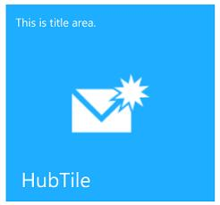
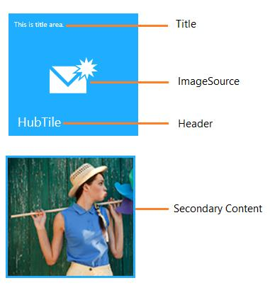
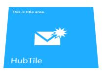
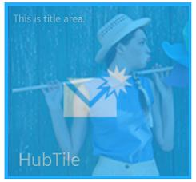
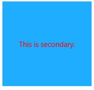
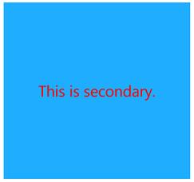

# SfHubTile

`SfHubTile` control provides live updates and notifications similar to Windows 8 and Windows Phone. Hub Tiles can have image, title, and header to display in the tile.

## Features

* Rich built-in transition effects
* Freezing and unfreezing options 

### Visual structure

1.WinRT

2.Windows phone

## Creating SfHubTile control

Create a Universal Windows project in Visual Studio and refer to the following assemblies.

1. Syncfusion. SfHubTile.UWP
2. Syncfusion.SfShared.UWP

### Adding SfHubTile control through XAML Code

1.Include the namespace for Syncfusion.SfHubTile.UWP assembly in MainPage.xaml





<Page xmlns="http://schemas.microsoft.com/winfx/2006/xaml/presentation"

xmlns:x="http://schemas.microsoft.com/winfx/2006/xaml"

xmlns:notification="using:Syncfusion.UI.Xaml.Controls.Notification">





2.Now add the `SfHubTile` control with a required optimal name using the included namespace





<notification:SfHubTile x:Name="hubTile">





### Adding SfHubTile control through C# Code

1.Include the namespace for Syncfusion. SfHubTile.UWP assembly in MainPage.xaml.cs





using Syncfusion.UI.Xaml.Controls.Notification;





2.Now add the `SfHubTile` control with an optimal name 





SfHubTile hubTile = new SfHubTile();





## Configuring the tile

`SfHubTile` can be configured with text and image as follows:

### Title

The title text is displayed at the top of the tile. It is set using `HubTileBase.Title` property.

### Header 

The header is displayed at the bottom of the tile.

### ImageSource

Image is displayed at the center of the tile. It is set using `HubTileBase.ImageSource` property. 

### SecondaryContent

Secondary content can be any object which is displayed only when hub tile transition effects are applied.

Here is an example of HubTile configured with Title, Header and Image Source.





<notification:SfHubTile x:Name="hubTile" Foreground="White"

HorizontalAlignment="Center"

VerticalAlignment="Center"

ImageSource="Assets/New Mail.png"

Title="This is title area."

Header="HubTile"/>





## Animation and Transitions

`SfHubTile` control provided the following built-in transitions

* Rotate transition
* Slide transition
* Fade transition

### Interval

All the transition effects takes place with the specified interval. By default, `Interval` value is zero. Unless the interval is set, transition will never happen.





<notification:SfHubTile x:Name="hubTile" Interval="0:0:1"/>





hubTile.Interval = TimeSpan.FromSeconds(1);





### Rotate transition

Main and Secondary contents rotate with specified interval.

### Slide transition

Main and Secondary contents slide with specified interval.

### Fade transition

Main and Secondary contents fade with specified interval.





<Page xmlns:notification="using:Syncfusion.UI.Xaml.Controls.Notification"

xmlns:transitions="using:Syncfusion.UI.Xaml.Controls">

<Grid>

<notification:SfHubTile x:Name="hubTile" Foreground="White" Width="183" Height="173"

HorizontalAlignment="Center" Interval="0:0:1"

VerticalAlignment="Center"

ImageSource="Assets/New Mail.png"

Title="This is title area."

Header="HubTile">

<notification:SfHubTile.SecondaryContent>

<Image Source="Assets/Hubtile.png" Stretch="UniformToFill"/>

</notification:SfHubTile.SecondaryContent>

<notification:SfHubTile.HubTileTransitions>

<transitions:RotateTransition/>

<transitions:SlideTransition/>

<transitions:FadeTransition/>

</notification:SfHubTile.HubTileTransitions>

</notification:SfHubTile>





using Syncfusion.UI.Xaml.Controls;

public MainPage()

{

hubTile.HubTileTransitions.Add(new RotateTransition());

hubTile.HubTileTransitions.Add(new SlideTransition());

hubTile.HubTileTransitions.Add(new FadeTransition());

}





### HubTile TransitionCompleted event

Unless the tile is frozen, transitions occur repeatedly (cyclic manner) in hub tile for every specified interval. HubTile TransitionCompleted event fires on each transition completion. 





<notification:SfHubTile x:Name="hubTile" 

HubTileTransitionCompleted="hubTile_HubTileTransitionCompleted">









private void hubTile_HubTileTransitionCompleted(object Sender, AnimationCompletedArgs args)

{

}





Flip effect customization, tile click & command, pausing and resuming animation topics are available under `HubTileBase` section

## Appearance and Styling

`SfHubTile` appearance can be customized by `SecondaryContentTemplate`, `AccentBrush`, `TitleStyle`.

### SecondaryContentTemplate

`SecondaryContentTemplate` property is used to set the data template for secondary content. 





<notification:SfHubTile x:Name="hubTile" Interval="0:0:1"

ImageSource="Assets/New Mail.png"

Title="This is title area."

Header="HubTile" SecondaryContent="This is secondary.">

<notification:SfHubTile.HubTileTransitions>

<transitions:RotateTransition/>

<transitions:SlideTransition/>

<transitions:FadeTransition/>

</notification:SfHubTile.HubTileTransitions>

<notification:SfHubTile.SecondaryContentTemplate>

<DataTemplate>

<TextBlock Text="{Binding}" VerticalAlignment="Center" HorizontalAlignment="Center" Foreground="Red"/>

</DataTemplate>

</notification:SfHubTile.SecondaryContentTemplate>

</notification:SfHubTile>





AccentBrush and TitleStyle topics are available under HubTileBase section.

