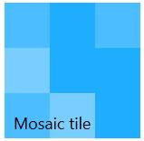

# SfMosaicTile

`SfMosaicTile` control provides a way to display pictures randomly with transition effect similar to people tile in Windows Phone 8 home screen. Mosaic tile can have collection of images and header to display in the tile.

## Features

* Show images with flip transition effect 
* Image collection can be either url or Image source

## Getting Started

This section explains how to create mosaic picture with flip transaction using ``SfMosaicTile` control.

### Adding SfMosaicTile control

Create a Universal Windows project in Visual Studio and refer to the following assemblies.

* Syncfusion.SfHubTile.UWP

* Syncfusion.SfShared.UWP

1.Include the namespace for Syncfusion.SfHubTile.UWP assembly in MainPage.xaml





<Page xmlns="http://schemas.microsoft.com/winfx/2006/xaml/presentation"
      xmlns:x="http://schemas.microsoft.com/winfx/2006/xaml"
	  xmlns:notification="using:Syncfusion.UI.Xaml.Controls.Notification">
	  
</Page>





2.Now add the `SfMosaicTile` control with a required optimal name using the included namespace





<notification:SfMosaicTile x:Name="mosaicTile"/>





SfMosaicTile mosaicTile = new SfMosaicTile();





Dim mosaicTile As New SfMosaicTile()





### Adding image list to the tile 

Set the properties Header, ImageList as given below:





<notification:SfMosaicTile Width="183" Height="173"
                           Header="HubTile" Foreground="White">
						   
<notification:SfMosaicTile.ImageList>

<notification:ImageList>

<x:String>Assets/emp10.png</x:String>
<x:String>Assets/emp11.png</x:String>
<x:String>Assets/emp12.png</x:String>
<x:String>Assets/emp13.png</x:String>
<x:String>Assets/emp1.png</x:String>
<x:String>Assets/emp2.png</x:String>
<x:String>Assets/emp3.png</x:String>
<x:String>Assets/emp4.png</x:String>
<x:String>Assets/emp5.png</x:String>
<x:String>Assets/emp6.png</x:String>
<x:String>Assets/emp7.png</x:String>
<x:String>Assets/emp8.png</x:String>
<x:String>Assets/emp9.png</x:String>

</notification:ImageList>

</notification:SfMosaicTile.ImageList>

</notification:SfMosaicTile>





## Configuring the Tile

`SfMosaicTile` can be configured with header and images as follows:

### Setting the header

`Header` property is used to set a display text at the bottom of the tile.





<notification:SfMosaicTile Header="Mosaic tile" x:Name="mosaicTile"/>









mosaicTile.Header = "Mosaic Tile";





mosaicTile.Header = "Mosaic Tile"





## Adding image collection

### Specifying BitmapImage or Image URLs

`IsBitmapImageList` property is used to specify whether the image location is given as url or image source. Image sources are preferred when images are retrieved from folders like Downloads, Picture library, Video library, Document library and Music library.

### Adding Image URLs

`ImageList` property is used to set a collection of image url that are to be displayed in tile. IsBitmapImageList property must be set to false while using image urls otherwise images does not appear in mosaic tile.





<Page xmlns:x=http://schemas.microsoft.com/winfx/2006/xaml
      xmlns:notification="using:Syncfusion.UI.Xaml.Controls.Notification">

<Grid Background="{ThemeResource ApplicationPageBackgroundThemeBrush}">

<notification:SfMosaicTile Header="Mosaic tile"
                           IsBitmapImageList="false"
						   x:Name="mosaicTile">
						   
<notification:SfMosaicTile.ImageList>

<notification:ImageList>

<x:String>Assets/emp10.png</x:String>
<x:String>Assets/emp11.png</x:String>
<x:String>Assets/emp12.png</x:String>
<x:String>Assets/emp13.png</x:String>
<x:String>Assets/emp1.png</x:String>
<x:String>Assets/emp2.png</x:String>
<x:String>Assets/emp3.png</x:String>
<x:String>Assets/emp4.png</x:String>
<x:String>Assets/emp5.png</x:String>
<x:String>Assets/emp6.png</x:String>
<x:String>Assets/emp7.png</x:String>
<x:String>Assets/emp8.png</x:String>
<x:String>Assets/emp9.png</x:String>

</notification:ImageList>

</notification:SfMosaicTile.ImageList>

</notification:SfMosaicTile>

</Grid>

</Page>









mosaicTile.ImageList = new ImageList();

mosaicTile.ImageList.Add("Assets/emp10.png");

mosaicTile.ImageList.Add("Assets/emp11.png");

mosaicTile.ImageList.Add("Assets/emp12.png");

mosaicTile.ImageList.Add("Assets/emp13.png");

mosaicTile.ImageList.Add("Assets/emp1.png");

mosaicTile.ImageList.Add("Assets/emp2.png");

mosaicTile.ImageList.Add("Assets/emp3.png");

mosaicTile.ImageList.Add("Assets/emp4.png");

mosaicTile.ImageList.Add("Assets/emp5.png");

mosaicTile.ImageList.Add("Assets/emp6.png");

mosaicTile.ImageList.Add("Assets/emp7.png");

mosaicTile.ImageList.Add("Assets/emp8.png");

mosaicTile.ImageList.Add("Assets/emp9.png");





mosaicTile.ImageList = New ImageList()

mosaicTile.ImageList.Add("Assets/emp10.png")

mosaicTile.ImageList.Add("Assets/emp11.png")

mosaicTile.ImageList.Add("Assets/emp12.png")

mosaicTile.ImageList.Add("Assets/emp13.png")

mosaicTile.ImageList.Add("Assets/emp1.png")

mosaicTile.ImageList.Add("Assets/emp2.png")

mosaicTile.ImageList.Add("Assets/emp3.png")

mosaicTile.ImageList.Add("Assets/emp4.png")

mosaicTile.ImageList.Add("Assets/emp5.png")

mosaicTile.ImageList.Add("Assets/emp6.png")

mosaicTile.ImageList.Add("Assets/emp7.png")

mosaicTile.ImageList.Add("Assets/emp8.png")

mosaicTile.ImageList.Add("Assets/emp9.png")





### Setting ImageSource

`BitmapImageList` property is used to set a collection of image sources that are to be displayed in the tile. IsBitmapImageList property must be set to true while using image sources otherwise images does not appear in mosaic tile.





<notification:SfMosaicTile Header="Mosaic tile"
                           IsBitmapImageList="True"
						   x:Name="mosaicTile"/>









public MainPage()

{

this.InitializeComponent();  

BitmapImageList list = new BitmapImageList();

for(int i=1; i<=13;i++)

list.Add(new Image() { Source = new BitmapImage() { UriSource = new Uri("ms-appx:///Assets/emp"+i+".png", UriKind.Absolute) } });

mosaicTile.BitmapImageList = list;

}





Public Sub New()

Me.InitializeComponent()

Dim list As New BitmapImageList()

For i As Integer = 1 To 13

list.Add(New Image() With {
	.Source = New BitmapImage() With {.UriSource = New Uri("ms-appx:///Assets/emp" & i & ".png", UriKind.Absolute)}
})
Next i

mosaicTile.BitmapImageList = list

End Sub





## Checking image existence

Image urls can be checked for existence using CheckForExistence method before adding to avoid duplicate images. This method returns true if the url already exists otherwise false.





mosaicTile.CheckForExistence("Assets/emp1.png");





mosaicTile.CheckForExistence("Assets/emp1.png")





## Setting interval for flip transition

Animation interval for flip transition can be changed using `Interval` property. It can be set as follows:





<notification:SfMosaicTile x:Name="mosaicTile" Interval="0:0:5"/>









mosaicTile.Interval = TimeSpan.FromSeconds(5);





mosaicTile.Interval = TimeSpan.FromSeconds(5)





Flip effect customization, tile click & command, pausing and resuming animation, AccentBrush, TitleStyle topics are available under HubTileBase section.
