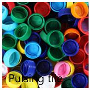
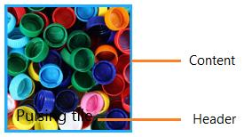
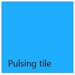

# SfPulsingTile

`SfPulsingTile` control allows to create a tile similar to Music and Video hub tile in Windows phone. The content zooms in/out randomly with random translation in X and Y axis.

## Overview

### Features

Animation properties are completely customizable  

### Visual structure

1.WinRT

2.Windows phone

## Creating SfSplitMosaicTile control

Create a Universal Windows project in Visual Studio and refer to the following assemblies.

1. Syncfusion. SfHubTile.UWP

2. Syncfusion.SfShared.UWP

### Adding SfSplitMosaicTile control through XAML Code

1.Include the namespace for Syncfusion.SfHubTile.UWP assembly in MainPage.xaml





<Page xmlns="http://schemas.microsoft.com/winfx/2006/xaml/presentation"

xmlns:x="http://schemas.microsoft.com/winfx/2006/xaml"

xmlns:notification="using:Syncfusion.UI.Xaml.Controls.Notification">





2.Now add the `SfSplitMosaicTile` control with a required optimal name using the included namespace





<notification:SfSplitMosaicTile x:Name="splitMosaicTile">





### Adding SfSplitMosaicTile control through C# Code

1.Include the namespace for Syncfusion. SfHubTile.UWP assembly in MainPage.xaml.cs





using Syncfusion.UI.Xaml.Controls.Notification;





2.Now add the SfSplitMosaicTile control with an optimal name 





SfSplitMosaicTile splitMosaicTile = new SfSplitMosaicTile();





## Configuring the tile

`SfSplitMosaicTile` can be configured with header and images as follows:

### Setting the header

`Header` property is used to set a display text at the bottom of the tile.





<notification:SfPulsingTile Header="Pulsing tile" x:Name="pulsingTile"/> 









pulsingTile.Header = "Pulsing Tile";





### Setting the content

Animation is performed on the content of pulsing tile regardless of its type. Here is an example to set an image as content of pulsing tile.





<notification:SfPulsingTile Header="Pulsing tile" x:Name="pulsingTile">

<Image Source="Assets/PulsingTile.jpg" Stretch="UniformToFill" VerticalAlignment="Center"

HorizontalAlignment="Center"/>

</notification:SfPulsingTile>





## Customizing animation

The animation properties that can be changed are pulsing depth, pulsing duration, translation duration, height and width.

### Pulse depth

`PulseScale` property specifies the range of translation in the x- and y-axis while pulsing the content.





<notification:SfPulsingTile PulseScale="1.2" x:Name="pulsingTile">

<Image Source="Assets/PulsingTile.jpg" Stretch="UniformToFill"
       VerticalAlignment="Center" HorizontalAlignment="Center" Height="150" />

</notification:SfPulsingTile>









pulsingTile.PulseScale = 1.2;





### Pulse duration

`PulseDuration` property specifies the time taken for a single scaling animation to complete in pulsing tile. Animation happens repeatedly if it is not frozen.





<notification:SfPulsingTile Height="150" Width="150"
                            PulseDuration="0:0:2" PulseScale="1.2" x:Name="pulsingTile">

<Image Source="Assets/PulsingTile.jpg" Stretch="UniformToFill"
       VerticalAlignment="Center" HorizontalAlignment="Center" Height="150" />

</notification:SfPulsingTile>









pulsingTile.PulseDuration = TimeSpan.FromSeconds(2);





### Translation width

`RadiusX` property specifies the range of translation in pulsing tile along x-axis.





<notification:SfPulsingTile RadiusX="2" x:Name="pulsingTile">

<Image Source="Assets/PulsingTile.jpg" Stretch="UniformToFill"
       VerticalAlignment="Center" HorizontalAlignment="Center" Height="150" />

</notification:SfPulsingTile>









pulsingTile.RadiusX = 2.0;





### Translation height

`RadiusY` property specifies the range of translation in pulsing tile along y-axis.





<notification:SfPulsingTile RadiusY="2" x:Name="pulsingTile">

<Image Source="Assets/PulsingTile.jpg" Stretch="UniformToFill"
       VerticalAlignment="Center" HorizontalAlignment="Center" Height="150" />

</notification:SfPulsingTile>









pulsingTile.RadiusY = 2.0;





### Translation duration

`TranslateDuration` property specifies the time taken for a single translation animation to complete in pulsing tile. Animation happens repeatedly if it is not frozen.





<notification:SfPulsingTile RadiusX="2" RadiusY="2" TranslationDuration="0:0:2" x:Name="pulsingTile">

<Image Source="Assets/PulsingTile.jpg" Stretch="UniformToFill"
       VerticalAlignment="Center" HorizontalAlignment="Center" Height="150" />

</notification:SfPulsingTile>









pulsingTile.TranslationDuration = TimeSpan.FromSeconds(2);





Flip effect customization, tile click & command, pausing and resuming animation, AccentBrush, TitleStyle topics are available under HubTileBase section.
