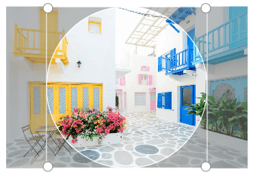
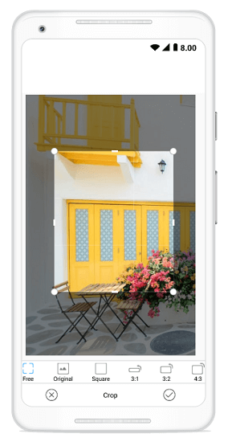
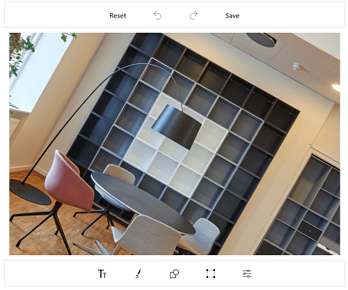
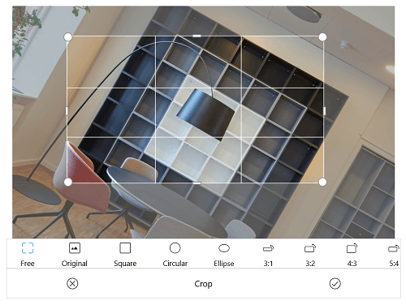

# Crop in UWP Image Editor (SfImageEditor)

The image editor control provides an option to crop the image. You can crop the image in the following two ways:

* From Toolbar
* Using Code

## From Toolbar

To enable cropping, click the `Crop` icon in the `Transforms` submenu. A sub toolbar appears with `Cancel` and `OK` buttons. From this sub toolbar, you can crop the image with the following aspect ratios:

* `Free` - crop the image to any size
* `Original` - crop the image based on its width and height
* `Square` - crop the image with equal width and height
* Specific aspect ratios such as `3:1`, `1:3`, `3:2`, `2:3`, `4:3`, `3:4`, `5:4`, `4:5`, `16:9`, and `9:16`. Double tapping the aspect ratio icon shows the reversed ratio.

To disable cropping, click the `Cancel` button. To save the cropped area, select the desired area and click the `OK` button. The toolbars reappear after the cropping operation is completed.

## Using Code

Cropping can be performed programmatically in the following two ways:

* Enable cropping and select the crop region visually
* Manually set the cropping area

N> You can enable cropping in the zoomed area and crop a specific position from the zoomed area.

### Handling the cropping tool

The [`ToggleCropping`](https://help.syncfusion.com/cr/uwp/Syncfusion.UI.Xaml.ImageEditor.SfImageEditor.html#Syncfusion_UI_Xaml_ImageEditor_SfImageEditor_ToggleCropping) method enables and disables a cropping region placed over the image to visually choose the area for cropping.

* To crop the image to any size.







// For free hand cropping

imageEditor.ToggleCropping();







{{ codesnippet1 | UnOrderList_Indent_Level_1 }} 

* To crop an image based on original width and height of the image.







// For cropping the image with original width and height

imageEditor.ToggleCropping(float.NaN, float.NaN);







{{ codesnippet2 | UnOrderList_Indent_Level_1 }} 

* To crop an image as square dimension.







// For cropping the image in square format

imageEditor.ToggleCropping(1, 1);







{{ codesnippet3 | UnOrderList_Indent_Level_1 }} 

* To crop an image based on specific ratio.







// For cropping the image with ratio x value as 9 and y value as 17

imageEditor.ToggleCropping(9, 17);







{{ codesnippet4 | UnOrderList_Indent_Level_1 }} 

* To position the cropping window with custom location, pass the desired rectangle in ToggleCropping method. Each value in the rectangle should be in offset value(0 to 100).


 




Rect rect = new Rect(20, 20, 50, 50);

editor.ToggleCropping(rect);







{{ codesnippet5 | UnOrderList_Indent_Level_1 }}

After selecting the cropping area, call the `Crop` method to crop the selected region and display the cropped image on the image editor.





// After selecting the crop area visually

imageEditor.Crop(new Rect(0, 0, 0, 0));





## Circle cropping

An image can be cropped in a circle or elliptical format. Specify the [`ToggleCropping`](https://help.syncfusion.com/cr/uwp/Syncfusion.UI.Xaml.ImageEditor.SfImageEditor.html#Syncfusion_UI_Xaml_ImageEditor_SfImageEditor_ToggleCropping_Windows_Foundation_Rect_System_Boolean_) parameter as shown in the following code sample.

N> When an empty rect is specified in the parameter, a rounded rect is formed covering the entire image. It is in a circle or ellipse shape based on the image bounds.





// To crop an image as a circular dimension

var size = editor.ActualImageRenderedBounds;
var minSize = Math.Min(size.Width, size.Height);
var leftX = (size.Width - minSize) / 2;
var topY = (size.Height - minSize) / 2;

var x = (leftX * 100) / size.Width;
var y = (topY * 100) / size.Height;
var width = (minSize * 100) / size.Width;
var height = (minSize * 100) / size.Height;

editor.ToggleCropping(new Rect(x, y, width, height), true);





The following image shows the circularly cropped image.

The following code shows cropping an image in elliptical format.





// To crop an image as an elliptical dimension

editor.ToggleCropping(new Rect(), true);





## Circle cropping with a ratio

To crop an image in a circle or an ellipse with a specific ratio, use [`ToggleCropping`](https://help.syncfusion.com/cr/uwp/Syncfusion.UI.Xaml.ImageEditor.SfImageEditor.html#Syncfusion_UI_Xaml_ImageEditor_SfImageEditor_ToggleCropping_System_Single_System_Single_System_Boolean_) with a ratio argument and an optional parameter of `true`. This specifies whether the cropping panel should be added in an elliptical or rectangle shape. The default value is `false`.





// To crop an image as a circle dimension with ratio

editor.ToggleCropping(1, 1, true);





## Manually set the cropping area

To manually set the cropping rectangle without enabling the cropping functionality, use the overloaded `Crop(Rectangle rect)` method by defining a rectangle and passing it to the `Crop(rect)` method.





imageEditor.Crop(new Rect(200, 150, 150, 150));





## Selecting the cropping ratio programmatically

You can select the desired cropping ratio from the various aspect ratios available in the built-in cropping toolbar by specifying the corresponding index of the toolbar item using the [`ToggleCropping`](https://help.syncfusion.com/cr/uwp/Syncfusion.UI.Xaml.ImageEditor.SfImageEditor.html#Syncfusion_UI_Xaml_ImageEditor_SfImageEditor_ToggleCropping_System_Boolean_System_Int32_) method.

The following code sample adds the cropping preview on the image in a square shape.





editor.ToggleCropping(true, 2);





## Tilt the image

You can tilt the image from `-45` to `+45` degrees by using the `Tilt()` method. The tilt is in preview state, and to apply this effect to the image, call the `Crop()` method.

N> Any action performed when the image is in tilt preview state resets the tilt effect of that image.





editor.Tilt(30);

// To apply the tilt effect to the image
editor.Crop(new Rect(0, 0, 0, 0));





The following screenshot depicts the tilt preview state.

After tilt preview, cropping can be performed using the available cropping options.

