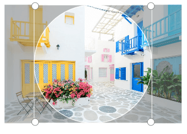
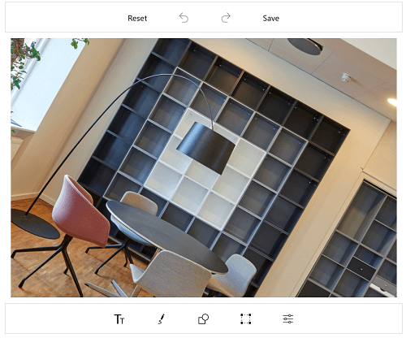
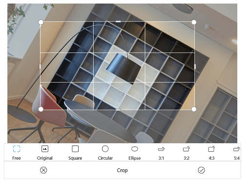

# Crop in UWP Image Editor (SfImageEditor)

The image editor control gives you an option to crop the image as desired. Cropping the image can be done in following two ways:

* From Toolbar
* Cropping programmatically

### From Toolbar

To enable cropping, in the `Transforms` submenu, click the `Crop` icon. When the `Crop` icon is tapped, a sub toolbar will appear on top of that toolbar. While the cropping is enabled, the crop sub toolbar, `Cancel` and `OK` buttons will be available. From that sub toolbar, you can able to crop the image with the following aspect ratios.

* `Free`- crop the image to any desired size.
* `Original`-crop the image based on image width and height. 
* `Square`-crop the image based on equal width and height.
* Crop the image to specific aspect ratio such as `3:1, 1:3, 3:2, 2:3, 4:3, 3:4, 5:4, 4:5, 16:9, 9:16`. On double tapping the aspect ratio icon reversed ratio will shown. 

To disable cropping,click the `Cancel` button. To save the cropped area, after selected the desired area, Click the `OK` button, the toolbars will reappear after the cropping operation is completed.

### Cropping programmatically

Cropping operation can be done programmatically in following two ways:

* Enable Cropping and Select the Crop region visually.
* Manually set the cropping area.

N> You can enable the cropping in the zoomed area and crop the specific position from the zoomed area. 

#### Handling the cropping tool

The `ToggleCropping` method in the SfImageEditor control is used to enable and disable a cropping region placed over the image to visually choose the area for cropping. 

*	To crop the image to any desired size.





//  for free hand cropping

imageEditor.ToggleCropping();    





* To crop an image based on original width and height of the image.





// for cropping the image with original width and height of the image.

imageEditor.ToggleCropping(float.NaN,float.NaN);    





* To crop an image as square dimension.





// for cropping the image in square format.

imageEditor.ToggleCropping(1, 1);    





* To crop an image based on specific ratio.





// for cropping the image with ratio x value as 9 and y value as 17

imageEditor.ToggleCropping(9,17);    





* To position the cropping window with custom location, pass the desired rectangle in ToggleCropping method. Each value in the rectangle should be in offset value(0 to 100).





Rect rect = new Rect(20,20,50,50);

editor.ToggleCropping(rect);    



 

After the cropping area has been selected, the `Crop` method is called which in turn crops the selected region and displays the cropped image on the ImageEditor.





// After selecting the crop area visually

imageEditor.Crop(new Rect(0, 0, 0, 0));





### Circle cropping

An image can be cropped in circle or elliptical format, which could be perfect for using it as a profile picture.
Specify the [`ToggleCropping`](https://help.syncfusion.com/cr/uwp/Syncfusion.UI.Xaml.ImageEditor.SfImageEditor.html#Syncfusion_UI_Xaml_ImageEditor_SfImageEditor_ToggleCropping_Windows_Foundation_Rect_System_Boolean_) parameter as shown in the below code sample.

N> When an empty rect is specified in the parameter, a rounded rect will be formed covering the entire image and it will be either in circle or ellipse shape based on the image bounds.



// To crop an image as a circular dimension.

            var size = editor.ActualImageRenderedBounds;
            var minSize = Math.Min(size.Width, size.Height);
            var leftX = (size.Width - minSize) / 2;
            var topY = (size.Height - minSize) / 2;

            var x = (leftX * 100) / size.Width;
            var y = (topY * 100) / size.Height;
            var width = (minSize * 100) / size.Width;
            var height = (minSize * 100) / size.Height;

            editor.ToggleCropping(new Rect(x, y, width, height), true);



The following image show cases the circularly cropped image.

 The following code shows cropping an image in elliptical format.



// To crop an image as a elliptical dimension.

  editor.ToggleCropping(new Rect(), true);



### Circle cropping with ratio

For cropping the image in circle or elliptical with specific ratio, specify `ToggleCropping` with ratio argument along with optional parameter as true, which specify the cropping panel should be added as elliptical or rectangle shape. Default value is false.

 

// To crop an image as a elliptical dimension with ratio.

editor.ToggleCropping(2, 2, true);



 

## Manually set the cropping area

To manually set the cropping rectangle without even enabling the cropping functionality, use overloaded Crop(Rectangle rect) method. This can be done by defining a rectangle and pass it to Crop(rect) method.



    imageEditor.Crop(new Rect(200, 150, 150, 150));



### Selecting the cropping ratio programmatically

Programmatically, you can select the desired cropping ratio from the various aspect ratios available in the built-in cropping toolbar by specifying the corresponding index of the toolbar item using the [`ToggleCropping`](https://help.syncfusion.com/cr/uwp/Syncfusion.UI.Xaml.ImageEditor.SfImageEditor.html#Syncfusion_UI_Xaml_ImageEditor_SfImageEditor_ToggleCropping_System_Boolean_System_Int32_) method.

The following code sample will add the cropping preview on the image in square shape.





 editor.ToggleCropping(true, 2);





## Tilt the image

You can tilt the image from -45 to +45 degree by using the `Tilt()` method. It will be in preview state and to apply this effect to the image you can call the `Crop()` method.

N> Any action performed when the image is in Tilt preview state will reset the tilt effect of that image.





editor.Tilt(30);

 // To apply the tilt effect to the image.
  editor.Crop(new Rect(0, 0, 0, 0));





Below screenshot depicts the tilt preview state.

After tilt preview, cropping can be performed using the available cropping options.

