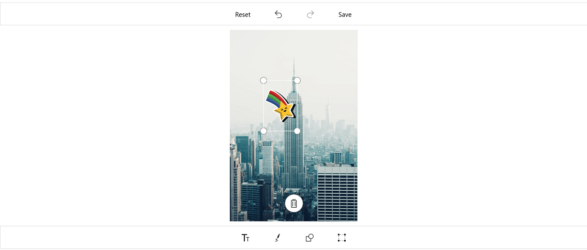
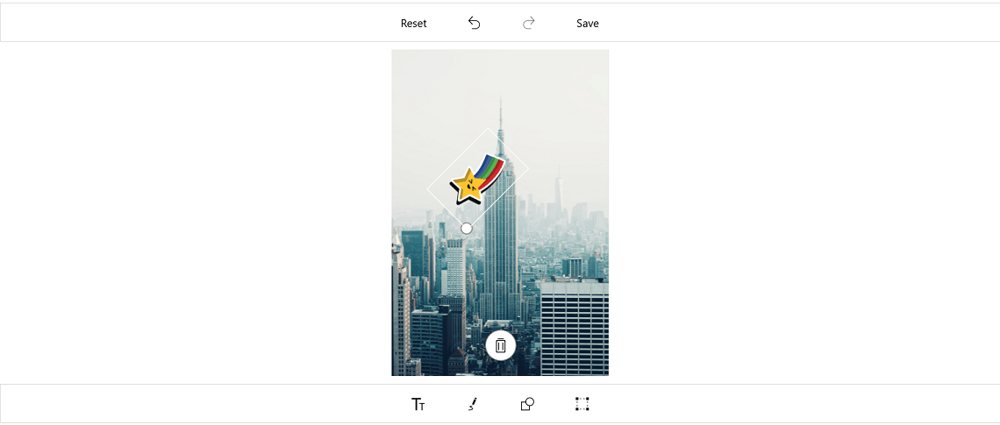

# Adding custom view in UWP Image Editor (SfImageEditor)

You can add any custom shape or view to an image using the [`AddCustomView`](https://help.syncfusion.com/cr/uwp/Syncfusion.UI.Xaml.ImageEditor.SfImageEditor.html#Syncfusion_UI_Xaml_ImageEditor_SfImageEditor_AddCustomView_Windows_UI_Xaml_FrameworkElement_Syncfusion_UI_Xaml_ImageEditor_CustomViewSettings_) method. To add a custom view, specify the view and its desired `CustomViewSettings` as demonstrated in the following code snippet.





Image customImage = new Image() { Height = 100, Width = 100 };
customImage.Source = new BitmapImage(new Uri("ms-appx:///customImage.png"));
imageEditor.AddCustomView(customImage, new CustomViewSettings());





N> If the SfImageEditor is loaded in a view without an image, call the [`AddCustomView`](https://help.syncfusion.com/cr/uwp/Syncfusion.UI.Xaml.ImageEditor.SfImageEditor.html#Syncfusion_UI_Xaml_ImageEditor_SfImageEditor_AddCustomView_Windows_UI_Xaml_FrameworkElement_Syncfusion_UI_Xaml_ImageEditor_CustomViewSettings_) method after a time delay. If the SfImageEditor is loaded in a view with an image, call the [`AddCustomView`](https://help.syncfusion.com/cr/uwp/Syncfusion.UI.Xaml.ImageEditor.SfImageEditor.html#Syncfusion_UI_Xaml_ImageEditor_SfImageEditor_AddCustomView_Windows_UI_Xaml_FrameworkElement_Syncfusion_UI_Xaml_ImageEditor_CustomViewSettings_) method in the [`ImageLoaded`](https://help.syncfusion.com/cr/uwp/Syncfusion.UI.Xaml.ImageEditor.SfImageEditor.html#Syncfusion_UI_Xaml_ImageEditor_SfImageEditor_ImageLoaded) event as shown in the following code sample.





imageEditor.ImageLoaded += (Object sender, ImageLoadedEventArgs args) =>
{
    Image customImage = new Image() { Height = 100, Width = 100 };
    customImage.Source = new BitmapImage(new Uri("ms-appx:///customImage.png"));
    imageEditor.AddCustomView(customImage, new CustomViewSettings());
};





## Custom view settings

`CustomViewSettings` defines values for the `CanMaintainAspectRatio`, `Bounds`, `Angle`, and `EnableDrag` properties.

* `CanMaintainAspectRatio` decides whether the aspect ratio is maintained when resizing the custom view.

* `Bounds` sets the boundaries of the custom view. You can position the custom view anywhere on the image. In percentage, the values should fall between 0 and 100.

* `Angle` sets the angle for the custom view. You can rotate the custom view to the desired angle.

* [`EnableDrag`](https://help.syncfusion.com/cr/uwp/Syncfusion.UI.Xaml.ImageEditor.CustomViewSettings.html#Syncfusion_UI_Xaml_ImageEditor_CustomViewSettings_EnableDrag) controls the dragging of the selected view over the image.





CustomViewSettings customViewSettings = new CustomViewSettings()
{
    CanMaintainAspectRatio = false,
    Bounds = new Rect(30, 30, 30, 30)
};





## Custom view rotation

You can rotate and resize the custom view by enabling the `RotatableElements` property of the image editor. `ImageEditorElements` is an enum type with values `Text`, `CustomView`, and `None` as demonstrated in the following code snippet.





imageEditor.RotatableElements = Syncfusion.UI.Xaml.ImageEditor.Enums.ImageEditorElements.CustomView;





N> The default value for `RotatableElements` is `None`.

You can rotate the custom view to a specific angle using the `Angle` property in `CustomViewSettings` as demonstrated in the following code snippet.





imageEditor.AddCustomView(customImage, new CustomViewSettings() { Angle = 45 });





## Restricting the custom view resize

You can restrict custom view resizing using the [`IsResizable`](https://help.syncfusion.com/cr/uwp/Syncfusion.UI.Xaml.ImageEditor.CustomViewSettings.html#Syncfusion_UI_Xaml_ImageEditor_CustomViewSettings_IsResizable) property. By default, the value of `IsResizable` is `true`, so you can resize the custom view added on an image. When the [`IsResizable`](https://help.syncfusion.com/cr/uwp/Syncfusion.UI.Xaml.ImageEditor.CustomViewSettings.html#Syncfusion_UI_Xaml_ImageEditor_CustomViewSettings_IsResizable) property is disabled, the custom view added on an image cannot be resized and you can only drag the custom view over an image as shown in the following code sample.





Image customImage = new Image() { Height = 100, Width = 100 };
customImage.Source = new BitmapImage(new Uri("ms-appx:///customImage.png"));
imageEditor.AddCustomView(customImage, new CustomViewSettings() { IsResizable = false });





## See also

[How to disable resizing the shapes, text, and custom view](https://www.syncfusion.com/kb/9476/how-to-disable-resizing-the-shapes-text-and-customview)