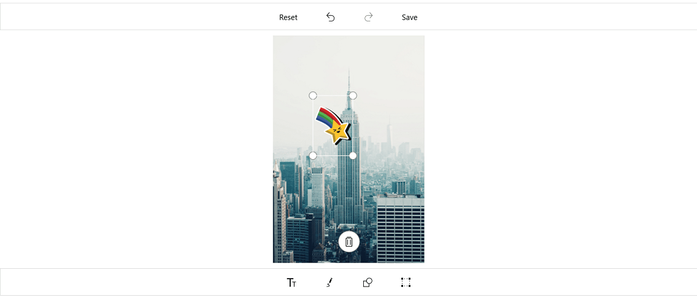
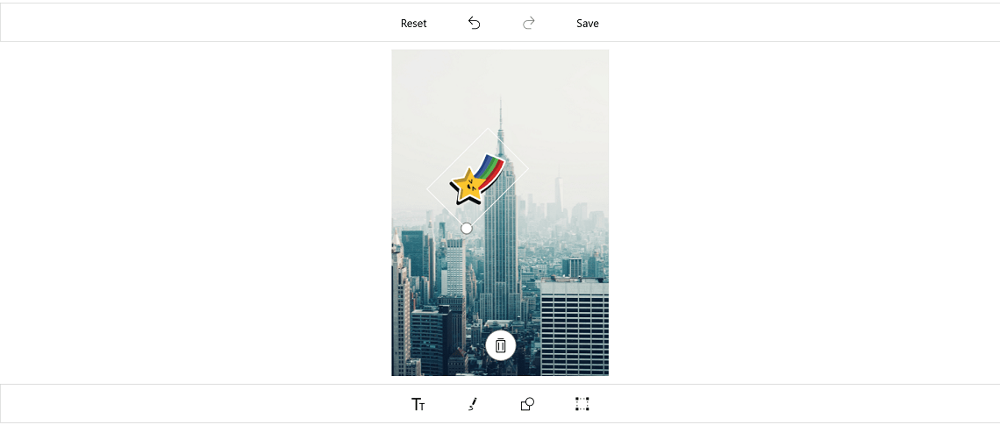

# Adding custom view UWP Image Editor

 You can add any custom shape or view to an image using the `AddCustomView` method in the image editor
 control. To add a custom view, specify the view and its desired `CustomViewSettings` as demonstrated in the 
 following code snippet.



            Image customImage = new Image() { Height = 100, Width = 100 };
            customImage.Source = new BitmapImage(new Uri("ms-appx:///customImage.png"));
            imageEditor.AddCustomView(customImage, new CustomViewSettings());



N> If you add the custom view when the SfImageEditor loaded in a view without image, then you need to call the [`AddCustomView`](https://help.syncfusion.com/cr/uwp/Syncfusion.UI.Xaml.ImageEditor.SfImageEditor.html#Syncfusion_UI_Xaml_ImageEditor_SfImageEditor_AddCustomView_Windows_UI_Xaml_FrameworkElement_Syncfusion_UI_Xaml_ImageEditor_CustomViewSettings_) method after some time delay. If you add the custom view when the SfImageEditor loaded in a view with image, then you need to call the [`AddCustomView`](https://help.syncfusion.com/cr/uwp/Syncfusion.UI.Xaml.ImageEditor.SfImageEditor.html#Syncfusion_UI_Xaml_ImageEditor_SfImageEditor_AddCustomView_Windows_UI_Xaml_FrameworkElement_Syncfusion_UI_Xaml_ImageEditor_CustomViewSettings_) method in the [`ImageLoaded`](https://help.syncfusion.com/cr/uwp/Syncfusion.UI.Xaml.ImageEditor.SfImageEditor.html#Syncfusion_UI_Xaml_ImageEditor_SfImageEditor_ImageLoaded) event as shown in the following code sample.



        imageEditor.ImageLoaded += (Object sender, ImageLoadedEventArgs args) =>
          {
              
            Image customImage = new Image() { Height = 100, Width = 100 };
            customImage.Source = new BitmapImage(new Uri("ms-appx:///customImage.png"));
            imageEditor.AddCustomView(customImage, new CustomViewSettings());

          };



## Custom view settings

The `CustomViewSettings` is defined to set values for the `CanMaintainAspectRatio`, `Bounds`, and `Angle` properties.

* The CanMaintainAspectRatio property is used to decide whether the aspect ratio value needs to be maintained when resizing the custom view.

* Bounds property is used to set the boundaries of the custom view. Using this property, you can position the custom view wherever you want on the image. In percentage, the value should fall between 0 and 100.

* Angle property is used to set the angle for custom view. Using this property, you can rotate the custom view to the desired angle.

* [`EnableDrag`](https://help.syncfusion.com/cr/uwp/Syncfusion.UI.Xaml.ImageEditor.CustomViewSettings.html#Syncfusion_UI_Xaml_ImageEditor_CustomViewSettings_EnableDrag) - Controls the dragging of selected view over the image.



            CustomViewSettings customViewSettings = new CustomViewSettings()
            {
                CanMaintainAspectRatio = false,
                Bounds = new Rect(30, 30, 30, 30)
            };



## Custom view rotation

You can rotate and resize the custom view by enabling the `RotatableElements` property of image editor. `ImageEditorElements` is an enum type with values Text, CustomView and None as demonstrated in the following code snippet.



        imageEditor.RotatableElements = Syncfusion.UI.Xaml.ImageEditor.Enums.ImageEditorElements.CustomView;



>Note: The default value for RotatableElements is `None`.

You can rotate the custom view based on a particular angle using `Angle` property in `CustomViewSettings` as demonstrated in the following code snippet. 





        imageEditor.AddCustomView(customImage, new CustomViewSettings(){Angle = 45});    





## Restricting the custom view resize

You can restrict the custom view resizing using the [`IsResizable`](https://help.syncfusion.com/cr/uwp/Syncfusion.UI.Xaml.ImageEditor.CustomViewSettings.html#Syncfusion_UI_Xaml_ImageEditor_CustomViewSettings_IsResizable) property. By default, the value of the IsResizable property is true, so you can resize the custom view added on an image. When the [`IsResizable`](https://help.syncfusion.com/cr/uwp/Syncfusion.UI.Xaml.ImageEditor.CustomViewSettings.html#Syncfusion_UI_Xaml_ImageEditor_CustomViewSettings_IsResizable) property is disabled, custom view added on an image cannot be resized and you can only drag the custom view over an image as shown in the following code sample.



        Image customImage = new Image() { Height = 100, Width = 100 };
        customImage.Source = new BitmapImage(new Uri("ms-appx:///customImage.png"));
        imageEditor.AddCustomView(customImage, new CustomViewSettings() { IsResizable = false });



## See also

[How to disable resizing the shapes text and custom](https://www.syncfusion.com/kb/9476/how-to-disable-resizing-the-shapes-text-and-customview)