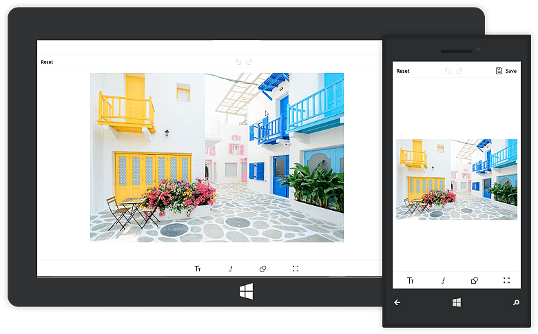

# Getting Started with UWP Image Editor (SfImageEditor)

This section explains the steps required to load an image to the image editor. Image editor has a built-in toolbar that has options to edit the image with shapes, path, text, crop, rotate and flip.

## Configuring SfImageEditor

After installing Essential Studio for UWP, you can find all the required assemblies in the installation folder,

**SfImageEditor** is available in the following assembly and namespace:

**Assembly**: Syncfusion.SfImageEditor.UWP

**Namespace**: Syncfusion.UI.Xaml.ImageEditor

N> In addition, you have to install a [`Win2D`](https://www.nuget.org/packages/Win2D.uwp) package to save the image.

## Initialize the image editor

* Import the SfImageEditor namespace as shown below,







    xmlns:syncfusion="using:Syncfusion.UI.Xaml.ImageEditor"
    




    using Syncfusion.UI.Xaml.ImageEditor;
    






{{ codesnippet1 | UnOrderList_Indent_Level_1 }} 

* Initialize the image editor as shown below,







    <syncfusion:SfImageEditor/>
    




    SfImageEditor editor = new SfImageEditor();
    grid.Children.Add(editor);
    






{{ codesnippet2 | UnOrderList_Indent_Level_1 }} 

## Loading an image to the image editor

It can be done by the following two ways:

* Using bitmap object
* Using Stream

### Using bitmap object

You can load an image to the control as a bitmap object.



     IRandomAccessStream stream = await file.OpenAsync(FileAccessMode.Read);
     BitmapImage bitMapImage = new BitmapImage();
     image.SetSource(stream);
     imageEditor.ImageSource = bitMapImage;
    


### Using Stream

You can load an image to the control as a stream.



    IRandomAccessStream stream = await file.OpenAsync(FileAccessMode.Read);
    imageEditor.Image = stream;



* After an image has been loaded to the SfImageEditor, you can start to edit an image by using the built-in Toolbar

## See also

[How to enable access permission in uwp application](https://support.syncfusion.com/kb/article/7751/how-to-enable-access-permission-in-uwp-application)