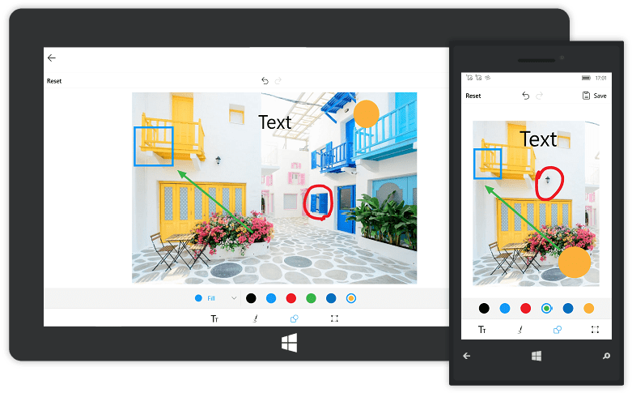
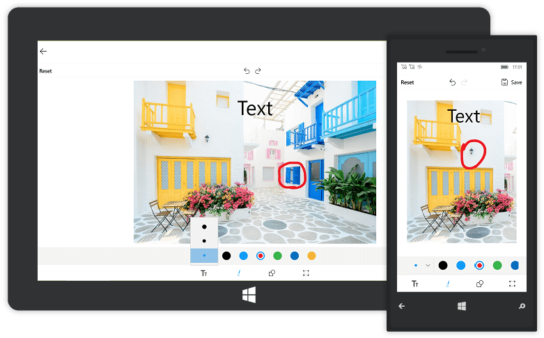

# Shapes of SfImageEditor

You can annotate any path on an image by using free hand drawing and adding texts and shapes such as rectangle, circle, arrow over the image. The shapes and text can be added in the following two ways:

* From Toolbar
* Using Code

## To add a shape (Rectangle, Circle, Arrow) over an image

### From Toolbar

To add shapes from the toolbar, click the `Shapes` icon in the toolbar. When the `Shapes` icon is tapped, a sub toolbar will appear on top of that toolbar. From that sub toolbar, choose the shape (`Rectangle`, `Circle` or `Arrow`). Click the desired shape; the shape will be added to the center of the image. The shape will has the handles on each edge; it helps to resize the shape to the desired size and it can be moved to the desired position by dragging.

#### Change Color and Fill Options of the Shape

You can change the selected shape Color and [`Mode`](https://help.syncfusion.com/cr/uwp/sfimageeditor) of the shape as outline or fill. The color palette of the shapes can be customized by using ColorPalette property.

T> By default, the shape color is Red stroke with Transparent fill.

### Using Code

Shapes can be added based on the [`ShapeType`](https://help.syncfusion.com/cr/uwp/sfimageeditor) and [`PenSettings`](https://help.syncfusion.com/cr/uwp/sfimageeditor) by using a method `AddShape` in the SfImageEditor control.

* To add a rectangle, circle or arrow over the image, specify the ShapeType as well as the desired PenSettings as shown in below code,



    imageEditor.AddShape(ShapeType.Arrow,new PenSettings() 
    {
        StrokeWidth = 2
    });



* You can annotate any path on an image by using free hand drawing as shown in the below code,



    imageEditor.AddShape(ShapeType.Path,new PenSettings() 
    { 
        PathStrokeWidth=10
    });



N> If you add the shape when the SfImageEditor loaded in a view without image, then you need to call the [`AddShape`](https://help.syncfusion.com/cr/uwp/Syncfusion.UI.Xaml.ImageEditor.SfImageEditor.html#Syncfusion_UI_Xaml_ImageEditor_SfImageEditor_AddShape_Syncfusion_UI_Xaml_ImageEditor_Enums_ShapeType_Syncfusion_UI_Xaml_ImageEditor_PenSettings_) method after some time delay. If you add the shape when the SfImageEditor loaded in a view with image, then you need to call the [`AddShape`](https://help.syncfusion.com/cr/uwp/Syncfusion.UI.Xaml.ImageEditor.SfImageEditor.html#Syncfusion_UI_Xaml_ImageEditor_SfImageEditor_AddShape_Syncfusion_UI_Xaml_ImageEditor_Enums_ShapeType_Syncfusion_UI_Xaml_ImageEditor_PenSettings_) method in the [`ImageLoaded`](https://help.syncfusion.com/cr/uwp/Syncfusion.UI.Xaml.ImageEditor.SfImageEditor.html#Syncfusion_UI_Xaml_ImageEditor_SfImageEditor_ImageLoaded) event as shown in the following code sample.



        imageEditor.ImageLoaded += (Object sender, ImageLoadedEventArgs args) =>
            {
                  imageEditor.AddShape(ShapeType.Circle,new PenSettings() { });
            };



## To delete a shape or text from the view

You can delete a selected shape or text from the view in the following two ways:

* Using Code
* From Toolbar

### From Toolbar

When a shape is selected, a circular floating button with Delete icon will appear on top of the toolbar. To delete the selected shape from the view, use `Delete` icon.

### Using Code

programmatically, the selected shape can be deleted by using the Delete method as shown below,



    imageEditor.Delete();



N> You cannot delete the path.

## Resize a shape or text or customView

You can resize a selected shape, text, or customView using the `ResizableElements` property.

Example: imageEditor.ResizableElements = Syncfusion.UI.Xaml.ImageEditor.Enums.ImageEditorResizableElements.Shapes represents that shapes(`Rectangle`, `Circle` or `Arrow`) can be resizable. Other elements such as Text and CustomView cannot be resizable.

>Note: By default, all the elements are resizable.



    imageEditor.ResizableElements = Syncfusion.UI.Xaml.ImageEditor.Enums.ImageEditorResizableElements.Shapes;



## Restricting the shape resize

You can restrict the shape resizing using the [`IsResizable`](https://help.syncfusion.com/cr/uwp/Syncfusion.UI.Xaml.ImageEditor.PenSettings.html#Syncfusion_UI_Xaml_ImageEditor_PenSettings_IsResizable) property. By default, the value of the IsResizable property is true, so you can resize the shape added on an image. When the [`IsResizable`](https://help.syncfusion.com/cr/uwp/Syncfusion.UI.Xaml.ImageEditor.PenSettings.html#Syncfusion_UI_Xaml_ImageEditor_PenSettings_IsResizable) property is disabled, shape added on an image cannot be resized and you can only drag the shape over an image as shown in the following code sample.



 imageEditor.AddShape(ShapeType.Circle, new PenSettings() { IsResizable=false });



## See also

[How to disable resizing the shapes text and custom](https://www.syncfusion.com/kb/9476/how-to-disable-resizing-the-shapes-text-and-customview)