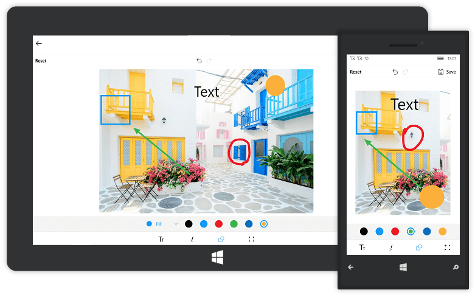
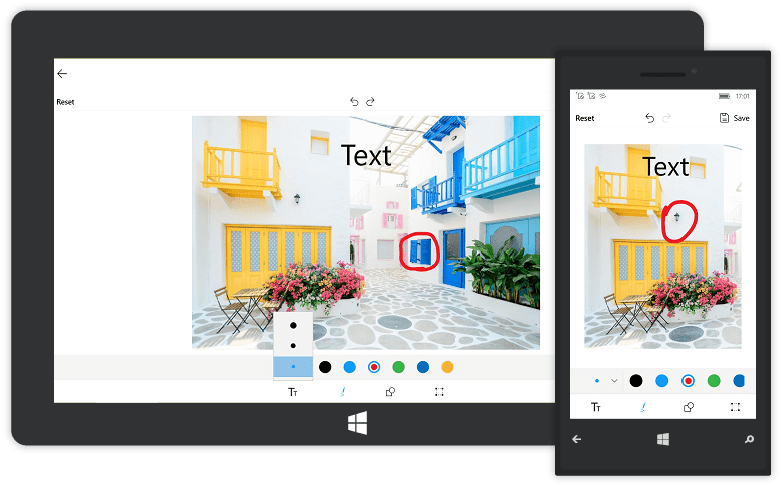

The following namespaces are required for adding shapes in the SfImageEditor control:

* `Syncfusion.UI.Xaml.ImageEditor`
* `Syncfusion.UI.Xaml.ImageEditor.Enums`

# Shapes in UWP Image Editor (SfImageEditor)

You can annotate any path on an image by using free-hand drawing, and add texts and shapes over the image.

The shapes and text can be added in the following two ways:

* From the toolbar
* Using code

The following shapes can be added:

* `Rectangle`
* `Circle`
* `Arrow`
* `Line`
* `Dotted`
* `DoubleArrow`
* `DottedArrow`
* `DottedDoubleArrow`

## To add a shape over an image

### From the toolbar

To add shapes from the toolbar, click the `Shapes` icon in the toolbar. When the `Shapes` icon is tapped, a sub-toolbar will appear on top of the main toolbar. From that sub-toolbar, choose the shape (`Rectangle`, `Circle`, or `Arrow`). Click the desired shape; the shape will be added to the center of the image. The shape will have handles on each edge; it helps to resize the shape to the desired size, and it can be moved to the desired position by dragging.

#### Change color and fill options of the shape

You can change the selected shape color and [`Mode`](https://help.syncfusion.com/cr/uwp/sfimageeditor) of the shape as outline or fill. The color palette of the shapes can be customized by using the `ColorPalette` property.

N> By default, the shape color is red stroke with a transparent fill.

### Using code

Shapes can be added based on the [`ShapeType`](https://help.syncfusion.com/cr/uwp/sfimageeditor) and [`PenSettings`](https://help.syncfusion.com/cr/uwp/sfimageeditor) by using the `AddShape` method in the SfImageEditor control.

* To add a rectangle, circle, or arrow over the image, specify the `ShapeType` as well as the desired `PenSettings` as shown in the code below:





    using Syncfusion.UI.Xaml.ImageEditor;
    using Syncfusion.UI.Xaml.ImageEditor.Enums;

    imageEditor.AddShape(ShapeType.Arrow, new PenSettings()
    {
        StrokeWidth = 2
    });





{{ codesnippet1 | UnOrderList_Indent_Level_1 }} 

* You can annotate any path on an image by using free-hand drawing as shown in the code below:





    using Syncfusion.UI.Xaml.ImageEditor;
    using Syncfusion.UI.Xaml.ImageEditor.Enums;

    imageEditor.AddShape(ShapeType.Path, new PenSettings()
    {
        PathStrokeWidth = 10
    });





{{ codesnippet2 | UnOrderList_Indent_Level_1 }} 

By default, the toolbar contains the `Rectangle`, `Circle`, `Arrow`, and `Path` shapes. You can add other shapes to the toolbar items by using the `VisibleShapesItems` property in [`ToolbarSettings`](https://help.syncfusion.com/cr/uwp/Syncfusion.UI.Xaml.ImageEditor.ToolbarSettings.html).

`VisibleShapesItems` is an enum property with values of `Rectangle`, `Circle`, `Arrow`, `Path`, `Line`, `Dotted`, `DoubleArrow`, `DottedArrow`, and `DottedDoubleArrow`. You can specify one or more shapes in the property to add shapes to the toolbar.



    using Syncfusion.UI.Xaml.ImageEditor.Enums;

    editor.ToolbarSettings.VisibleShapesItems = ImageEditorShapes.Line | ImageEditorShapes.Dotted |
                                                ImageEditorShapes.DottedArrow |
                                                ImageEditorShapes.DottedDoubleArrow |
                                                ImageEditorShapes.DoubleArrow;



N> If you add a shape when the SfImageEditor is loaded in a view without an image, then you need to call the [`AddShape`](https://help.syncfusion.com/cr/uwp/Syncfusion.UI.Xaml.ImageEditor.SfImageEditor.html#Syncfusion_UI_Xaml_ImageEditor_SfImageEditor_AddShape_Syncfusion_UI_Xaml_ImageEditor_Enums_ShapeType_Syncfusion_UI_Xaml_ImageEditor_PenSettings_) method after some time delay. If you add the shape when the SfImageEditor is loaded in a view with an image, then you need to call the [`AddShape`](https://help.syncfusion.com/cr/uwp/Syncfusion.UI.Xaml.ImageEditor.SfImageEditor.html#Syncfusion_UI_Xaml_ImageEditor_SfImageEditor_AddShape_Syncfusion_UI_Xaml_ImageEditor_Enums_ShapeType_Syncfusion_UI_Xaml_ImageEditor_PenSettings_) method in the [`ImageLoaded`](https://help.syncfusion.com/cr/uwp/Syncfusion.UI.Xaml.ImageEditor.SfImageEditor.html#Syncfusion_UI_Xaml_ImageEditor_SfImageEditor_ImageLoaded) event as shown in the following code sample.



    using Syncfusion.UI.Xaml.ImageEditor;
    using Syncfusion.UI.Xaml.ImageEditor.Enums;

    imageEditor.ImageLoaded += (object sender, ImageLoadedEventArgs args) =>
    {
        imageEditor.AddShape(ShapeType.Circle, new PenSettings() { });
    };



## To delete a shape or text from the view

You can delete a selected shape or text from the view in the following two ways:

* Using code
* From the toolbar

### From the toolbar

When a shape is selected, a circular floating button with a delete icon will appear on top of the toolbar. To delete the selected shape from the view, use the `Delete` icon.

### Using code

Programmatically, the selected shape can be deleted by using the `Delete` method as shown below:



    imageEditor.Delete();



N> You cannot delete the path.

## Resize a shape, text, or custom view

You can resize a selected shape, text, or custom view using the `ResizableElements` property.

For example, `imageEditor.ResizableElements = ImageEditorResizableElements.Shapes` represents that shapes (`Rectangle`, `Circle`, or `Arrow`) can be resized. Other elements such as Text and CustomView cannot be resized.

N> By default, all the elements are resizable.



    using Syncfusion.UI.Xaml.ImageEditor.Enums;

    imageEditor.ResizableElements = ImageEditorResizableElements.Shapes;



## Restricting the shape resize

You can restrict the shape resizing using the [`IsResizable`](https://help.syncfusion.com/cr/uwp/Syncfusion.UI.Xaml.ImageEditor.PenSettings.html#Syncfusion_UI_Xaml_ImageEditor_PenSettings_IsResizable) property. By default, the value of the `IsResizable` property is `true`, so you can resize the shape added on an image. When the [`IsResizable`](https://help.syncfusion.com/cr/uwp/Syncfusion.UI.Xaml.ImageEditor.PenSettings.html#Syncfusion_UI_Xaml_ImageEditor_PenSettings_IsResizable) property is set to `false`, the shape added on an image cannot be resized and you can only drag the shape over an image as shown in the following code sample.



    using Syncfusion.UI.Xaml.ImageEditor;
    using Syncfusion.UI.Xaml.ImageEditor.Enums;

    imageEditor.AddShape(ShapeType.Circle, new PenSettings() { IsResizable = false });



## See also

[How to disable resizing the shapes, text, and custom view](https://www.syncfusion.com/kb/9476/how-to-disable-resizing-the-shapes-text-and-customview)
