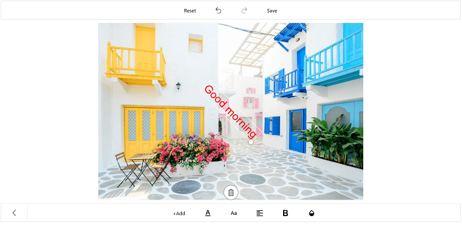

# Text of SfImageEditor

To add the desired text elements over the image, use the following two ways:

* From Toolbar
* Using Code

## From Toolbar

To add text from the toolbar, click on the `Text` icon in the toolbar. When the Text icon is tapped, a pop-up will appear. To add the text over the image, Type the desired text and click OK. To close the pop-up, click CANCEL button. By dragging, the text can be moved to the desired place.

### To Change Color of the selected Text

Select the desired text and click on the color palette available in the sub menu.

### Change TextEffect of selected Text

Changes the effects of the text such as `Bold`, `Italic` and `Underline`. 

## Using Code

programmatically, the desired text elements also can be added over the image. The `AddText` method in the SfImageEditor control is used to add text based on the string value and [`TextSettings`](https://help.syncfusion.com/cr/uwp/sfimageeditor).

N> If you add the text when the SfImageEditor loaded in a view without image, then you need to call the [`AddText`](https://help.syncfusion.com/cr/uwp/Syncfusion.UI.Xaml.ImageEditor.SfImageEditor.html#Syncfusion_UI_Xaml_ImageEditor_SfImageEditor_AddText_System_String_Syncfusion_UI_Xaml_ImageEditor_TextSettings_) method after some time delay. If you add the text when the SfImageEditor loaded in a view with image, then you need to call the [`AddText`](https://help.syncfusion.com/cr/uwp/Syncfusion.UI.Xaml.ImageEditor.SfImageEditor.html#Syncfusion_UI_Xaml_ImageEditor_SfImageEditor_AddText_System_String_Syncfusion_UI_Xaml_ImageEditor_TextSettings_) method in the [`ImageLoaded`](https://help.syncfusion.com/cr/uwp/Syncfusion.UI.Xaml.ImageEditor.SfImageEditor.html#Syncfusion_UI_Xaml_ImageEditor_SfImageEditor_ImageLoaded) event as shown in the following code sample.



        imageEditor.ImageLoaded += (Object sender, ImageLoadedEventArgs args) =>
            {
                 imageEditor.AddText("New Text", new TextSettings());
            };

### TextSettings

TextSettings is defined to set the values for Color and FontSize.



    imageEditor.AddText("CustomTextView", new TextSettings() { Color = new SolidColorBrush(Colors.Orange), TextEffects = TextEffects.Bold | TextEffects.Italic | TextEffects.Underline });



## Multiline text and text alignment

### Multiline text
You can annotate multiple line text over an image with the help of text preview window.

### Text alignment
`TextAlignment` is an enum type and text can be aligned with the help of text alignment enum values such as left, right and center. 

N> The default text alignment is `Left` and text alignment is not applicable for single line text.



    imageEditor.AddText("Hello\nGood morning\nHave a nice day", new TextSettings() {TextAlignment = TextAlignment.Right });



## Text Rotation

You can rotate and resize the text by enabling the `RotatableElements` property of image editor. `ImageEditorElements` is an enum type with values Text, CustomView and None as shown in the following code snippet.





    imageEditor.RotatableElements = ImageEditorElements.Text;   





N> The default value for RotatableElements is `None`.

You can rotate the text based on a particular angle using `Angle` property in `TextSettings` as shown in the following code snippet. 





    imageEditor.AddText("Good morning", new TextSettings(){Angle = 45});    





## Restricting the edit text box pop-up window

You can restrict the edit text box pop-up window using the [`IsEditable`](https://help.syncfusion.com/cr/uwp/Syncfusion.UI.Xaml.ImageEditor.TextSettings.html#Syncfusion_UI_Xaml_ImageEditor_TextSettings_IsEditable) property. By default, the value of the IsEditable property is true, so you can edit the text in edit text box pop-up window. When setting the IsEditable property to false, the edit text box pop-up window will not be displayed, and you are restricted to edit the text in the edit text box. 



    imageEditor.AddText("text", new TextSettings { IsEditable=false });



## Restricting the text resize

You can restrict the text resizing using the [`IsResizable`](https://help.syncfusion.com/cr/uwp/Syncfusion.UI.Xaml.ImageEditor.TextSettings.html#Syncfusion_UI_Xaml_ImageEditor_TextSettings_IsResizable) property. By default, the value of the IsResizable property is true, so you can resize the text added on an image. When the [`IsResizable`](https://help.syncfusion.com/cr/uwp/Syncfusion.UI.Xaml.ImageEditor.TextSettings.html#Syncfusion_UI_Xaml_ImageEditor_TextSettings_IsResizable) property is disabled, text added on an image cannot be resized and you can only drag the text over an image as shown in the following code sample.



    imageEditor.AddText("Enter Text", new TextSettings { IsResizable = false });



## See also

[How to add text after image has been loaded in uwp](https://www.syncfusion.com/kb/10073/how-to-add-text-after-image-has-been-loaded-in-uwp)

[How to disable resizing the shapes text and custom](https://www.syncfusion.com/kb/9476/how-to-disable-resizing-the-shapes-text-and-customview)