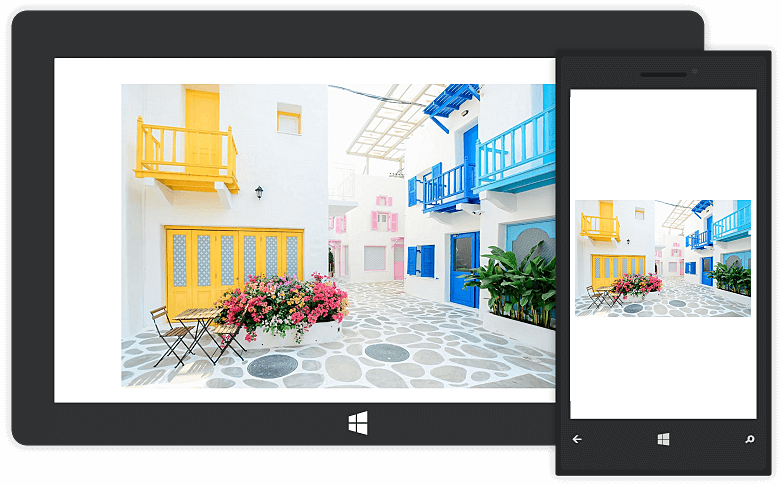
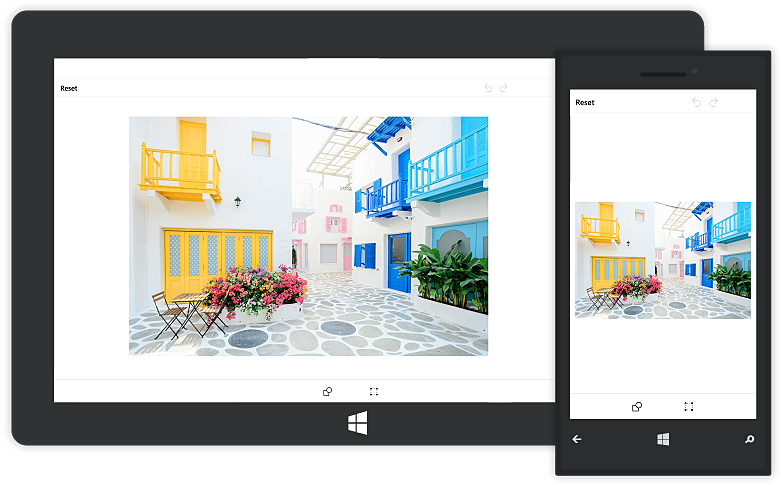
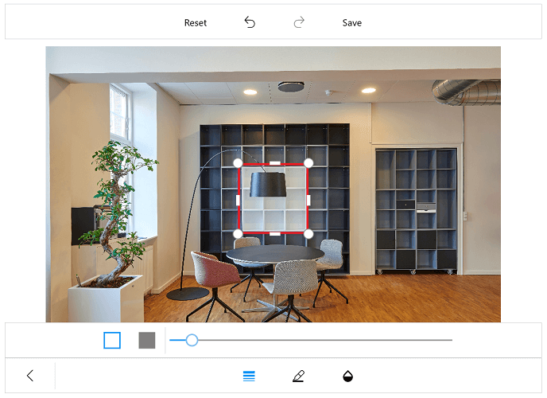
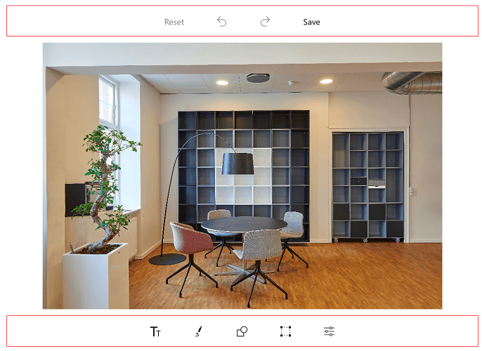

# Toolbar Customization

You can change the default colors of the ColorPalette and visibility of the toolbar.

## Customize toolbar items

The SfImageEditor control provides support to customize and configure the appearance of toolbar menu. You can customize the toolbar by adding respective FooterToolbarItem and HeaderToolbarItem.

### Toolbar item

You can customize each toolbar item using the [`Text`](https://help.syncfusion.com/cr/uwp/Syncfusion.UI.Xaml.ImageEditor.ToolbarItem.html#Syncfusion_UI_Xaml_ImageEditor_ToolbarItem_Text) and [`Icon`](https://help.syncfusion.com/cr/uwp/Syncfusion.UI.Xaml.ImageEditor.ToolbarItem.html#Syncfusion_UI_Xaml_ImageEditor_ToolbarItem_Icon) properties.

The toolbar menu contains a set of header and footer menu items that help to performs editing actions. This can be categorized into the following types:

1. HeaderToolbarItem
2. FooterToolbarItem
3. SubItems

## Adding a HeaderToolbarItem

The [`HeaderToolbarItem`](https://help.syncfusion.com/cr/uwp/Syncfusion.UI.Xaml.ImageEditor.HeaderToolbarItem.html) is placed on the top of the image editor, and you can customize the HeaderToolbarItem using the [`Icon`](https://help.syncfusion.com/cr/uwp/Syncfusion.UI.Xaml.ImageEditor.ToolbarItem.html#Syncfusion_UI_Xaml_ImageEditor_ToolbarItem_Icon) and [`Text`](https://help.syncfusion.com/cr/uwp/Syncfusion.UI.Xaml.ImageEditor.ToolbarItem.html#Syncfusion_UI_Xaml_ImageEditor_ToolbarItem_Text) properties:



            imageEditor.ToolbarSettings.ToolbarItems.Add(new HeaderToolbarItem() { Icon = new BitmapImage(new Uri("ms-appx://Assets/share.png")), Text = "Share" });



## Adding a FooterToolbarItem   

The [`FooterToolbarItem`](https://help.syncfusion.com/cr/uwp/Syncfusion.UI.Xaml.ImageEditor.FooterToolbarItem.html) is placed on the bottom of the image editor, and you can customize the footer toolbar item using the [`Icon`](https://help.syncfusion.com/cr/uwp/Syncfusion.UI.Xaml.ImageEditor.ToolbarItem.html#Syncfusion_UI_Xaml_ImageEditor_ToolbarItem_Icon) and [`Text`](https://help.syncfusion.com/cr/uwp/Syncfusion.UI.Xaml.ImageEditor.ToolbarItem.html#Syncfusion_UI_Xaml_ImageEditor_ToolbarItem_Text) properties:

Refer to the following code sample to customize footer toolbar item.



      imageEditor.ToolbarSettings.ToolbarItems.Add(new FooterToolbarItem() { Icon = new BitmapImage(new Uri("ms-appx://Assets/share.png")), Text = "Share" });



## Adding sub items to the FooterToolbarItem

The [`SubItems`](https://help.syncfusion.com/cr/uwp/Syncfusion.UI.Xaml.ImageEditor.FooterToolbarItem.html#Syncfusion_UI_Xaml_ImageEditor_FooterToolbarItem_SubItems) is only applicable for [`FooterToolbarItem`](https://help.syncfusion.com/cr/uwp/Syncfusion.UI.Xaml.ImageEditor.FooterToolbarItem.html), and it represents grouped action of respective footer toolbar item. The SubItems will be placed above the footer toolbar item layout, and you can also customize the appearance of SubItems as main toolbar items.

Refer to the following code sample, to customize SubItems of FooterToolbarItem.



 	imageEditor.ToolbarSettings.ToolbarItems.Add(new FooterToolbarItem()
            {
                Text = "More",
                Icon = new BitmapImage(new Uri("ms-appx://Assets/share.more")),
                SubItems = new ObservableCollection<ToolbarItem>()
                {
                   new ToolbarItem() {
                Icon = new BitmapImage(new Uri("ms-appx://Assets/download.png"))
                },
                   new ToolbarItem() {
                Icon = new BitmapImage(new Uri("ms-appx://Assets/share.png"))
                } }
            });



## ToolbarItemSelected event 

Whenever you tap the toolbar menu item, the [`ToolbarItemSelected`](https://help.syncfusion.com/cr/uwp/Syncfusion.UI.Xaml.ImageEditor.ToolbarSettings.html#Syncfusion_UI_Xaml_ImageEditor_ToolbarSettings_ToolbarItemSelected) event will be triggered, and you can get the respective tapped toolbar item as an argument as shown in the following code sample. 



        public MainPage()
        {
            imageEditor.ToolbarSettings.ToolbarItemSelected += ToolbarSettings_ToolbarItemSelected;
        }

        private void ToolbarSettings_ToolbarItemSelected(object sender, ToolbarItemSelectedEventArgs e)
        {
           var text = e.ToolbarItem.Text;
        }



### MoveSubItemsToFooterToolbar 

The [`MoveSubItemsToFooterToolbar`](https://help.syncfusion.com/cr/xamarin/Syncfusion.SfImageEditor.XForms.ToolbarItemSelectedEventArgs.html#Syncfusion_SfImageEditor_XForms_ToolbarItemSelectedEventArgs_MoveSubItemsToFooterToolbar) is boolean property of the ToolbarItemSelected event argument; it decides the placement of each sub items of respective footer toolbar item. 

If you set the value to `true`, the respective sub items of footer item will be placed on footer toolbar layout. If you set `false`, then the sub items will be placed above the footer toolbar layout.



    public MainPage()
            {
                        . . .

                imageEditor.ToolbarSettings.ToolbarItems.Add(new FooterToolbarItem()
                    {
                        Text = "NewFooterItem",
                        SubItems = new ObservableCollection<ToolbarItem>()
                        {
                            new ToolbarItem(){ Text= "Subitem1"},
                            new ToolbarItem(){ Text= "Subitem2"},
                            new ToolbarItem(){ Text= "Subitem3"},
                        }
                    });
                imageEditor.ToolbarSettings.ToolbarItemSelected += ToolbarSettings_ToolbarItemSelected;
                        
                        . . .
            }

    private void ToolbarSettings_ToolbarItemSelected(object sender, ToolbarItemSelectedEventArgs e)
            {
                if(e.ToolbarItem != null && e.ToolbarItem is FooterToolbarItem)
                {
                    if(e.ToolbarItem.Text == "NewFooterItem")
                    {
                        e.MoveSubItemsToFooterToolbar = true;
                    }
                }
            }



N> This is not applicable for built-in footer toolbar items.

## To customize the ColorPalette

The following code explains to change the colors of the ColorPalette.





    <control:SfImageEditor.ColorPalette>

        <SolidColorBrush>Yellow</SolidColorBrush>
        <SolidColorBrush>Pink</SolidColorBrush>
        <SolidColorBrush>Violet</SolidColorBrush>

    </control:SfImageEditor.ColorPalette>    





    List<SolidColorBrush> CustomColorPalette = new List<SolidColorBrush>()
    {
            new SolidColorBrush(Colors.Yellow),
            new SolidColorBrush(Colors.Pink),
            new SolidColorBrush(Colors.Violet)
    };
     
    imageEditor.ColorPalette = CustomColorPalette;





## To hide/visible the toolbar

You can customize the toolbar as shown below,





    <control:SfImageEditor.ToolbarSettings>
        <control:ToolbarSettings IsToolbarVisiblity="False"/>
    </control:SfImageEditor.ToolbarSettings>

            



    imageEditor.ToolbarSettings.IsToolbarVisiblity = false;





## To hide/visible the toolbar item

You can customize the toolbar items namely, text, path, shapes, transform, rectangle, circle, arrow, flip, crop, rotate, reset, undo, Redo and save as shown below,



    imageEditor.SetToolbarItemVisibility("text, save", false); 



## To hide or show the delete button

You can show or hide the delete button, which employed in deleting the selected shapes added in image editor with the help of [`ShowDeleteButton`](https://help.syncfusion.com/cr/uwp/Syncfusion.UI.Xaml.ImageEditor.ToolbarSettings.html#Syncfusion_UI_Xaml_ImageEditor_ToolbarSettings_ShowDeleteButton) property in [`ToolbarSettings`](https://help.syncfusion.com/cr/uwp/Syncfusion.UI.Xaml.ImageEditor.ToolbarSettings.html).

Setting false for this property will never show the delete button. On setting true, delete button will get enabled by selecting the shapes.





            <syncfusion:SfImageEditor.ToolbarSettings>
                <syncfusion:ToolbarSettings ShowDeleteButton="False"></syncfusion:ToolbarSettings>
            </syncfusion:SfImageEditor.ToolbarSettings>

            



            ToolbarSettings settings = new ToolbarSettings();
            settings.ShowDeleteButton = false;
            imageEditor.ToolbarSettings = settings;





## Default color selected index

You can change the default index of the color palette in the toolbar. By default, color palette index value is 2.




  
    <imageeditor:SfImageEditor x:Name="imageEditor" DefaultSelectedColorIndex="0"/>
      




    imageEditor.DefaultSelectedColorIndex = 4;





## Customization of toolbar height

You can customize `height of the toolbar` and also toolbar items `icon` and `text`.

### Customize toolbar height 

The image editor control supports to customize the default height of the `Header`, `Footer`, and `Sub item` using the following properties:

1. [`HeaderToolbarHeight`](https://help.syncfusion.com/cr/uwp/Syncfusion.UI.Xaml.ImageEditor.ToolbarSettings.html#Syncfusion_UI_Xaml_ImageEditor_ToolbarSettings_HeaderToolbarHeight)
2. [`FooterToolbarHeight`](https://help.syncfusion.com/cr/uwp/Syncfusion.UI.Xaml.ImageEditor.ToolbarSettings.html#Syncfusion_UI_Xaml_ImageEditor_ToolbarSettings_FooterToolbarHeight) 
3. [`SubItemToolbarHeight`](https://help.syncfusion.com/cr/uwp/Syncfusion.UI.Xaml.ImageEditor.ToolbarSettings.html#Syncfusion_UI_Xaml_ImageEditor_ToolbarSettings_SubItemToolbarHeight)

The toolbar items will be resized based on the height. To change the height of the toolbar, refer to the following code sample.





         <imageeditor:SfImageEditor.ToolbarSettings>
                    <imageeditor:ToolbarSettings 
                        HeaderToolbarHeight="70"
                        FooterToolbarHeight="70"                          
                        SubItemToolbarHeight="70"/>
         </imageeditor:SfImageEditor.ToolbarSettings>





    imageEditor.ToolbarSettings.HeaderToolbarHeight = 70;
    imageEditor.ToolbarSettings.FooterToolbarHeight = 70;
    imageEditor.ToolbarSettings.SubItemToolbarHeight = 70;





### Individual toolbar item height customization

You can arrange the toolbar items based on the toolbar height using the following properties:

1.  [`TextHeight`](https://help.syncfusion.com/cr/uwp/Syncfusion.UI.Xaml.ImageEditor.ToolbarItem.html#Syncfusion_UI_Xaml_ImageEditor_ToolbarItem_TextHeight)
2.  [`IconHeight`](https://help.syncfusion.com/cr/uwp/Syncfusion.UI.Xaml.ImageEditor.ToolbarItem.html#Syncfusion_UI_Xaml_ImageEditor_ToolbarItem_IconHeight)

To change the toolbar items, TextHeight and IconHeight, refer to the following code sample.





        FooterToolbarItem footerItem = new FooterToolbarItem()
            {
                IconHeight = 40,
                TextHeight = 20,
                Icon = new BitmapImage(new Uri("ms-appx://Assets/share.png")),
                Text = "Share"
            };

            imageEditor.ToolbarSettings.ToolbarItems.Add(footerItem);





## Toolbar color customization

Border color of the toolbar can be customized with the help of [`BorderColor`](https://help.syncfusion.com/cr/uwp/Syncfusion.UI.Xaml.ImageEditor.ToolbarSettings.html#Syncfusion_UI_Xaml_ImageEditor_ToolbarSettings_BorderColor) property in ToolbarSettings.





            <syncfusion:SfImageEditor.ToolbarSettings>
                <syncfusion:ToolbarSettings BorderColor="Red"></syncfusion:ToolbarSettings>
            </syncfusion:SfImageEditor.ToolbarSettings>

            



            ToolbarSettings settings = new ToolbarSettings();
            settings.BorderColor = new SolidColorBrush(Colors.Red);
            editor.ToolbarSettings = settings;





