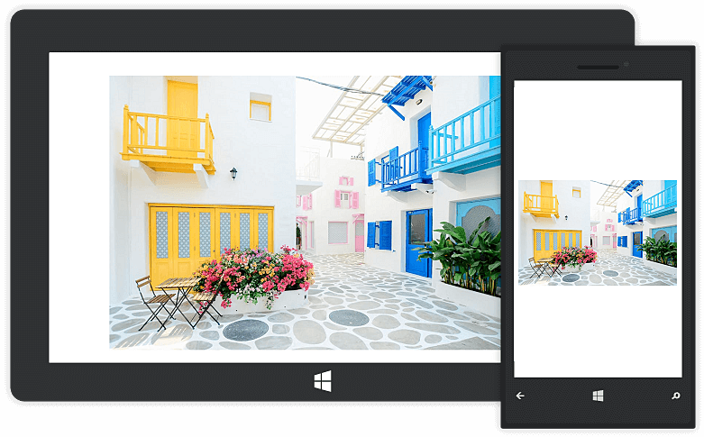
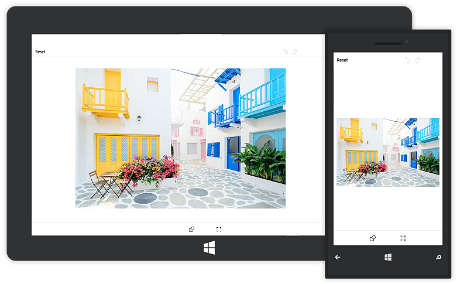
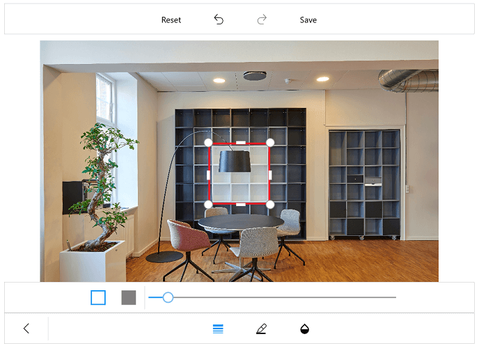
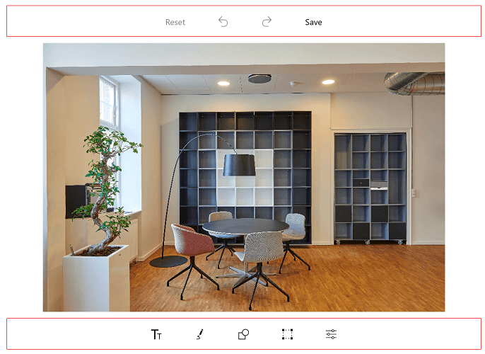

The following namespaces are required for customizing the toolbar in the SfImageEditor control:

* `Syncfusion.UI.Xaml.ImageEditor`
* `Windows.UI`
* `Windows.UI.Xaml.Media`
* `Windows.UI.Xaml.Media.Imaging`
* `System.Collections.ObjectModel`
* `System`

# Toolbar Customization in UWP Image Editor (SfImageEditor)

You can change the default colors of the `ColorPalette` and the visibility of the toolbar.

## Customizing toolbar items

The SfImageEditor control supports customizing and configuring the appearance of the toolbar menu. You can customize the toolbar by adding a respective `FooterToolbarItem` and `HeaderToolbarItem`.

### Toolbar item

You can customize each toolbar item using the [`Text`](https://help.syncfusion.com/cr/uwp/Syncfusion.UI.Xaml.ImageEditor.ToolbarItem.html#Syncfusion_UI_Xaml_ImageEditor_ToolbarItem_Text) and [`Icon`](https://help.syncfusion.com/cr/uwp/Syncfusion.UI.Xaml.ImageEditor.ToolbarItem.html#Syncfusion_UI_Xaml_ImageEditor_ToolbarItem_Icon) properties.

The toolbar menu contains a set of header and footer toolbar items that help to perform editing actions. They can be categorized into the following types:

1. `HeaderToolbarItem`
2. `FooterToolbarItem`
3. `SubItems`

## Adding a HeaderToolbarItem

The [`HeaderToolbarItem`](https://help.syncfusion.com/cr/uwp/Syncfusion.UI.Xaml.ImageEditor.HeaderToolbarItem.html) is placed at the top of the image editor, and you can customize the `HeaderToolbarItem` using the [`Icon`](https://help.syncfusion.com/cr/uwp/Syncfusion.UI.Xaml.ImageEditor.ToolbarItem.html#Syncfusion_UI_Xaml_ImageEditor_ToolbarItem_Icon) and [`Text`](https://help.syncfusion.com/cr/uwp/Syncfusion.UI.Xaml.ImageEditor.ToolbarItem.html#Syncfusion_UI_Xaml_ImageEditor_ToolbarItem_Text) properties.



    using Syncfusion.UI.Xaml.ImageEditor;
    using Windows.UI.Xaml.Media.Imaging;

    imageEditor.ToolbarSettings.ToolbarItems.Add(new HeaderToolbarItem() { Icon = new BitmapImage(new Uri("ms-appx://Assets/share.png")), Text = "Share" });



## Adding a FooterToolbarItem

The [`FooterToolbarItem`](https://help.syncfusion.com/cr/uwp/Syncfusion.UI.Xaml.ImageEditor.FooterToolbarItem.html) is placed at the bottom of the image editor, and you can customize the footer toolbar item using the [`Icon`](https://help.syncfusion.com/cr/uwp/Syncfusion.UI.Xaml.ImageEditor.ToolbarItem.html#Syncfusion_UI_Xaml_ImageEditor_ToolbarItem_Icon) and [`Text`](https://help.syncfusion.com/cr/uwp/Syncfusion.UI.Xaml.ImageEditor.ToolbarItem.html#Syncfusion_UI_Xaml_ImageEditor_ToolbarItem_Text) properties.

Refer to the following code sample to customize the footer toolbar item.



    using Syncfusion.UI.Xaml.ImageEditor;
    using Windows.UI.Xaml.Media.Imaging;

    imageEditor.ToolbarSettings.ToolbarItems.Add(new FooterToolbarItem() { Icon = new BitmapImage(new Uri("ms-appx://Assets/share.png")), Text = "Share" });



## Adding sub items to the FooterToolbarItem

The [`SubItems`](https://help.syncfusion.com/cr/uwp/Syncfusion.UI.Xaml.ImageEditor.FooterToolbarItem.html#Syncfusion_UI_Xaml_ImageEditor_FooterToolbarItem_SubItems) property is applicable only for [`FooterToolbarItem`](https://help.syncfusion.com/cr/uwp/Syncfusion.UI.Xaml.ImageEditor.FooterToolbarItem.html), and it represents the grouped actions of the respective footer toolbar item. The `SubItems` will be placed above the footer toolbar layout, and you can also customize the appearance of `SubItems` as with the main toolbar items.

Refer to the following code sample to customize the `SubItems` of a `FooterToolbarItem`.



    using Syncfusion.UI.Xaml.ImageEditor;
    using System.Collections.ObjectModel;
    using Windows.UI.Xaml.Media.Imaging;

    imageEditor.ToolbarSettings.ToolbarItems.Add(new FooterToolbarItem()
    {
        Text = "More",
        Icon = new BitmapImage(new Uri("ms-appx://Assets/share.more")),
        SubItems = new ObservableCollection<ToolbarItem>()
        {
            new ToolbarItem()
            {
                Icon = new BitmapImage(new Uri("ms-appx://Assets/download.png"))
            },
            new ToolbarItem()
            {
                Icon = new BitmapImage(new Uri("ms-appx://Assets/share.png"))
            }
        }
    });



## ToolbarItemSelected event

Whenever you tap a toolbar menu item, the [`ToolbarItemSelected`](https://help.syncfusion.com/cr/uwp/Syncfusion.UI.Xaml.ImageEditor.ToolbarSettings.html#Syncfusion_UI_Xaml_ImageEditor_ToolbarSettings_ToolbarItemSelected) event will be triggered, and you can get the tapped toolbar item as an argument, as shown in the following code sample.



    using Syncfusion.UI.Xaml.ImageEditor;

    public MainPage()
    {
        imageEditor.ToolbarSettings.ToolbarItemSelected += ToolbarSettings_ToolbarItemSelected;
    }

    private void ToolbarSettings_ToolbarItemSelected(object sender, ToolbarItemSelectedEventArgs e)
    {
        var text = e.ToolbarItem.Text;
    }



### MoveSubItemsToFooterToolbar

The [`MoveSubItemsToFooterToolbar`](https://help.syncfusion.com/cr/uwp/Syncfusion.UI.Xaml.ImageEditor.ToolbarItemSelectedEventArgs.html#Syncfusion_UI_Xaml_ImageEditor_ToolbarItemSelectedEventArgs_MoveSubItemsToFooterToolbar) property is a boolean property of the `ToolbarItemSelected` event argument; it decides the placement of each sub item of the respective footer toolbar item.

If you set the value to `true`, the sub items of the respective footer item will be placed on the footer toolbar layout. If you set it to `false`, then the sub items will be placed above the footer toolbar layout.



    using Syncfusion.UI.Xaml.ImageEditor;
    using System.Collections.ObjectModel;

    public MainPage()
    {
        . . .

        imageEditor.ToolbarSettings.ToolbarItems.Add(new FooterToolbarItem()
        {
            Text = "NewFooterItem",
            SubItems = new ObservableCollection<ToolbarItem>()
            {
                new ToolbarItem() { Text = "Subitem1" },
                new ToolbarItem() { Text = "Subitem2" },
                new ToolbarItem() { Text = "Subitem3" },
            }
        });
        imageEditor.ToolbarSettings.ToolbarItemSelected += ToolbarSettings_ToolbarItemSelected;

        . . .
    }

    private void ToolbarSettings_ToolbarItemSelected(object sender, ToolbarItemSelectedEventArgs e)
    {
        if (e.ToolbarItem != null && e.ToolbarItem is FooterToolbarItem)
        {
            if (e.ToolbarItem.Text == "NewFooterItem")
            {
                e.MoveSubItemsToFooterToolbar = true;
            }
        }
    }



N> This is not applicable for built-in footer toolbar items.

## To customize the ColorPalette

The following code explains how to change the colors of the `ColorPalette`.





    xmlns:control="using:Syncfusion.UI.Xaml.ImageEditor"

    <control:SfImageEditor.ColorPalette>

        <SolidColorBrush>Yellow</SolidColorBrush>
        <SolidColorBrush>Pink</SolidColorBrush>
        <SolidColorBrush>Violet</SolidColorBrush>

    </control:SfImageEditor.ColorPalette>





    using System.Collections.Generic;
    using Syncfusion.UI.Xaml.ImageEditor;
    using Windows.UI;
    using Windows.UI.Xaml.Media;

    List<SolidColorBrush> CustomColorPalette = new List<SolidColorBrush>()
    {
        new SolidColorBrush(Colors.Yellow),
        new SolidColorBrush(Colors.Pink),
        new SolidColorBrush(Colors.Violet)
    };

    imageEditor.ColorPalette = CustomColorPalette;





## To hide or show the toolbar

You can show or hide the toolbar as shown below.





    xmlns:control="using:Syncfusion.UI.Xaml.ImageEditor"

    <control:SfImageEditor.ToolbarSettings>
        <control:ToolbarSettings IsToolbarVisiblity="False"/>
    </control:SfImageEditor.ToolbarSettings>





    imageEditor.ToolbarSettings.IsToolbarVisiblity = false;





## To hide or show toolbar items

You can customize the visibility of the built-in toolbar items, such as text, path, shapes, transform, rectangle, circle, arrow, flip, crop, rotate, reset, undo, redo, and save, as shown below.



    imageEditor.SetToolbarItemVisibility("text, save", false);



## To hide or show the delete button

You can show or hide the delete button, which is used to delete the selected shapes added in the image editor, by using the [`ShowDeleteButton`](https://help.syncfusion.com/cr/uwp/Syncfusion.UI.Xaml.ImageEditor.ToolbarSettings.html#Syncfusion_UI_Xaml_ImageEditor_ToolbarSettings_ShowDeleteButton) property in [`ToolbarSettings`](https://help.syncfusion.com/cr/uwp/Syncfusion.UI.Xaml.ImageEditor.ToolbarSettings.html).

Setting this property to `false` will never show the delete button. Setting it to `true` enables the delete button when shapes are selected.





    xmlns:syncfusion="using:Syncfusion.UI.Xaml.ImageEditor"

    <syncfusion:SfImageEditor.ToolbarSettings>
        <syncfusion:ToolbarSettings ShowDeleteButton="False"></syncfusion:ToolbarSettings>
    </syncfusion:SfImageEditor.ToolbarSettings>





    using Syncfusion.UI.Xaml.ImageEditor;

    ToolbarSettings settings = new ToolbarSettings();
    settings.ShowDeleteButton = false;
    imageEditor.ToolbarSettings = settings;





## Default color selected index

You can change the default index of the color palette in the toolbar. By default, the color palette index is `2`.





    xmlns:imageeditor="using:Syncfusion.UI.Xaml.ImageEditor"

    <imageeditor:SfImageEditor x:Name="imageEditor" DefaultSelectedColorIndex="0"/>





    imageEditor.DefaultSelectedColorIndex = 4;





## Customization of toolbar height

You can customize the height of the toolbar and also the `Icon` and `Text` of the toolbar items.

### Customize the toolbar height

The image editor control supports customizing the default height of the `Header`, `Footer`, and `SubItem` toolbars using the following properties:

1. [`HeaderToolbarHeight`](https://help.syncfusion.com/cr/uwp/Syncfusion.UI.Xaml.ImageEditor.ToolbarSettings.html#Syncfusion_UI_Xaml_ImageEditor_ToolbarSettings_HeaderToolbarHeight)
2. [`FooterToolbarHeight`](https://help.syncfusion.com/cr/uwp/Syncfusion.UI.Xaml.ImageEditor.ToolbarSettings.html#Syncfusion_UI_Xaml_ImageEditor_ToolbarSettings_FooterToolbarHeight)
3. [`SubItemToolbarHeight`](https://help.syncfusion.com/cr/uwp/Syncfusion.UI.Xaml.ImageEditor.ToolbarSettings.html#Syncfusion_UI_Xaml_ImageEditor_ToolbarSettings_SubItemToolbarHeight)

The toolbar items will be resized based on the height. To change the height of the toolbar, refer to the following code sample.





    xmlns:imageeditor="using:Syncfusion.UI.Xaml.ImageEditor"

    <imageeditor:SfImageEditor.ToolbarSettings>
        <imageeditor:ToolbarSettings
            HeaderToolbarHeight="70"
            FooterToolbarHeight="70"
            SubItemToolbarHeight="70"/>
    </imageeditor:SfImageEditor.ToolbarSettings>





    imageEditor.ToolbarSettings.HeaderToolbarHeight = 70;
    imageEditor.ToolbarSettings.FooterToolbarHeight = 70;
    imageEditor.ToolbarSettings.SubItemToolbarHeight = 70;





### Individual toolbar item height customization

You can arrange the toolbar items based on the toolbar height using the following properties:

1. [`TextHeight`](https://help.syncfusion.com/cr/uwp/Syncfusion.UI.Xaml.ImageEditor.ToolbarItem.html#Syncfusion_UI_Xaml_ImageEditor_ToolbarItem_TextHeight)
2. [`IconHeight`](https://help.syncfusion.com/cr/uwp/Syncfusion.UI.Xaml.ImageEditor.ToolbarItem.html#Syncfusion_UI_Xaml_ImageEditor_ToolbarItem_IconHeight)

To change the toolbar items' `TextHeight` and `IconHeight`, refer to the following code sample.





    using Syncfusion.UI.Xaml.ImageEditor;
    using Windows.UI.Xaml.Media.Imaging;

    FooterToolbarItem footerItem = new FooterToolbarItem()
    {
        IconHeight = 40,
        TextHeight = 20,
        Icon = new BitmapImage(new Uri("ms-appx://Assets/share.png")),
        Text = "Share"
    };

    imageEditor.ToolbarSettings.ToolbarItems.Add(footerItem);





## Toolbar color customization

The border color of the toolbar can be customized by using the [`BorderColor`](https://help.syncfusion.com/cr/uwp/Syncfusion.UI.Xaml.ImageEditor.ToolbarSettings.html#Syncfusion_UI_Xaml_ImageEditor_ToolbarSettings_BorderColor) property in `ToolbarSettings`.





    xmlns:syncfusion="using:Syncfusion.UI.Xaml.ImageEditor"

    <syncfusion:SfImageEditor.ToolbarSettings>
        <syncfusion:ToolbarSettings BorderColor="Red"></syncfusion:ToolbarSettings>
    </syncfusion:SfImageEditor.ToolbarSettings>





    using Syncfusion.UI.Xaml.ImageEditor;
    using Windows.UI;
    using Windows.UI.Xaml.Media;

    ToolbarSettings settings = new ToolbarSettings();
    settings.BorderColor = new SolidColorBrush(Colors.Red);
    imageEditor.ToolbarSettings = settings;





