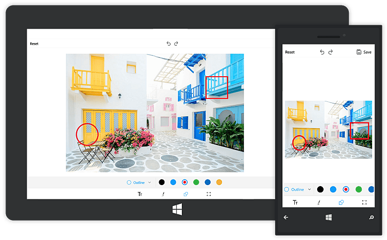

The following namespace is required for performing undo and redo operations in the SfImageEditor control:

* `Syncfusion.UI.Xaml.ImageEditor`

# Undo and Redo in UWP Image Editor (SfImageEditor)

One of the important features of the image editor control is to perform `Undo` and `Redo` operations for adding shapes, text, and drawing paths. You can perform the undo and redo operations in the following two ways:

* From the toolbar
* Using code

N> Undo and Redo will not be applied to cropping and transformations.

## Undo

### From the toolbar

The top toolbar in the SfImageEditor control contains the undo and redo buttons between the `Save` and `Reset` buttons. The Undo and Redo buttons will be disabled by default. When you add a shape, text, or draw a path, the `Undo` button will be enabled. Clicking the Undo button will clear the last performed operation. Undo can be performed for the following operations:

* Add/Delete shapes and text
* Change positions
* Color/Fill changes
* Path drawings

### Using code

Programmatically, the `Undo` method can be used in the SfImageEditor control to revert the changes.



    imageEditor.Undo();



## Redo

### From the toolbar

The Redo button will be disabled by default. The Redo button will be enabled only when an undo operation is performed. Clicking the `Redo` button reverses the undo operations.

### Using code

The `Redo` method is used to redo the changes reverted by the undo operation.



    imageEditor.Redo();



