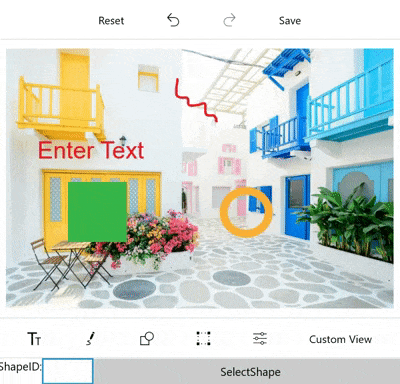

# Select annotations programmatically in Image Editor (SfImageEditor)

In ImageEditor, the Unique ID is generated for all annotations (Text, Shapes, Paths, and CustomViews) when they are added to the image editor and you can get this Unique ID from the ItemsSelected event arguments or from the serialized JSON. By passing this Unique ID to the `SelectShape` method of SfImageEditor, you can select the particular annotation programmatically.

The following code sample demonstrates this.



<Grid>
    <Grid.RowDefinitions>
        <RowDefinition Height="*" />
        <RowDefinition Height="Auto" />
    </Grid.RowDefinitions>

    <imageEditor:SfImageEditor x:Name="ImageEditor"
                               ImageSource="Assets/Buldingimage.jpeg"/>

    <StackPanel Grid.Row="1"
                Orientation="Horizontal">
        <TextBlock Text="ShapeID:" />
        <TextBox x:Name="shapeID" />
        <Button x:Name="SelectShape"
                HorizontalAlignment="Stretch"
                Width="390"
                Content="SelectShape"
                Click="SelectShape_Click" />
    </StackPanel>
</Grid>





public MainPage()
{
    this.InitializeComponent();
    this.ImageEditor.ToolbarSettings.ToolbarItemSelected += this.ToolbarSettings_ToolbarItemSelected;
    this.ImageEditor.ToolbarSettings.ToolbarItems.Add(new FooterToolbarItem()
    {
        Text = "Custom View"
    });
}

private void ToolbarSettings_ToolbarItemSelected(object sender, ToolbarItemSelectedEventArgs e)
{
    if (e.ToolbarItem.Text == "Custom View")
    {
        Image customImage = new Image() { Height = 100, Width = 100 };
        customImage.Source = new BitmapImage(new Uri("ms-appx:///Assets/Buldingimage.jpeg"));
        this.ImageEditor.AddCustomView(customImage, new CustomViewSettings());
    }
}

private void SelectShape_Click(object sender, RoutedEventArgs e)
{
    int shapeId;
    if (int.TryParse(this.shapeID.Text, out shapeId))
    {
        this.ImageEditor.SelectShape(shapeId);
    }
}

private void ImageEditor_ItemSelected(object sender, ItemSelectedEventArgs args)
{
    int uniqueID;
    PenSettings penSettings = args.Settings as PenSettings;
    TextSettings textSettings = args.Settings as TextSettings;
    CustomViewSettings customViewSettings = args.Settings as CustomViewSettings;
    if (penSettings != null)
    {
        uniqueID = penSettings.ShapeID;
    }
    else if (textSettings != null)
    {
        uniqueID = textSettings.ShapeID;
    }
    else
    {
        uniqueID = customViewSettings.ShapeID;
    }
}



