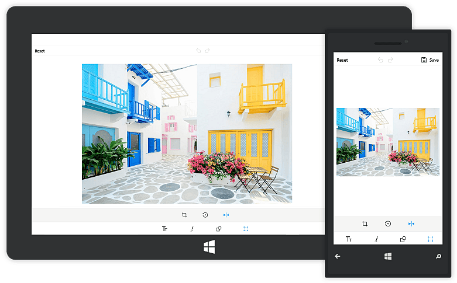

The following namespace is required for performing image transformations in the SfImageEditor control:

* `Syncfusion.UI.Xaml.ImageEditor.Enums`

# Transform in UWP Image Editor (SfImageEditor)

The image editor control can perform image transformations, namely `rotation` and `flip`. The transformations can be achieved in the following two ways:

* From the toolbar
* Using code

## Rotation

### From the toolbar

To rotate an image, in the toolbar, click the `Rotate` button in the submenu of `Transforms`. Clicking the button rotates the image 90 degrees clockwise from its current state.

### Using code

Programmatically, the `Rotate` method is used in the SfImageEditor control to rotate the image.

N> An angle cannot be specified in code to alter the rotation angle of the image.



    imageEditor.Rotate();



## Flip

### From the toolbar

The SfImageEditor control can show the mirror image. To get the mirror image of the loaded image, click the `Flip` button in the submenu of `Transforms` in the toolbar.

### Using code

The `Flip` method flips the image horizontally or vertically based on the [`FlipDirection`](https://help.syncfusion.com/cr/uwp/sfimageeditor), which is specified as an argument for the `Flip` method.

N> By default, the image flips horizontally.



    using Syncfusion.UI.Xaml.ImageEditor.Enums;

    imageEditor.Flip(FlipDirection.Horizontal);



