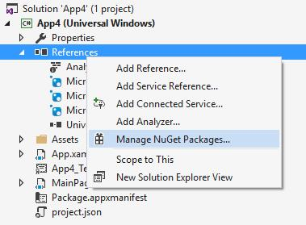
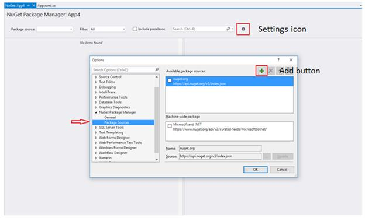
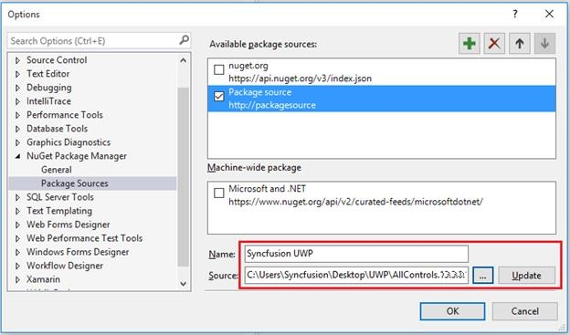
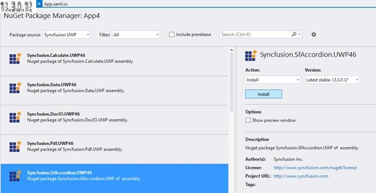

# Installation and Deployment

## Manual Installation

The following procedure illustrates how to install Essential Studio.

* Double-click the Syncfusion Essential Studio UWP setup file. The Self-Extractor wizard opens and extracts the package automatically.
* Enter the User Name, Organization and Unlock Key in corresponding text boxes and click “Next” button.
* After reading the terms and conditions, check the “I accept the terms and conditions” check box.
* Click “Next” button. Then choose the Installation and Samples folder location and click “Install” button.
* Select the “Run Dashboard” check box to launch the Dashboard after the installation has completed.
* Click “Finish” button. Essential Studio for UWP is installed successfully in your system and Syncfusion Essential Studio [Dashboard](http://help.syncfusion.com/ug/common/documents/dashboard.htm#) launches automatically.

## Nuget Installation

The following steps helps to add reference of Syncfusion assemblies in the project references.

1.Right-click the project in Solution Explorer and choose “Manage NuGet Packages”.

2.Click the “Settings” icon. Refer the following screenshot for more information.

3.Press “Add” button. Modify the name and browse the location of NuGet. Then click “Update” button to add the Nu-Get assemblies.

4.Click “Ok” button. Select the required package and click “Install” button to install the package as shown in the following screenshot. 

5.After successful installation, the package will be listed in installed packages filter and the assemblies are added in project references.

## Commandline Installation

Follow the given steps to install Essential Studio for UWP through command line in silent mode.

* Double-click the Syncfusion Essential Studio Setup file. The Self-Extractor wizard opens and extracts the package automatically.
* SyncfusionEssentialStudio_({{ site.releaseversion }}).exe file is extracted into the Temp folder.
* Open Run prompt and then execute the command %Temp” to open the Temp folder. SyncfusionEssentialStudio_({{ site.releaseversion }}).exe file is available in one of the folders.
* Copy the SyncfusionEssentialStudio_({{ site.releaseversion }}).exe file to local drive. Example: D:\temp
* Cancel the wizard and open command prompt in administrator mode and pass the following arguments for corresponding version.



  

“Setup file path\SyncfusionEssentialStudio_({{ site.releaseversion }}).exe” Install /PIDKEY:“(product unlock key)” [/log “{Log file path}”] [/InstallPath:{Location to install}]

 



N> In above section, Latest Essential Studio version details has been provided. User can refer installed Essential Studio version instead of mentioned version.

## Copy Local

Copying assemblies to local folder is supported by Syncfusion components. It can be achieved by setting the assembly’s Copy Local property to true, so that it can be copied to Bin\Release, Bin\Debug folders. The files .exe, dlls, xml, .pri, rd.xml, .xaml  are copied to client machines.

## Installed Location

The following table represents installed location of Assemblies and Samples.

<table>
<tr>
<td>
Assemblies/Samples</td><td>
Installed location</td></tr>
<tr>
<td>
SDK package</td><td>
C:\Program Files (x86)\Syncfusion\Essential Studio\{{ site.releaseversion }}\Universal Windows\10.0\SDK</td></tr>
<tr>
<td>
Assemblies</td><td>
C:\Program Files (x86)\Syncfusion\Essential Studio\{{ site.releaseversion }}\Assemblies for Universal Windows\10.0</td></tr>
<tr>
<td>
Samples</td><td>
[drive]:\Users\[username]\AppData\Local\Syncfusion\EssentialStudio\{{ site.releaseversion }}\UWP\SampleBrowser</td></tr>
</table>

N> In above table, Latest Essential Studio version details has been provided. User can refer installed Essential Studio version instead of mentioned version.
