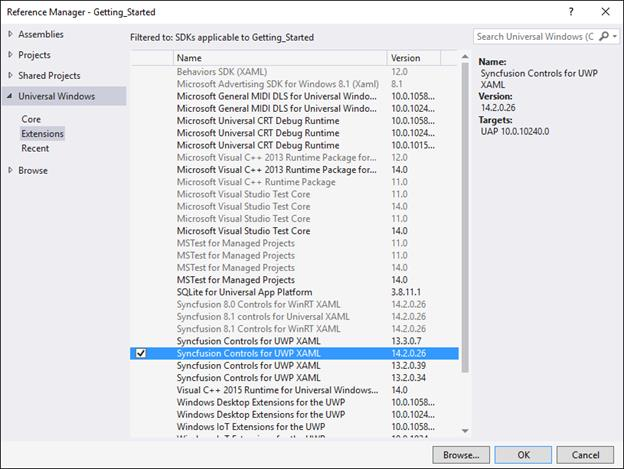
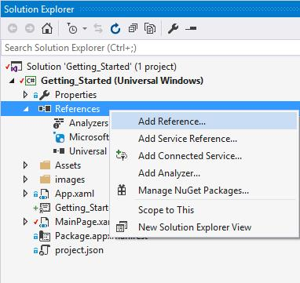
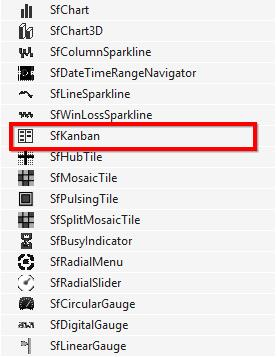
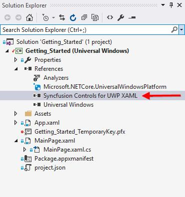
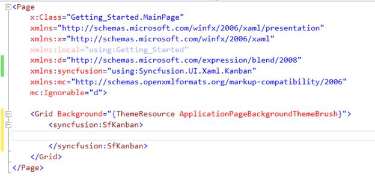
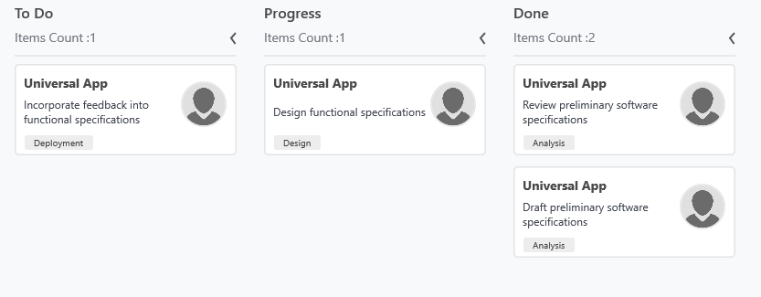

# Getting Started with UWP Kanban Board (SfKanban)

The following section provides an assistance to create a simple Kanban application and to configure it. 

## Referencing Essential Studio Components in your Solution

### Adding SDK reference

1. Open the Reference Manager window from project.
2. Choose Windows > Extensions > Syncfusion Controls for UWP XAML.

### Adding assembly reference

Individual reference can be added to the project instead of SDK “Syncfusion Controls for UWP XAML” which refers all the controls in the Syncfusion control library.

In the Add Reference window, browse and choose the reference assembly from the following location. 

Installed location\Syncfusion\Essential Studio\Installed version\Assemblies for Universal Windows\10.0\Syncfusion.SfKanban.UWP.dll

## Create a simple Kanban

In this walk through, you will create a new application that contains the SfKanban which includes the below topics.

* Adding SfKanban 
* Create data model
* Binding data
* Defining columns
* Working with Workflows
* Work In-Progress Limit

### Adding SfKanban

1. Add the required assembly references to the project as discussed in the Reference Essential Studio Components in your Solution section.
2. Add the `Syncfusion.UI.Xaml.Kanban` namespace to the application as shown below.




xmlns:syncfusion="using:Syncfusion.UI.Xaml.Kanban"



using Syncfusion.UI.Xaml.Kanban;




3. Create an instance of SfKanban control.




<syncfusion:SfKanban>

</syncfusion:SfKanban>




SfKanban kanban = new SfKanban();





### Adding SfKanban from toolbox

Drag and drop the Kanban control from the toolbox to your application.

Now the “Syncfusion Controls for UWP XAML” reference is added to the application references and the xmlns namespace code is generated in MainWindow.xaml as below.

### Create data model

You need to create a collection of KanbanModel objects for populating SfKanban.


   
    public class TaskDetails
    {
        public TaskDetails()
        {

            Tasks = new ObservableCollection<KanbanModel>();

            Tasks.Add(new KanbanModel()
            {

                Title = "Universal App",

                ID = "27654",

                Description = "Incorporate feedback into functional specifications",

                Category = "Open",

                ColorKey = "Low",

                Tags = new string[] { "Deployment" },

                ImageURL = new Uri("ms-appx:///images/icon.jpg"),
            });

            Tasks.Add(new KanbanModel()
            {

                Title = "Universal App",

                ID = "29477",

                Description = "Design functional specifications",

                Category = "In Progress",

                ColorKey = "Normal",

                Tags = new string[] { "Design" },

                ImageURL = new Uri("ms-appx:///images/icon.jpg"),
            });

            Tasks.Add(new KanbanModel()
            {
                Title = "Universal App",

                ID = "25678",

                Description = "Review preliminary software specifications",

                Category = "Done",

                ColorKey = "Low",

                Tags = new string[] { "Analysis" },

                ImageURL = new Uri("ms-appx:///images/icon.jpg"),
            });

            Tasks.Add(new KanbanModel()
            {
                Title = "Universal App",

                ID = "6593",

                Description = "Draft preliminary software specifications",

                Category = "Review",

                ColorKey = "High",

                Tags = new string[] { "Analysis" },

                ImageURL = new Uri("ms-appx:///images/icon.jpg"),

            });
        }
        public ObservableCollection<KanbanModel> Tasks { get; set; }
    }



### Binding data

In order to bind the data source of the SfKanban, set `ItemsSource` property as shown below.





<syncfusion:SfKanban ItemsSource="{Binding Tasks}" />





SfKanban kanban = new SfKanban()
{
    ItemsSource = new TaskDetails().Tasks
};





### Defining columns

By default, we need to define the columns manually by adding the KanbanColumn object to the [`Columns`](https://help.syncfusion.com/cr/uwp/Syncfusion.UI.Xaml.Kanban.SfKanban.html#Syncfusion_UI_Xaml_Kanban_SfKanban_Columns) collection property in SfKanban.

ItemsSource which was bound to the Kanban will be added to the respective columns using ColumnMappingPath property in SfKanban and Categories property in KanbanColumn.

We need to set the required property name to ColumnMappingPath which will be essential to add the data to the respective columns.

In this example, the data whose Category property’s value is set as Open will be added to the ‘To Do’ Column and other data will be added to the respective columns.

The following code example illustrates how this can be done.





  <syncfusion:SfKanban MinColumnWidth="150" 
                       ColumnMappingPath="Category" 
                       ItemsSource="{Binding Tasks}"
                       AutoGenerateColumns="False">

            <syncfusion:KanbanColumn Categories="Open" Title="To Do"></syncfusion:KanbanColumn>

            <syncfusion:KanbanColumn Categories="In Progress" Title="Progress"></syncfusion:KanbanColumn>

            <syncfusion:KanbanColumn Categories="Review,Done" Title="Done"></syncfusion:KanbanColumn>

</syncfusion:SfKanban>





SfKanban kanban = new SfKanban()
{
    AutoGenerateColumns = false,
    ItemsSource = new TaskDetails().Tasks,
    MinColumnWidth = 150,
    ColumnMappingPath="Category" 
};

kanban.Columns.Add(new KanbanColumn()
{
    Categories = "Open",
    Title = "To Do",
    MinimumLimit = 1,
    MaximumLimit = 2,
});

kanban.Columns.Add(new KanbanColumn()
{
    Categories = "In Progress",
    Title = "Progress",
    MinimumLimit = 1,
    MaximumLimit = 2
});

kanban.Columns.Add(new KanbanColumn()
{
    Categories = "Review,Done",
    Title = "Done",
    MinimumLimit = 1,
    MaximumLimit = 2
});

grid.Children.Add(kanban);





You can also set [`AutoGenerateColumns`](https://help.syncfusion.com/cr/uwp/Syncfusion.UI.Xaml.Kanban.SfKanban.html#Syncfusion_UI_Xaml_Kanban_SfKanban_AutoGenerateColumns) property to true in which you don’t need to define the columns as mentioned in the above example. This will create columns depending on the ColumnMappingPath property for all the distinct values in ItemsSource.

N> When the columns are auto-generated, you can handle the ColumnsGenerated event to customize the columns.

You can find the complete getting started sample from this [link](https://github.com/SyncfusionExamples/Kanban-UWP-Getting-Started).
