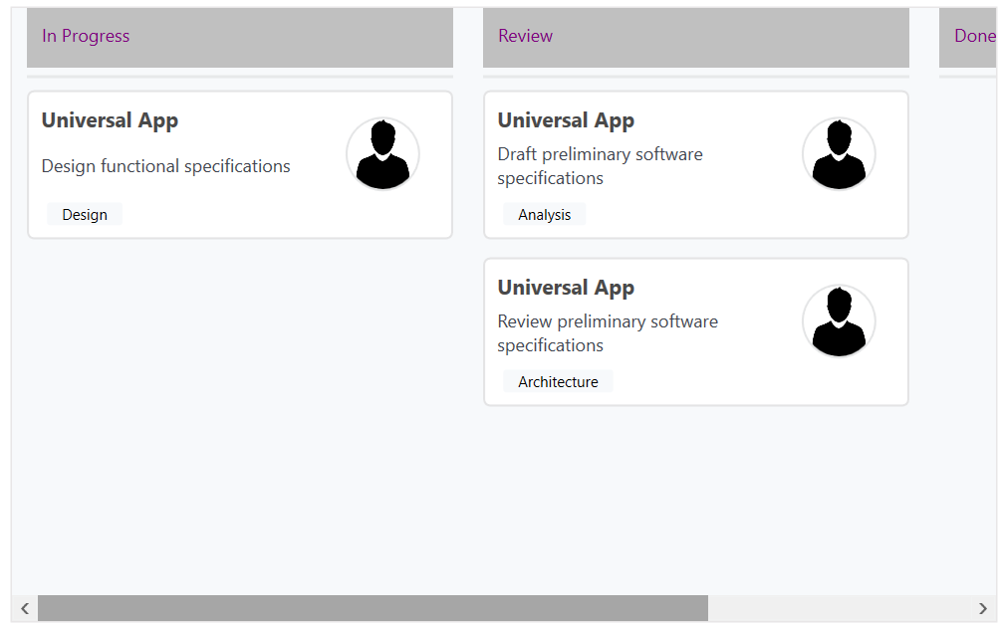
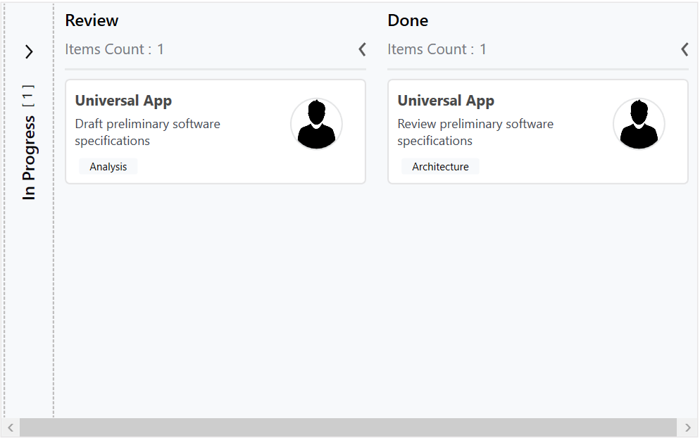

# Column in UWP Kanban Board (SfKanban)

## Customizing column size

By default, the columns are sized smartly to arrange the default elements of the cards with better readability. You can also define the minimum and maximum widths for the columns in [`SfKanban`](https://help.syncfusion.com/cr/uwp/Syncfusion.UI.Xaml.Kanban.SfKanban.html) using the [`SfKanban.MinColumnWidth`](https://help.syncfusion.com/cr/uwp/Syncfusion.UI.Xaml.Kanban.SfKanban.html#Syncfusion_UI_Xaml_Kanban_SfKanban_MinColumnWidth) and [`SfKanban.MaxColumnWidth`](https://help.syncfusion.com/cr/uwp/Syncfusion.UI.Xaml.Kanban.SfKanban.html#Syncfusion_UI_Xaml_Kanban_SfKanban_MaxColumnWidth) properties, respectively.





<syncfusion:SfKanban MinColumnWidth="300" MaxColumnWidth="340"/>



 

kanban.MinColumnWidth = 300;
kanban.MaxColumnWidth = 340;





You can also define the exact column width using the [`SfKanban.ColumnWidth`](https://help.syncfusion.com/cr/uwp/Syncfusion.UI.Xaml.Kanban.SfKanban.html#Syncfusion_UI_Xaml_Kanban_SfKanban_ColumnWidth) property.





<syncfusion:SfKanban ColumnWidth="250"/>



 

kanban.ColumnWidth = 250;





## Categorizing columns

The cards are categorized and added into the respective columns using the value of the [`KanbanModel.Category`](https://help.syncfusion.com/cr/uwp/Syncfusion.UI.Xaml.Kanban.IKanbanModel.html#Syncfusion_UI_Xaml_Kanban_IKanbanModel_Category) property if the [`ItemsSource`](https://help.syncfusion.com/cr/uwp/Syncfusion.UI.Xaml.Kanban.SfKanban.html#Syncfusion_UI_Xaml_Kanban_SfKanban_ItemsSource) is the collection of KanbanModel. But, if the [`ItemsSource`](https://help.syncfusion.com/cr/uwp/Syncfusion.UI.Xaml.Kanban.SfKanban.html#Syncfusion_UI_Xaml_Kanban_SfKanban_ItemsSource) is populated with custom objects, the property from the custom object used to categorize the card should be defined explicitly using the [`ColumnMappingPath`](https://help.syncfusion.com/cr/uwp/Syncfusion.UI.Xaml.Kanban.SfKanban.html#Syncfusion_UI_Xaml_Kanban_SfKanban_ColumnMappingPath) property.





<syncfusion:SfKanban ColumnMappingPath="Group"/>



 

kanban.ColumnMappingPath = "Group";





## Populate the column with cards from different categories

More than one category can be mapped to a column by assigning multiple values to the ['Categories'](https://help.syncfusion.com/cr/uwp/Syncfusion.UI.Xaml.Kanban.KanbanColumn.html#Syncfusion_UI_Xaml_Kanban_KanbanColumn_Categories) collection of [`KanbanColumn`](https://help.syncfusion.com/cr/uwp/Syncfusion.UI.Xaml.Kanban.KanbanColumn.html). For example, you can map the “In Progress" and "Validated" types under the “In progress” column.

 

progressColumn.Categories = new List<object>() { "In Progress", "Validated" };



## Headers

[`Header`](https://help.syncfusion.com/cr/uwp/Syncfusion.UI.Xaml.Kanban.SfKanban.html#Syncfusion_UI_Xaml_Kanban_SfKanban_Header) shows the [`Title`](https://help.syncfusion.com/cr/uwp/Syncfusion.UI.Xaml.Kanban.KanbanColumn.html#Syncfusion_UI_Xaml_Kanban_KanbanColumn_Title) category, items count, and the min and max informations of a column. The UI of the header can be replaced entirely using the [`SfKanban.ColumnHeaderTemplate`](https://help.syncfusion.com/cr/uwp/Syncfusion.UI.Xaml.Kanban.SfKanban.html#Syncfusion_UI_Xaml_Kanban_SfKanban_ColumnHeaderTemplate) property. The following code sample and screenshot illustrates this.



<syncfusion:SfKanban.ColumnHeaderTemplate>
    <DataTemplate>
      
        <StackPanel Width="300" Height="40"  Background="Silver">
            <TextBlock Margin="10" Text="{Binding  Header}" Foreground="Purple" HorizontalAlignment="Left"/>
        </StackPanel>
               
    </DataTemplate>
</syncfusion:SfKanban.ColumnHeaderTemplate>



## Column Tags

The [`Tags`](https://help.syncfusion.com/cr/uwp/Syncfusion.UI.Xaml.Kanban.KanbanColumn.html#Syncfusion_UI_Xaml_Kanban_KanbanColumn_Tags) property customizes the header of a kanban column. The following properties of the tags are used to customize the column header:

* [`CardCount`](https://help.syncfusion.com/cr/uwp/Syncfusion.UI.Xaml.Kanban.ColumnTag.html#Syncfusion_UI_Xaml_Kanban_ColumnTag_CardCount) - Gets or sets the count of Cards available in column. 
* [`Maximum`](https://help.syncfusion.com/cr/uwp/Syncfusion.UI.Xaml.Kanban.ColumnTag.html#Syncfusion_UI_Xaml_Kanban_ColumnTag_Maximum) - Gets or sets a value that indicates cards collection's maximum limit of KanbanColumn.
* [`Minimum`](https://help.syncfusion.com/cr/uwp/Syncfusion.UI.Xaml.Kanban.ColumnTag.html#Syncfusion_UI_Xaml_Kanban_ColumnTag_Minimum) - Gets or sets a value that indicates cards collection's minimum limit of KanbanColumn. 
* [`IsExpanded`](https://help.syncfusion.com/cr/uwp/Syncfusion.UI.Xaml.Kanban.ColumnTag.html#Syncfusion_UI_Xaml_Kanban_ColumnTag_IsExpanded) - Gets or sets a value that indicates whether the KanbanColumn is in expanded or not.
* [`Header`](https://help.syncfusion.com/cr/uwp/Syncfusion.UI.Xaml.Kanban.ColumnTag.html#Syncfusion_UI_Xaml_Kanban_ColumnTag_Header) - Gets or sets a object which indicates KanbanColumn header.

## Expand/Collapse Column

The Columns can be expanded/collapsed by tapping the toggle button, which is placed at the top-right corner of the Kanban header. The [`KanbanColumn.IsExpanded`](https://help.syncfusion.com/cr/uwp/Syncfusion.UI.Xaml.Kanban.KanbanColumn.html#Syncfusion_UI_Xaml_Kanban_KanbanColumn_IsExpanded) property is used to programmatically expand/collapse the Kanban column.





<syncfusion:KanbanColumn  IsExpanded="false"></syncfusion:KanbanColumn>



 

KanbanColumn kanbanColumn = new KanbanColumn();
kanbanColumn.IsExpanded = false;





## Enable/Disable Drag & Drop

You can enable or disable the drag-and-drop operation of the cards for a particular column using the [`KanbanColumn.AllowDrag`](https://help.syncfusion.com/cr/uwp/Syncfusion.UI.Xaml.Kanban.KanbanColumn.html#Syncfusion_UI_Xaml_Kanban_KanbanColumn_AllowDrag) property.





<syncfusion:KanbanColumn  AllowDrag="false"></syncfusion:KanbanColumn>



 

KanbanColumn kanbanColumn = new KanbanColumn();
kanbanColumn.AllowDrag = false;




