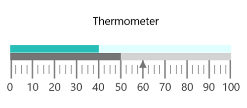

# Getting Started with UWP Linear Gauge (SfLinearGauge)

This section explains the steps required to configure a [`SfLinearGauge`](https://help.syncfusion.com/cr/uwp/Syncfusion.UI.Xaml.Gauges.SfLinearGauge.html) control in a real-time scenario and also provides a walk-through on some of the customization features available in [`SfLinearGauge`](https://help.syncfusion.com/cr/uwp/Syncfusion.UI.Xaml.Gauges.SfLinearGauge.html)  control.

## Adding gauge references

Refer to this [article](https://help.syncfusion.com/uwp/add-syncfusion-controls)  to know how to add Syncfusion controls to Visual Studio projects in various ways. You can also refer to [this](https://help.syncfusion.com/uwp/control-dependencies) link to know about the assemblies required for adding gauge to your project.

### Initialize gauge

Import  the [`SfLinearGauge`](https://help.syncfusion.com/cr/uwp/Syncfusion.UI.Xaml.Gauges.SfLinearGauge.html) namespace to your respective Window as follows.





xmlns:gauge="using:Syncfusion.UI.Xaml.Gauges"





using Syncfusion.UI.Xaml.Gauges;





You can initialize an empty [`SfLinearGauge`](https://help.syncfusion.com/cr/uwp/Syncfusion.UI.Xaml.Gauges.SfLinearGauge.html) control.





    <gauge:SfLinearGauge/>





SfLinearGauge sfLinearGauge = new SfLinearGauge();

this.Content = sfLinearGauge;





### Adding header

You can assign a unique header to [`SfLinearGauge`](https://help.syncfusion.com/cr/uwp/Syncfusion.UI.Xaml.Gauges.SfLinearGauge.html) by using the [`Header`](https://help.syncfusion.com/cr/uwp/Syncfusion.UI.Xaml.Gauges.SfLinearGauge.html#Syncfusion_UI_Xaml_Gauges_SfLinearGauge_Header)  property and position it wherever as you desired by using the [`HeaderOffset`](https://help.syncfusion.com/cr/uwp/Syncfusion.UI.Xaml.Gauges.SfLinearGauge.html#Syncfusion_UI_Xaml_Gauges_SfLinearGauge_HeaderOffset)  property.





      <gauge:SfLinearGauge Header="Thermometer"  HeaderFontSize="15" HeaderOffset="0.47,0.38">

      </gauge:SfLinearGauge>





           SfLinearGauge sfLinearGauge = new SfLinearGauge();

            sfLinearGauge.Header = "Thermometer";

            sfLinearGauge.HeaderFontSize = 15;

            sfLinearGauge.HeaderOffset = new Point(0.47, 0.38);

            this.Content = sfLinearGauge;





### Configuring scale

Configuring scale

You can configure the [`LinearScale`](https://help.syncfusion.com/cr/uwp/Syncfusion.UI.Xaml.Gauges.LinearScale.html) elements by making use of following API’s available in [`SfLinearGauge`](https://help.syncfusion.com/cr/uwp/Syncfusion.UI.Xaml.Gauges.SfLinearGauge.html).
They are:

•	ScaleDirection

•	ScaleBarStroke

•	ScaleBarSize

•	ScaleBarLength

•	ScaleBarBorderThickness

•	Interval

•	Minimum

•	Maximum





    <gauge:SfLinearGauge>

    <gauge:SfLinearGauge.MainScale>

    <gauge:LinearScale     Interval="10" 

     MajorTickStroke="Gray" MajorTickSize="25"    MinorTickSize="12" LabelSize="15"

     MinorTickStroke="Gray" LabelStroke="#424242"  MinorTicksPerInterval="3" ScaleBarLength="300">

    </gauge:LinearScale>

    </gauge:SfLinearGauge.MainScale>

    </gauge:SfLinearGauge>





          SfLinearGauge sfLinearGauge = new SfLinearGauge();

            LinearScale linearScale = new LinearScale();

            linearScale.Interval = 10;

            linearScale.LabelSize = 15;

            linearScale.MajorTickStroke = new SolidColorBrush(Colors.Gray);

            linearScale.MinorTickStroke = new SolidColorBrush(Colors.Gray);

            linearScale.LabelStroke = new SolidColorBrush(Color.FromArgb(0xff, 0x42, 0x42, 0x42));

            linearScale.MajorTickSize = 25;

            linearScale.MinorTickSize = 12;

            linearScale.ScaleBarLength = 300;

            linearScale.MinorTicksPerInterval = 3;

            sfLinearGauge.MainScale = linearScale;





### Adding ranges

You can categorize the scale values using the start and end values properties in [`LinearRange`](https://help.syncfusion.com/cr/uwp/Syncfusion.UI.Xaml.Gauges.LinearRange.html). You can add multiple ranges for a scale using the [`Ranges`](https://help.syncfusion.com/cr/uwp/Syncfusion.UI.Xaml.Gauges.LinearScale.html#Syncfusion_UI_Xaml_Gauges_LinearScale_Ranges) property.





        <gauge:SfLinearGauge>

            <gauge:SfLinearGauge.MainScale>

            <gauge:LinearScale     Interval="10" 
                                   MajorTickStroke="Gray" MajorTickSize="25" 
                                   MinorTickSize="12" LabelSize="15" ScaleBarSize="10"
                                   MinorTickStroke="Gray" LabelStroke="#424242"
                                   MinorTicksPerInterval="3" ScaleBarLength="300">

                <gauge:LinearScale.Ranges>
                    
                    <gauge:LinearRange     StartValue="0" EndValue="40"
                                           RangeStroke="#27BEB7"  StartWidth="10"
                                           EndWidth="10" RangeOffset="0.4" />
                    
                    <gauge:LinearRange     StartValue="40" EndValue="100"
                                           RangeStroke="LightCyan" RangeOffset="0.4"
                                           StartWidth="10"  EndWidth="10"/>
                    
                </gauge:LinearScale.Ranges>

            </gauge:LinearScale>

            </gauge:SfLinearGauge.MainScale>

        </gauge:SfLinearGauge>





            SfLinearGauge sfLinearGauge = new SfLinearGauge();

            LinearScale linearScale = new LinearScale();

            linearScale.Interval = 10;

            linearScale.LabelSize = 15;

            linearScale.ScaleBarSize = 10;

            linearScale.MajorTickStroke = new SolidColorBrush(Colors.Gray);

            linearScale.MinorTickStroke = new SolidColorBrush(Colors.Gray);

            linearScale.LabelStroke = new SolidColorBrush(Color.FromArgb(0xff, 0x42, 0x42, 0x42));

            linearScale.MajorTickSize = 25;

            linearScale.MinorTickSize = 12;

            linearScale.ScaleBarLength = 300;

            linearScale.MinorTicksPerInterval = 3;

            LinearRange linearRange = new LinearRange();

            linearRange.StartValue = 0;

            linearRange.EndValue = 40;

            linearRange.RangeStroke = new SolidColorBrush(Color.FromArgb(0xff,0x27,0xBE,0xB7));

            linearRange.StartWidth = 10;

            linearRange.EndWidth = 10;

            linearRange.RangeOffset = 0.4;

            linearScale.Ranges.Add(linearRange);

            LinearRange linearRange1 = new LinearRange();

            linearRange1.StartValue = 40;

            linearRange1.EndValue = 100;

            linearRange1.RangeStroke = new SolidColorBrush(Colors.LightCyan);

            linearRange1.RangeOffset = 0.4;

            linearRange1.StartWidth = 10;

            linearRange1.EndWidth = 10;

            linearScale.Ranges.Add(linearRange1);

            sfLinearGauge.MainScale = linearScale;





### Adding a symbol pointer

`SymbolPointer` is a shape that can be placed to mark the pointer value in gauge.




 
        <gauge:SfLinearGauge>

            <gauge:SfLinearGauge.MainScale>

            <gauge:LinearScale     Interval="10" 
                                   MajorTickStroke="Gray" MajorTickSize="25" 
                                   MinorTickSize="12" LabelSize="15" ScaleBarSize="10"
                                   MinorTickStroke="Gray" LabelStroke="#424242"
                                   MinorTicksPerInterval="3" ScaleBarLength="300">

                <gauge:LinearScale.Pointers>

                    <gauge:LinearPointer    PointerType="SymbolPointer" Value="60"
                                            SymbolPointerHeight="10" SymbolPointerWidth="10"
                                            SymbolPointerPosition="Below" SymbolPointerStroke="#757575"/>

                </gauge:LinearScale.Pointers>

            </gauge:LinearScale>

            </gauge:SfLinearGauge.MainScale>

        </gauge:SfLinearGauge>





            SfLinearGauge sfLinearGauge = new SfLinearGauge();

            LinearScale linearScale = new LinearScale();

            linearScale.Interval = 10;

            linearScale.LabelSize = 15;

            linearScale.ScaleBarSize = 10;

            linearScale.MajorTickStroke = new SolidColorBrush(Colors.Gray);

            linearScale.MinorTickStroke = new SolidColorBrush(Colors.Gray);

            linearScale.LabelStroke = new SolidColorBrush(Color.FromArgb(0xff, 0x42, 0x42, 0x42));

            linearScale.MajorTickSize = 25;

            linearScale.MinorTickSize = 12;

            linearScale.ScaleBarLength = 300;

            linearScale.MinorTicksPerInterval = 3;

            LinearPointer linearPointer = new LinearPointer();

            linearPointer.PointerType = LinearPointerType.SymbolPointer;

            linearPointer.Value = 60;

            linearPointer.SymbolPointerHeight = 10;

            linearPointer.SymbolPointerWidth = 10;

            linearPointer.SymbolPointerPosition = LinearSymbolPointersPosition.Below;

            linearPointer.SymbolPointerStroke = new SolidColorBrush(Color.FromArgb(0xff,0x75,0x75,0x75));

            linearScale.Pointers.Add(linearPointer);

            sfLinearGauge.MainScale = linearScale;





### Adding a bar pointer

`BarPointer` is used to mark the scale values. This starts at the beginning of gauge and ends at the pointer value.





      <gauge:SfLinearGauge>

            <gauge:SfLinearGauge.MainScale>

            <gauge:LinearScale     Interval="10" 
                                   MajorTickStroke="Gray" MajorTickSize="25" 
                                   MinorTickSize="12" LabelSize="15" ScaleBarSize="10"
                                   MinorTickStroke="Gray" LabelStroke="#424242"
                                   MinorTicksPerInterval="3" ScaleBarLength="300">

                <gauge:LinearScale.Pointers>

                    <gauge:LinearPointer PointerType="BarPointer" Value="50" BarPointerStroke="#757575"
                                             BarPointerStrokeThickness="10"/>

                </gauge:LinearScale.Pointers>

            </gauge:LinearScale>

            </gauge:SfLinearGauge.MainScale>

        </gauge:SfLinearGauge>





             SfLinearGauge sfLinearGauge = new SfLinearGauge();

            LinearScale linearScale = new LinearScale();

            linearScale.Interval = 10;

            linearScale.LabelSize = 15;

            linearScale.ScaleBarSize = 10;

            linearScale.MajorTickStroke = new SolidColorBrush(Colors.Gray);

            linearScale.MinorTickStroke = new SolidColorBrush(Colors.Gray);

            linearScale.LabelStroke = new SolidColorBrush(Color.FromArgb(0xff, 0x42, 0x42, 0x42));

            linearScale.MajorTickSize = 25;

            linearScale.MinorTickSize = 12;

            linearScale.ScaleBarLength = 300;

            linearScale.MinorTicksPerInterval = 3;

            LinearPointer linearPointer1 = new LinearPointer();

            linearPointer1.PointerType = LinearPointerType.BarPointer;

            linearPointer1.Value = 50;

            linearPointer1.BarPointerStroke = new SolidColorBrush(Color.FromArgb(0xff, 0x75, 0x75, 0x75));

            linearPointer1.BarPointerStrokeThickness = 10;

            linearScale.Pointers.Add(linearPointer1);

            sfLinearGauge.MainScale = linearScale;





The following code example is the complete code of the previous configurations.





   <Page

   x:Class="GaugeGettingStarted.MainPage"

   xmlns="http://schemas.microsoft.com/winfx/2006/xaml/presentation"

    xmlns:x="http://schemas.microsoft.com/winfx/2006/xaml"

    xmlns:local="using:GaugeGettingStarted"

   xmlns:d="http://schemas.microsoft.com/expression/blend/2008"

    xmlns:mc="http://schemas.openxmlformats.org/markup-compatibility/2006"

    mc:Ignorable="d"

    xmlns:gauge="using:Syncfusion.UI.Xaml.Gauges">

    <gauge:SfLinearGauge Header="Thermometer"  HeaderFontSize="15" HeaderOffset="0.47,0.38">

            <gauge:SfLinearGauge.MainScale>

            <gauge:LinearScale     Interval="10" 
                                   MajorTickStroke="Gray" MajorTickSize="25" 
                                   MinorTickSize="12" LabelSize="15" ScaleBarSize="10"
                                   MinorTickStroke="Gray" LabelStroke="#424242"
                                   MinorTicksPerInterval="3" ScaleBarLength="300">

                <gauge:LinearScale.Pointers>

                    <gauge:LinearPointer    PointerType="SymbolPointer" Value="60"
                                            SymbolPointerHeight="10" SymbolPointerWidth="10"
                                            SymbolPointerPosition="Below" SymbolPointerStroke="#757575"/>

                    <gauge:LinearPointer PointerType="BarPointer" Value="50" BarPointerStroke="#757575"
                                             BarPointerStrokeThickness="10"/>

                </gauge:LinearScale.Pointers>

                <gauge:LinearScale.Ranges>

                    <gauge:LinearRange     StartValue="0" EndValue="40"
                                           RangeStroke="#27BEB7"  StartWidth="10"
                                           EndWidth="10" RangeOffset="0.4" />

                    <gauge:LinearRange     StartValue="40" EndValue="100"
                                           RangeStroke="LightCyan" RangeOffset="0.4"
                                           StartWidth="10"  EndWidth="10"/>

                </gauge:LinearScale.Ranges>

            </gauge:LinearScale>

            </gauge:SfLinearGauge.MainScale>

        </gauge:SfLinearGauge>

    </Page>





using Windows.UI.Xaml.Controls;
using Windows.UI.Xaml.Media;
using Syncfusion.UI.Xaml.Gauges;
using Windows.UI;
using Windows.Foundation;

namespace GaugeGettingStarted
{
    public sealed partial class MainPage : Page
    {
        public MainPage()
        {
            this.InitializeComponent();

            SfLinearGauge sfLinearGauge = new SfLinearGauge();

            sfLinearGauge.Header = "Thermometer";

            sfLinearGauge.HeaderFontSize = 15;

            sfLinearGauge.HeaderOffset = new Point(0.47, 0.38);

            LinearScale linearScale = new LinearScale();

            linearScale.Interval = 10;

            linearScale.LabelSize = 15;

            linearScale.ScaleBarSize = 10;

            linearScale.MajorTickStroke = new SolidColorBrush(Colors.Gray);

            linearScale.MinorTickStroke = new SolidColorBrush(Colors.Gray);

            linearScale.LabelStroke = new SolidColorBrush(Color.FromArgb(0xff, 0x42, 0x42, 0x42));

            linearScale.MajorTickSize = 25;

            linearScale.MinorTickSize = 12;

            linearScale.ScaleBarLength = 300;

            linearScale.MinorTicksPerInterval = 3;

            LinearRange linearRange = new LinearRange();

            linearRange.StartValue = 0;

            linearRange.EndValue = 40;

            linearRange.RangeStroke = new SolidColorBrush(Color.FromArgb(0xff, 0x27, 0xBE, 0xB7));

            linearRange.StartWidth = 10;

            linearRange.EndWidth = 10;

            linearRange.RangeOffset = 0.4;

            linearScale.Ranges.Add(linearRange);

            LinearRange linearRange1 = new LinearRange();

            linearRange1.StartValue = 40;

            linearRange1.EndValue = 100;

            linearRange1.RangeStroke = new SolidColorBrush(Colors.LightCyan);

            linearRange1.RangeOffset = 0.4;

            linearRange1.StartWidth = 10;

            linearRange1.EndWidth = 10;

            linearScale.Ranges.Add(linearRange1);

            LinearPointer linearPointer = new LinearPointer();

            linearPointer.PointerType = LinearPointerType.SymbolPointer;

            linearPointer.Value = 60;

            linearPointer.SymbolPointerHeight = 10;

            linearPointer.SymbolPointerWidth = 10;

            linearPointer.SymbolPointerPosition = LinearSymbolPointersPosition.Below;

            linearPointer.SymbolPointerStroke = new SolidColorBrush(Color.FromArgb(0xff, 0x75, 0x75, 0x75));

            linearScale.Pointers.Add(linearPointer);

            LinearPointer linearPointer1 = new LinearPointer();

            linearPointer1.PointerType = LinearPointerType.BarPointer;

            linearPointer1.Value = 50;

            linearPointer1.BarPointerStroke = new SolidColorBrush(Color.FromArgb(0xff, 0x75, 0x75, 0x75));

            linearPointer1.BarPointerStrokeThickness = 10;

            linearScale.Pointers.Add(linearPointer1);

            sfLinearGauge.MainScale = linearScale;

            this.Content = sfLinearGauge;
        }
    }
}





The following screenshot illustrates the result of the previous codes.

You can find the complete getting started sample from this [`link`]().

