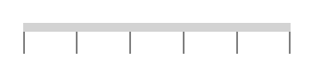

# Labels in UWP Linear Gauge (SfLinearGauge)

`Labels` of the linear scale provide a numeric value to the major ticks that will be specified according to the range of the scale.

## Label color customization

The foreground of the label is customized by setting the [`LabelStroke`](https://help.syncfusion.com/cr/uwp/Syncfusion.UI.Xaml.Gauges.LinearScale.html#Syncfusion_UI_Xaml_Gauges_LinearScale_LabelStroke) of the linear scale.





     <gauge:SfLinearGauge>

            <gauge:SfLinearGauge.MainScale>

            <gauge:LinearScale     Interval="10" 
                                   MajorTickStroke="Gray" MajorTickSize="25" 
                                   MinorTickSize="12" LabelSize="15" ScaleBarSize="10"
                                   MinorTickStroke="Gray" LabelStroke="Purple"
                                   MinorTicksPerInterval="3" ScaleBarLength="300">
                
            </gauge:LinearScale>

            </gauge:SfLinearGauge.MainScale>

        </gauge:SfLinearGauge>





             SfLinearGauge sfLinearGauge = new SfLinearGauge();

            LinearScale linearScale = new LinearScale();

            linearScale.Interval = 10;

            linearScale.LabelSize = 15;

            linearScale.ScaleBarSize = 10;

            linearScale.MajorTickStroke = new SolidColorBrush(Colors.Gray);

            linearScale.MinorTickStroke = new SolidColorBrush(Colors.Gray);

            linearScale.LabelStroke = new SolidColorBrush(Colors.Purple);

            linearScale.MajorTickSize = 25;

            linearScale.MinorTickSize = 12;

            linearScale.ScaleBarLength = 300;

            linearScale.MinorTicksPerInterval = 3;

            sfLinearGauge.MainScale = linearScale;





## Label font customization

The label font can be customized using the [`LabelSize`](https://help.syncfusion.com/cr/uwp/Syncfusion.UI.Xaml.Gauges.LinearScale.html#Syncfusion_UI_Xaml_Gauges_LinearScale_LabelSize), `FontFamily`, and `FontStyle` properties. 





    <gauge:SfLinearGauge>

            <gauge:SfLinearGauge.MainScale>

            <gauge:LinearScale     Interval="10" FontFamily="Monotype Corsiva" 
                                   FontStyle="Italic"
                                   MajorTickStroke="Gray" MajorTickSize="25" 
                                   MinorTickSize="12" LabelSize="15" ScaleBarSize="10"
                                   MinorTickStroke="Gray" LabelStroke="#424242"
                                   MinorTicksPerInterval="3" ScaleBarLength="300">
                
            </gauge:LinearScale>

            </gauge:SfLinearGauge.MainScale>

        </gauge:SfLinearGauge>





            SfLinearGauge sfLinearGauge = new SfLinearGauge();

            LinearScale linearScale = new LinearScale();

            linearScale.Interval = 10;

            linearScale.LabelSize = 15;

            linearScale.FontFamily = new FontFamily("Monotype Corsiva");

            linearScale.FontStyle = Windows.UI.Text.FontStyle.Italic;

            linearScale.ScaleBarSize = 10;

            linearScale.MajorTickStroke = new SolidColorBrush(Colors.Gray);

            linearScale.MinorTickStroke = new SolidColorBrush(Colors.Gray);

            linearScale.LabelStroke = new SolidColorBrush(Color.FromArgb(0xff, 0x42, 0x42, 0x42));

            linearScale.MajorTickSize = 25;

            linearScale.MinorTickSize = 12;

            linearScale.ScaleBarLength = 300;

            linearScale.MinorTicksPerInterval = 3;

            sfLinearGauge.MainScale = linearScale;





## Setting position for labels

The labels in the scale can be placed above or below the linear scale by choosing the following options available in the [`LabelPosition`](https://help.syncfusion.com/cr/uwp/Syncfusion.UI.Xaml.Gauges.LinearScale.html#Syncfusion_UI_Xaml_Gauges_LinearScale_LabelPosition) property. The default value of [`LabelPosition`](https://help.syncfusion.com/cr/uwp/Syncfusion.UI.Xaml.Gauges.LinearScale.html#Syncfusion_UI_Xaml_Gauges_LinearScale_LabelPosition) property is below.

1.	Above
2.	Below (Default)





        <gauge:SfLinearGauge>

            <gauge:SfLinearGauge.MainScale>

            <gauge:LinearScale     Interval="10" LabelPosition="Above"
                                   MajorTickStroke="Gray" MajorTickSize="25" 
                                   MinorTickSize="12" LabelSize="15" ScaleBarSize="10"
                                   MinorTickStroke="Gray" LabelStroke="#424242"
                                   MinorTicksPerInterval="3" ScaleBarLength="300">
                
            </gauge:LinearScale>

            </gauge:SfLinearGauge.MainScale>

        </gauge:SfLinearGauge>





            SfLinearGauge sfLinearGauge = new SfLinearGauge();

            LinearScale linearScale = new LinearScale();

            linearScale.Interval = 10;

            linearScale.LabelSize = 15;

            linearScale.LabelPosition = LinearLabelsPosition.Above;

            linearScale.ScaleBarSize = 10;

            linearScale.MajorTickStroke = new SolidColorBrush(Colors.Gray);

            linearScale.MinorTickStroke = new SolidColorBrush(Colors.Gray);

            linearScale.LabelStroke = new SolidColorBrush(Color.FromArgb(0xff, 0x42, 0x42, 0x42));

            linearScale.MajorTickSize = 25;

            linearScale.MinorTickSize = 12;

            linearScale.ScaleBarLength = 300;

            linearScale.MinorTicksPerInterval = 3;

            sfLinearGauge.MainScale = linearScale;





## Setting postfix and prefix for labels

You can postfix and prefix values to the scale labels using the [`LabelPostfix`](https://help.syncfusion.com/cr/uwp/Syncfusion.UI.Xaml.Gauges.LinearScale.html#Syncfusion_UI_Xaml_Gauges_LinearScale_LabelPostfix) and [`LabelPrefix`](https://help.syncfusion.com/cr/uwp/Syncfusion.UI.Xaml.Gauges.LinearScale.html#Syncfusion_UI_Xaml_Gauges_LinearScale_LabelPrefix) properties, respectively.

### Setting label postfix

The [`LabelPostfix`](https://help.syncfusion.com/cr/uwp/Syncfusion.UI.Xaml.Gauges.LinearScale.html#Syncfusion_UI_Xaml_Gauges_LinearScale_LabelPostfix) property allows to postfix the values to scale labels.





       <gauge:SfLinearGauge>

            <gauge:SfLinearGauge.MainScale>

            <gauge:LinearScale    Minimum="0" Maximum="50"  LabelPostfix="%"
                                  Interval="10" 
                                   MajorTickStroke="Gray" MajorTickSize="25" 
                                   MinorTickSize="12" LabelSize="15" ScaleBarSize="10"
                                   MinorTickStroke="Gray" LabelStroke="#424242"
                                   ScaleBarLength="300">
                
            </gauge:LinearScale>

            </gauge:SfLinearGauge.MainScale>

        </gauge:SfLinearGauge>





            SfLinearGauge sfLinearGauge = new SfLinearGauge();

            LinearScale linearScale = new LinearScale();

            linearScale.Interval = 10;

            linearScale.LabelSize = 15;

            linearScale.Minimum = 0;

            linearScale.Maximum = 50;

            linearScale.LabelPostfix = "%";

            linearScale.ScaleBarSize = 10;

            linearScale.MajorTickStroke = new SolidColorBrush(Colors.Gray);

            linearScale.MinorTickStroke = new SolidColorBrush(Colors.Gray);

            linearScale.LabelStroke = new SolidColorBrush(Color.FromArgb(0xff, 0x42, 0x42, 0x42));

            linearScale.MajorTickSize = 25;

            linearScale.MinorTickSize = 12;

            linearScale.ScaleBarLength = 300;

            sfLinearGauge.MainScale = linearScale;





### Setting label prefix

The [`LabelPrefix`](https://help.syncfusion.com/cr/uwp/Syncfusion.UI.Xaml.Gauges.LinearScale.html#Syncfusion_UI_Xaml_Gauges_LinearScale_LabelPrefix) property allows to prefix the values to scale labels.





    <gauge:SfLinearGauge>

            <gauge:SfLinearGauge.MainScale>

            <gauge:LinearScale     Minimum="0" Maximum="50"  LabelPrefix="$"
                                   Interval="10" 
                                   MajorTickStroke="Gray" MajorTickSize="25" 
                                   MinorTickSize="12" LabelSize="15" ScaleBarSize="10"
                                   MinorTickStroke="Gray" LabelStroke="#424242" ScaleBarLength="300">
                
            </gauge:LinearScale>

            </gauge:SfLinearGauge.MainScale>

        </gauge:SfLinearGauge>





            SfLinearGauge sfLinearGauge = new SfLinearGauge();

            LinearScale linearScale = new LinearScale();

            linearScale.Interval = 10;

            linearScale.LabelSize = 15;

            linearScale.Minimum = 0;

            linearScale.Maximum = 50;

            linearScale.LabelPostfix = "$";

            linearScale.ScaleBarSize = 10;

            linearScale.MajorTickStroke = new SolidColorBrush(Colors.Gray);

            linearScale.MinorTickStroke = new SolidColorBrush(Colors.Gray);

            linearScale.LabelStroke = new SolidColorBrush(Color.FromArgb(0xff, 0x42, 0x42, 0x42));

            linearScale.MajorTickSize = 25;

            linearScale.MinorTickSize = 12;

            linearScale.ScaleBarLength = 300;

            sfLinearGauge.MainScale = linearScale;





## Setting label offset

The labels can be positioned far away from the ticks using the [`LabelOffset`](https://help.syncfusion.com/cr/uwp/Syncfusion.UI.Xaml.Gauges.LinearScale.html#Syncfusion_UI_Xaml_Gauges_LinearScale_LabelOffset) property.





    <gauge:SfLinearGauge>

            <gauge:SfLinearGauge.MainScale>

            <gauge:LinearScale     LabelOffset="15"
                                   MajorTickStroke="Gray" MajorTickSize="25" 
                                   MinorTickSize="12" LabelSize="15" ScaleBarSize="10"
                                   MinorTickStroke="Gray" LabelStroke="#424242" ScaleBarLength="300">
                
            </gauge:LinearScale>

            </gauge:SfLinearGauge.MainScale>

        </gauge:SfLinearGauge>





            SfLinearGauge sfLinearGauge = new SfLinearGauge();

            LinearScale linearScale = new LinearScale();

            linearScale.ScaleBarSize = 10;

            linearScale.LabelOffset = 15;

            linearScale.MajorTickStroke = new SolidColorBrush(Colors.Gray);

            linearScale.MinorTickStroke = new SolidColorBrush(Colors.Gray);

            linearScale.LabelStroke = new SolidColorBrush(Color.FromArgb(0xff, 0x42, 0x42, 0x42));

            linearScale.MajorTickSize = 25;

            linearScale.MinorTickSize = 12;

            linearScale.ScaleBarLength = 300;

            sfLinearGauge.MainScale = linearScale;





## Labels visibility

Labels visibility can be customized using the [`ShowLabels`](https://help.syncfusion.com/cr/uwp/Syncfusion.UI.Xaml.Gauges.LinearScale.html#Syncfusion_UI_Xaml_Gauges_LinearScale_ShowLabels) property of linear scale.





    <gauge:SfLinearGauge>

        <gauge:SfLinearGauge.MainScale>

            <gauge:LinearScale     ShowLabels="False"
                                   MajorTickStroke="Gray" MajorTickSize="25" 
                                   MinorTickSize="12" LabelSize="15" ScaleBarSize="10"
                                   MinorTickStroke="Gray" LabelStroke="#424242" ScaleBarLength="300">

            </gauge:LinearScale>

        </gauge:SfLinearGauge.MainScale>

    </gauge:SfLinearGauge>





            SfLinearGauge sfLinearGauge = new SfLinearGauge();

            LinearScale linearScale = new LinearScale();

            linearScale.ScaleBarSize = 10;

            linearScale.ShowLabels = false;

            linearScale.MajorTickStroke = new SolidColorBrush(Colors.Gray);

            linearScale.MinorTickStroke = new SolidColorBrush(Colors.Gray);

            linearScale.LabelStroke = new SolidColorBrush(Color.FromArgb(0xff, 0x42, 0x42, 0x42));

            linearScale.MajorTickSize = 25;

            linearScale.MinorTickSize = 12;

            linearScale.ScaleBarLength = 300;

            sfLinearGauge.MainScale = linearScale;





## Customize the scale labels
 
The scale label are customized by using `LabelFormat` and `Culture` properties of linear scale.

`LabelFormat` property is used to change the format of labels by setting a formatting string on the `LabelFormat` property.
`Culture` property is used to format the group separator of the value based on the respective culture.





        <gauge:SfLinearGauge>
            <gauge:SfLinearGauge.MainScale>
                <gauge:LinearScale  MaximumLabels="4"  ScaleOffset="50" Minimum="10" Maximum="50" Interval="10" ScaleBarStroke="#E0E0E0" 
                            ScaleBarSize="10"   MinorTicksPerInterval ="1" LabelStroke="#000000" LabelSize="20" LabelFormat="{}{0:c2}" LabelOffset="10">
                    <gauge:LinearScale.Pointers>
                        <gauge:LinearPointer BarPointerStrokeThickness="10" PointerType="BarPointer" Value="35"  BarPointerStroke="#DC3913" />
                    </gauge:LinearScale.Pointers>
                    <gauge:LinearScale.Ranges>
                        <gauge:LinearRange StartValue="0"  StartWidth="10" EndWidth="10"  EndValue="30" RangeStroke="#3267CC"  RangeOffset="5" />
                    </gauge:LinearScale.Ranges>
                </gauge:LinearScale>
            </gauge:SfLinearGauge.MainScale>
        </gauge:SfLinearGauge>





            SfLinearGauge linearGauge = new SfLinearGauge();
            LinearScale linearScale = new LinearScale();
            linearScale.MaximumLabels = 4;
            linearScale.ScaleOffset = 50;
            linearScale.Minimum = 10;
            linearScale.Maximum = 50;
            linearScale.Interval = 10;
            linearScale.ScaleBarStroke = new SolidColorBrush(Colors.LightGray);
            linearScale.MinorTicksPerInterval = 1;
            linearScale.LabelSize = 20;
            linearScale.LabelFormat = "{0:c}";
            linearScale.LabelOffset = 10;
            linearScale.ScaleBarSize = 10;
            linearScale.MinorTicksPerInterval = 1;
            linearScale.LabelStroke = new SolidColorBrush(Colors.Black);
            LinearPointer barPointer = new LinearPointer();
            barPointer.BarPointerStrokeThickness = 10;
            barPointer.PointerType = LinearPointerType.BarPointer;
            barPointer.BarPointerStroke = new SolidColorBrush(Colors.Red);
            barPointer.Value = 35;
            linearScale.Pointers.Add(barPointer);
            LinearRange linearRange = new LinearRange();
            linearRange.StartValue = 0;
            linearRange.EndValue = 30;
            linearRange.StartWidth = 10;
            linearRange.EndWidth = 10;
            linearRange.RangeStroke = new SolidColorBrush(Colors.Blue);
            linearRange.RangeOffset = 5;
            linearScale.Ranges.Add(linearRange);
            linearGauge.MainScale=linearScale;
            linearScale.Culture = new System.Globalization.CultureInfo("fr-FR");
    




