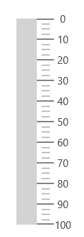

# Orientation in UWP Linear Gauge (SfLinearGauge)

The [`LinearGauge`](https://help.syncfusion.com/cr/uwp/Syncfusion.UI.Xaml.Gauges.SfLinearGauge.html) control supports horizontal and vertical orientations. By default, the [`LinearGauge`](https://help.syncfusion.com/cr/uwp/Syncfusion.UI.Xaml.Gauges.SfLinearGauge.html) is rendered with horizontal orientation. You can change the orientation using the [`Orientation`](https://help.syncfusion.com/cr/uwp/Syncfusion.UI.Xaml.Gauges.SfLinearGauge.html#Syncfusion_UI_Xaml_Gauges_SfLinearGauge_Orientation) property.





     <gauge:SfLinearGauge Orientation="Vertical">

        <gauge:SfLinearGauge.MainScale>

            <gauge:LinearScale     Interval="10" 
                                   MajorTickStroke="Gray" MajorTickSize="25" 
                                   MinorTickSize="12" LabelSize="15" ScaleBarSize="20"
                                   MinorTickStroke="Gray" LabelStroke="#424242"
                                   MinorTicksPerInterval="3" ScaleBarLength="300">

            </gauge:LinearScale>

        </gauge:SfLinearGauge.MainScale>

    </gauge:SfLinearGauge>





          SfLinearGauge sfLinearGauge = new SfLinearGauge();

            sfLinearGauge.Orientation = Orientation.Vertical;

            LinearScale linearScale = new LinearScale();

            linearScale.Interval = 10;

            linearScale.LabelSize = 15;

            linearScale.MajorTickStroke = new SolidColorBrush(Colors.Gray);

            linearScale.MinorTickStroke = new SolidColorBrush(Colors.Gray);

            linearScale.LabelStroke = new SolidColorBrush(Color.FromArgb(0xff, 0x42, 0x42, 0x42));

            linearScale.MajorTickSize = 25;

            linearScale.MinorTickSize = 12;

            linearScale.ScaleBarLength = 300;

            linearScale.MinorTicksPerInterval = 3;

            sfLinearGauge.MainScale = linearScale;





