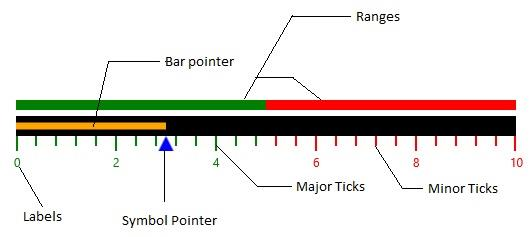

# UWP Linear Gauge (SfLinearGauge) Overview

[`SfLinearGauge`](https://help.syncfusion.com/cr/uwp/Syncfusion.UI.Xaml.Gauges.SfLinearGauge.html)  displays a range of values graphically along the linear scale, which is considered as the linear form of the linear gauge. It measures the values of the scale and it is present in the horizontal, vertical sliding, or meter.

[`SfLinearGauge`](https://help.syncfusion.com/cr/uwp/Syncfusion.UI.Xaml.Gauges.SfLinearGauge.html)  is used to visualize the numerical values of a scale in linear manner. By using the [`SfLinearGauge`](https://help.syncfusion.com/cr/uwp/Syncfusion.UI.Xaml.Gauges.SfLinearGauge.html)  control, it is possible to render the thermometer.

## Key features

### Scale

The [`Scale`](https://help.syncfusion.com/uwp/sflineargauge/scale)  supports to adding multiple scales on linear gauge by horizontal and vertical orientations.

### Ranges

Highlights the desired [`Ranges`](https://help.syncfusion.com/uwp/sflineargauge/ranges)   of values in the gauge scale.

### Pointers

The [`Pointers`](https://help.syncfusion.com/uwp/sflineargauge/pointers)  supports  to add multiple pointers (bar and symbol) on the linear scale.

### Annotations

Annotations are used to mark the specific area of interest in the gauge area with texts, shapes, or images. You can add any number of annotations to the gauge.

