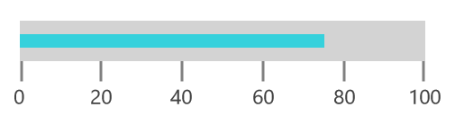
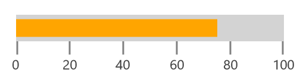
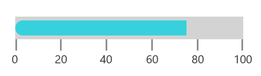
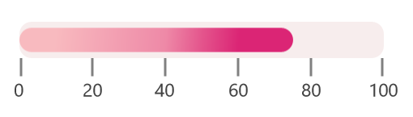
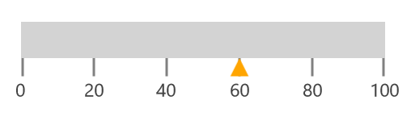
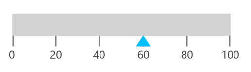
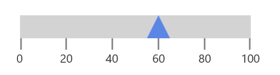
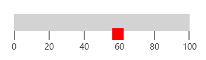
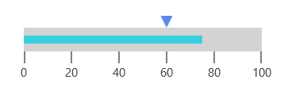

# Pointers in UWP Linear Gauge (SfLinearGauge)

The [`LinearGauge`](https://help.syncfusion.com/cr/uwp/Syncfusion.UI.Xaml.Gauges.SfLinearGauge.html) provides support to mark values using the `BarPointer` and `SymbolPointer`.

## Bar pointer

`BarPointer` is used to mark scale values. It starts at the beginning of gauge and ends at the pointer value. You can add bar pointer using the [`PointerType`](https://help.syncfusion.com/cr/uwp/Syncfusion.UI.Xaml.Gauges.LinearPointer.html#Syncfusion_UI_Xaml_Gauges_LinearPointer_PointerType) property. 





      <gauge:SfLinearGauge >

            <gauge:SfLinearGauge.MainScale>

            <gauge:LinearScale     MajorTickStroke="Gray" LabelSize="15" 
                                   MinorTickStroke="Gray" LabelStroke="#424242"
                                   ScaleBarLength="300">

                <gauge:LinearScale.Pointers>

                    <gauge:LinearPointer PointerType="BarPointer" Value="75" 
                                         BarPointerStroke="#36D1DC" />
                </gauge:LinearScale.Pointers>
                
            </gauge:LinearScale>

            </gauge:SfLinearGauge.MainScale>

        </gauge:SfLinearGauge>





             SfLinearGauge sfLinearGauge = new SfLinearGauge();

            LinearScale linearScale = new LinearScale();

            linearScale.MajorTickStroke = new SolidColorBrush(Colors.Gray);

            linearScale.MinorTickStroke = new SolidColorBrush(Colors.Gray);

            linearScale.LabelStroke = new SolidColorBrush(Color.FromArgb(0xff, 0x42, 0x42, 0x42));

            linearScale.ScaleBarLength = 300;

            linearScale.LabelSize = 15;

            LinearPointer linearPointer1 = new LinearPointer();

            linearPointer1.PointerType = LinearPointerType.BarPointer;

            linearPointer1.Value = 75;

            linearPointer1.BarPointerStroke = new SolidColorBrush(Color.FromArgb(0xff,0x36,0xD1,0xDC));

            linearScale.Pointers.Add(linearPointer1);

            sfLinearGauge.MainScale = linearScale;





### Bar pointer customization

The UI of `Bar pointer` is customized using the [`BarPointerStroke`](https://help.syncfusion.com/cr/uwp/Syncfusion.UI.Xaml.Gauges.LinearPointer.html#Syncfusion_UI_Xaml_Gauges_LinearPointer_BarPointerStroke) and [`BarPointerStrokeThickness`](https://help.syncfusion.com/cr/uwp/Syncfusion.UI.Xaml.Gauges.LinearPointer.html#Syncfusion_UI_Xaml_Gauges_LinearPointer_BarPointerStrokeThickness) properties.





        <gauge:SfLinearGauge >

            <gauge:SfLinearGauge.MainScale>

            <gauge:LinearScale     MajorTickStroke="Gray" LabelSize="15" 
                                   MinorTickStroke="Gray" LabelStroke="#424242"
                                   ScaleBarLength="300">

                <gauge:LinearScale.Pointers>

                    <gauge:LinearPointer PointerType="BarPointer" Value="75" 
                                         BarPointerStroke="Orange" BarPointerStrokeThickness="20"/>
                </gauge:LinearScale.Pointers>
                
            </gauge:LinearScale>

            </gauge:SfLinearGauge.MainScale>

        </gauge:SfLinearGauge>





           SfLinearGauge sfLinearGauge = new SfLinearGauge();

            LinearScale linearScale = new LinearScale();

            linearScale.MajorTickStroke = new SolidColorBrush(Colors.Gray);

            linearScale.MinorTickStroke = new SolidColorBrush(Colors.Gray);

            linearScale.LabelStroke = new SolidColorBrush(Color.FromArgb(0xff, 0x42, 0x42, 0x42));

            linearScale.ScaleBarLength = 300;

            linearScale.LabelSize = 15;

            LinearPointer linearPointer1 = new LinearPointer();

            linearPointer1.PointerType = LinearPointerType.BarPointer;

            linearPointer1.Value = 75;

            linearPointer1.BarPointerStroke = new SolidColorBrush(Colors.Orange);

            linearPointer1.BarPointerStrokeThickness = 20;

            linearScale.Pointers.Add(linearPointer1);

            sfLinearGauge.MainScale = linearScale;





## Setting corner radius type for bar pointer

Corners of the `BarPointer` can be customized by setting the value to the 
[`CornerRadius`](https://help.syncfusion.com/cr/uwp/Syncfusion.UI.Xaml.Gauges.LinearPointer.html#Syncfusion_UI_Xaml_Gauges_LinearPointer_CornerRadius) property. 





      <gauge:SfLinearGauge >

            <gauge:SfLinearGauge.MainScale>

            <gauge:LinearScale     MajorTickStroke="Gray" LabelSize="15"
                                   MinorTickStroke="Gray" LabelStroke="#424242" 
                                   ScaleBarLength="300">

                <gauge:LinearScale.Pointers>

                    <gauge:LinearPointer PointerType="BarPointer" Value="75" BarPointerStroke="#36D1DC"
                                 CornerRadius="10,0,0,10"       BarPointerStrokeThickness="20">
                       
                    </gauge:LinearPointer>

                </gauge:LinearScale.Pointers>
                
            </gauge:LinearScale>

            </gauge:SfLinearGauge.MainScale>

        </gauge:SfLinearGauge>





           SfLinearGauge sfLinearGauge = new SfLinearGauge();

            LinearScale linearScale = new LinearScale();

            linearScale.MajorTickStroke = new SolidColorBrush(Colors.Gray);

            linearScale.MinorTickStroke = new SolidColorBrush(Colors.Gray);

            linearScale.LabelStroke = new SolidColorBrush(Color.FromArgb(0xff, 0x42, 0x42, 0x42));

            linearScale.ScaleBarLength = 300;

            linearScale.LabelSize = 15;

            LinearPointer linearPointer1 = new LinearPointer();

            linearPointer1.PointerType = LinearPointerType.BarPointer;

            linearPointer1.Value = 75;
     
            linearPointer1.BarPointerStrokeThickness = 20;

            linearPointer1.BarPointerStroke =  new SolidColorBrush(Color.FromArgb(0xff, 0x36, 0xD1, 0xDC));

            linearPointer1.CornerRadius = new Windows.UI.Xaml.CornerRadius(10,0,0,10);

            linearScale.Pointers.Add(linearPointer1);

            sfLinearGauge.MainScale = linearScale;
            




## Setting gradient color for bar pointer

You can give smooth color transition to bar pointer to specifying the different colors based on bar pointer’s value by using [`GradientStops`](https://help.syncfusion.com/cr/uwp/Syncfusion.UI.Xaml.Gauges.LinearPointer.html#Syncfusion_UI_Xaml_Gauges_LinearPointer_GradientStops)  property.





           <gauge:SfLinearGauge >

            <gauge:SfLinearGauge.MainScale>

            <gauge:LinearScale     MajorTickStroke="Gray" LabelSize="15" CornerRadius="10"
                                   MinorTickStroke="Gray" LabelStroke="#424242" ScaleBarStroke="#F7EDED"
                                   ScaleBarLength="300">

                <gauge:LinearScale.Pointers>

                    <gauge:LinearPointer   PointerType="BarPointer" Value="75" 
                                           CornerRadius="10"  BarPointerStrokeThickness="20">

                        <gauge:LinearPointer.GradientStops>

                            <gauge:GaugeGradientStop Value="10" Color="#f8babf"/>
                            <gauge:GaugeGradientStop Value="40" Color="#ee89a7"/>
                            <gauge:GaugeGradientStop Value="50" Color="#e4548c"/>
                            <gauge:GaugeGradientStop Value="60" Color="#db2575"/>

                        </gauge:LinearPointer.GradientStops>

                    </gauge:LinearPointer>

                </gauge:LinearScale.Pointers>
                
            </gauge:LinearScale>

            </gauge:SfLinearGauge.MainScale>

        </gauge:SfLinearGauge>





         
            SfLinearGauge sfLinearGauge = new SfLinearGauge();

            LinearScale linearScale = new LinearScale();

            linearScale.MajorTickStroke = new SolidColorBrush(Colors.Gray);

            linearScale.MinorTickStroke = new SolidColorBrush(Colors.Gray);

            linearScale.LabelStroke = new SolidColorBrush(Color.FromArgb(0xff, 0x42, 0x42, 0x42));

            linearScale.ScaleBarStroke = new SolidColorBrush(Color.FromArgb(0xff, 0xF7, 0xED, 0xED));

            linearScale.ScaleBarLength = 300;

            linearScale.LabelSize = 15;

            linearScale.CornerRadius = new Windows.UI.Xaml.CornerRadius(10);

            LinearPointer linearPointer1 = new LinearPointer();

            linearPointer1.PointerType = LinearPointerType.BarPointer;

            linearPointer1.Value = 75;

            GaugeGradientStop gaugeGradientStop = new GaugeGradientStop();

            gaugeGradientStop.Value = 10;

            gaugeGradientStop.Color = Color.FromArgb(0xff, 0xF8, 0xBA, 0xBF);

            linearPointer1.GradientStops.Add(gaugeGradientStop);

            GaugeGradientStop gaugeGradientStop1 = new GaugeGradientStop();

            gaugeGradientStop1.Value = 40;

            gaugeGradientStop1.Color = Color.FromArgb(0xff, 0xEE, 0x89, 0xA7);

            linearPointer1.GradientStops.Add(gaugeGradientStop1);

            GaugeGradientStop gaugeGradientStop2 = new GaugeGradientStop();

            gaugeGradientStop2.Value = 50;

            gaugeGradientStop2.Color = Color.FromArgb(0xff, 0xE4, 0x54, 0x8C);

            linearPointer1.GradientStops.Add(gaugeGradientStop2);

            GaugeGradientStop gaugeGradientStop3 = new GaugeGradientStop();

            gaugeGradientStop3.Value = 60;

            gaugeGradientStop3.Color = Color.FromArgb(0xff, 0xDB, 0x25, 0x75);

            linearPointer1.GradientStops.Add(gaugeGradientStop3);
        
            linearPointer1.BarPointerStrokeThickness = 20;

            linearPointer1.CornerRadius = new Windows.UI.Xaml.CornerRadius(10);

            linearScale.Pointers.Add(linearPointer1);

            sfLinearGauge.MainScale = linearScale;





## Symbol pointer

In `SymbolPointer`, the value is pointed by a symbol on the scale.





    <gauge:SfLinearGauge >

            <gauge:SfLinearGauge.MainScale>

            <gauge:LinearScale     MajorTickStroke="Gray" LabelSize="15"
                                   MinorTickStroke="Gray" LabelStroke="#424242" 
                                   ScaleBarLength="300">

                <gauge:LinearScale.Pointers>

                    <gauge:LinearPointer PointerType="SymbolPointer" Value="60"  />

                </gauge:LinearScale.Pointers>

            </gauge:LinearScale>

            </gauge:SfLinearGauge.MainScale>

        </gauge:SfLinearGauge>





             SfLinearGauge sfLinearGauge = new SfLinearGauge();

            LinearScale linearScale = new LinearScale();

            linearScale.MajorTickStroke = new SolidColorBrush(Colors.Gray);

            linearScale.MinorTickStroke = new SolidColorBrush(Colors.Gray);

            linearScale.LabelStroke = new SolidColorBrush(Color.FromArgb(0xff, 0x42, 0x42, 0x42));

            linearScale.ScaleBarLength = 300;

            linearScale.LabelSize = 15;

            LinearPointer linearPointer = new LinearPointer();

            linearPointer.PointerType = LinearPointerType.SymbolPointer;

            linearPointer.Value = 60;

            linearScale.Pointers.Add(linearPointer);

            sfLinearGauge.MainScale = linearScale;





### Symbol pointer customization

You can modify the size of symbol pointer by changing the [`SymbolPointerHeight`](https://help.syncfusion.com/cr/uwp/Syncfusion.UI.Xaml.Gauges.LinearPointer.html#Syncfusion_UI_Xaml_Gauges_LinearPointer_SymbolPointerHeight) and [`SymbolPointerWidth`](https://help.syncfusion.com/cr/uwp/Syncfusion.UI.Xaml.Gauges.LinearPointer.html#Syncfusion_UI_Xaml_Gauges_LinearPointer_SymbolPointerWidth) properties. The stroke of symbol pointer is changed using the [`SymbolPointerStroke`](https://help.syncfusion.com/cr/uwp/Syncfusion.UI.Xaml.Gauges.LinearPointer.html#Syncfusion_UI_Xaml_Gauges_LinearPointer_SymbolPointerStroke) property. 





       <gauge:SfLinearGauge >

            <gauge:SfLinearGauge.MainScale>

            <gauge:LinearScale     MajorTickStroke="Gray" LabelSize="15"
                                   MinorTickStroke="Gray" LabelStroke="#424242" 
                                   ScaleBarLength="300">

                <gauge:LinearScale.Pointers>

                    <gauge:LinearPointer       PointerType="SymbolPointer" Value="60"
                                               SymbolPointerHeight="15" SymbolPointerWidth="20"
                                               SymbolPointerStroke="DeepSkyBlue"/>

                </gauge:LinearScale.Pointers>

            </gauge:LinearScale>

            </gauge:SfLinearGauge.MainScale>

        </gauge:SfLinearGauge>





            SfLinearGauge sfLinearGauge = new SfLinearGauge();

            LinearScale linearScale = new LinearScale();

            linearScale.MajorTickStroke = new SolidColorBrush(Colors.Gray);

            linearScale.MinorTickStroke = new SolidColorBrush(Colors.Gray);

            linearScale.LabelStroke = new SolidColorBrush(Color.FromArgb(0xff, 0x42, 0x42, 0x42));

            linearScale.ScaleBarLength = 300;

            linearScale.LabelSize = 15;

            LinearPointer linearPointer = new LinearPointer();

            linearPointer.PointerType = LinearPointerType.SymbolPointer;

            linearPointer.Value = 60;

            linearPointer.SymbolPointerHeight = 15;

            linearPointer.SymbolPointerWidth = 20;

            linearPointer.SymbolPointerStroke = new SolidColorBrush(Colors.DeepSkyBlue);

            linearScale.Pointers.Add(linearPointer);

            sfLinearGauge.MainScale = linearScale;





## Positioning symbol pointer

The `SymbolPointer` in the scale can be placed above, below, or in between the scale by choosing the following options available in the [`SymbolPointerPosition`](https://help.syncfusion.com/cr/uwp/Syncfusion.UI.Xaml.Gauges.LinearPointer.html#Syncfusion_UI_Xaml_Gauges_LinearPointer_SymbolPointerPosition) property:

1.	Above
2.	Below (Default)
3.	Cross
4.  Away





        <gauge:SfLinearGauge >

            <gauge:SfLinearGauge.MainScale>

            <gauge:LinearScale     MajorTickStroke="Gray" LabelSize="15"
                                   MinorTickStroke="Gray" LabelStroke="#424242" 
                                   ScaleBarLength="300" >

                <gauge:LinearScale.Pointers>

                    <gauge:LinearPointer      PointerType="SymbolPointer" Value="60"
                                              SymbolPointerPosition="Cross"
                                              SymbolPointerHeight="30" SymbolPointerWidth="30"
                                              SymbolPointerStroke="#5B86E5"/>

                </gauge:LinearScale.Pointers>

            </gauge:LinearScale>

            </gauge:SfLinearGauge.MainScale>

        </gauge:SfLinearGauge>





             SfLinearGauge sfLinearGauge = new SfLinearGauge();

            LinearScale linearScale = new LinearScale();

            linearScale.MajorTickStroke = new SolidColorBrush(Colors.Gray);

            linearScale.MinorTickStroke = new SolidColorBrush(Colors.Gray);

            linearScale.LabelStroke = new SolidColorBrush(Color.FromArgb(0xff, 0x42, 0x42, 0x42));

            linearScale.ScaleBarLength = 300;

            linearScale.LabelSize = 15;

            LinearPointer linearPointer = new LinearPointer();

            linearPointer.PointerType = LinearPointerType.SymbolPointer;

            linearPointer.Value = 60;

            linearPointer.SymbolPointerPosition = LinearSymbolPointersPosition.Cross;

            linearPointer.SymbolPointerHeight = 30;

            linearPointer.SymbolPointerWidth = 30;

            linearPointer.SymbolPointerStroke = new SolidColorBrush(Color.FromArgb(0xff, 0x5B, 0x86, 0xE5));

            linearScale.Pointers.Add(linearPointer);

            sfLinearGauge.MainScale = linearScale;





### Change symbol pointer shapes

The [`SymbolPointerStyle`](https://help.syncfusion.com/cr/uwp/Syncfusion.UI.Xaml.Gauges.LinearPointer.html#Syncfusion_UI_Xaml_Gauges_LinearPointer_SymbolPointerStyle) property is used to select symbol pointer style.





        <gauge:SfLinearGauge >

            <gauge:SfLinearGauge.MainScale>

            <gauge:LinearScale     MajorTickStroke="Gray" LabelSize="15"
                                   MinorTickStroke="Gray" LabelStroke="#424242" 
                                   ScaleBarLength="300"  >

                <gauge:LinearScale.Pointers>
                    <gauge:LinearPointer PointerType="SymbolPointer" Value="60"
                                           SymbolPointerStyle="Custom">

                        <gauge:LinearPointer.SymbolPointerTemplate>

                            <DataTemplate>
                                <Rectangle Width="10" Height="10" Stroke="Red" StrokeThickness="10">
                                </Rectangle>
                            </DataTemplate>

                        </gauge:LinearPointer.SymbolPointerTemplate>

                    </gauge:LinearPointer>

                </gauge:LinearScale.Pointers>

            </gauge:LinearScale>

            </gauge:SfLinearGauge.MainScale>

        </gauge:SfLinearGauge>





           SfLinearGauge sfLinearGauge = new SfLinearGauge();

            LinearScale linearScale = new LinearScale();

            linearScale.MajorTickStroke = new SolidColorBrush(Colors.Gray);

            linearScale.MinorTickStroke = new SolidColorBrush(Colors.Gray);

            linearScale.LabelStroke = new SolidColorBrush(Color.FromArgb(0xff, 0x42, 0x42, 0x42));

            linearScale.ScaleBarLength = 300;

            linearScale.LabelSize = 15;

            LinearPointer linearPointer = new LinearPointer();

            linearPointer.PointerType = LinearPointerType.SymbolPointer;

            linearPointer.Value = 60;

            var content = "<DataTemplate xmlns=\"http://schemas.microsoft.com/winfx/2006/xaml/presentation\">";

            content += "<Grid>";

            content += "<Rectangle Height=\"10\" Width=\"10\" Stroke=\"Red\" StrokeThickness=\"10\">";
                     
            content +=  "</Rectangle>" + "</Grid>";

            content += "</DataTemplate>";

            linearPointer.SymbolPointerStyle = LinearSymbolPointerStyle.Custom;

            linearPointer.SymbolPointerTemplate = (DataTemplate)XamlReader.Load(content);

            linearScale.Pointers.Add(linearPointer);

            sfLinearGauge.MainScale = linearScale;





### Adding multiple pointers

In addition to the default pointer, you can add "n" number of pointers to a linear scale using the [`Pointers`](https://help.syncfusion.com/cr/uwp/Syncfusion.UI.Xaml.Gauges.LinearScale.html#Syncfusion_UI_Xaml_Gauges_LinearScale_Pointers) property.





     <gauge:SfLinearGauge >

            <gauge:SfLinearGauge.MainScale>

            <gauge:LinearScale     MajorTickStroke="Gray" LabelSize="15"
                                   MinorTickStroke="Gray" LabelStroke="#424242" 
                                   ScaleBarLength="300"  >

                <gauge:LinearScale.Pointers>

                    <gauge:LinearPointer PointerType="SymbolPointer" Value="60"
                                             SymbolPointerHeight="15" SymbolPointerWidth="15"
                                              SymbolPointerPosition="Above" SymbolPointerStroke="#5B86E5"/>

                    <gauge:LinearPointer PointerType="BarPointer" Value="75" BarPointerStroke="#36D1DC"
                                             BarPointerStrokeThickness="10"/>

                </gauge:LinearScale.Pointers>

            </gauge:LinearScale>

            </gauge:SfLinearGauge.MainScale>

        </gauge:SfLinearGauge>





            SfLinearGauge sfLinearGauge = new SfLinearGauge();

            LinearScale linearScale = new LinearScale();

            linearScale.MajorTickStroke = new SolidColorBrush(Colors.Gray);

            linearScale.MinorTickStroke = new SolidColorBrush(Colors.Gray);

            linearScale.LabelStroke = new SolidColorBrush(Color.FromArgb(0xff, 0x42, 0x42, 0x42));

            linearScale.ScaleBarLength = 300;

            linearScale.LabelSize = 15;

            LinearPointer linearPointer1 = new LinearPointer();

            linearPointer1.PointerType = LinearPointerType.BarPointer;

            linearPointer1.Value = 75;

            linearPointer1.BarPointerStroke = new SolidColorBrush(Color.FromArgb(0xff, 0x36, 0xD1, 0xDC));

            linearPointer1.BarPointerStrokeThickness = 10;

            linearScale.Pointers.Add(linearPointer1);

            LinearPointer linearPointer = new LinearPointer();

            linearPointer.PointerType = LinearPointerType.SymbolPointer;

            linearPointer.Value = 60;

            linearPointer.SymbolPointerHeight = 15;

            linearPointer.SymbolPointerWidth = 15;

            linearPointer.SymbolPointerPosition = LinearSymbolPointersPosition.Above;

            linearPointer.SymbolPointerStroke = new SolidColorBrush(Color.FromArgb(0xff, 0x5B, 0x86, 0xE5));

            linearScale.Pointers.Add(linearPointer);

            sfLinearGauge.MainScale = linearScale;





