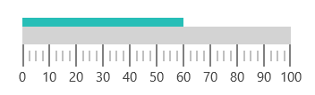
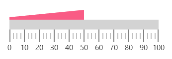
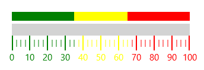
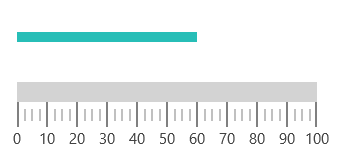
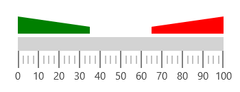
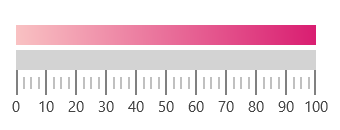
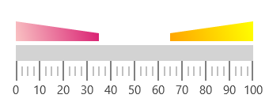

# Ranges in UWP Linear Gauge (SfLinearGauge)

Range is a visual element, which begins and ends at specified values within a scale. You can add any number of ranges to a scale using the array of range objects.

## Setting start and end values for range

The start and end values of ranges are set using the [`StartValue`](https://help.syncfusion.com/cr/uwp/Syncfusion.UI.Xaml.Gauges.LinearRange.html#Syncfusion_UI_Xaml_Gauges_LinearRange_StartValue) and [`EndValue`](https://help.syncfusion.com/cr/uwp/Syncfusion.UI.Xaml.Gauges.LinearRange.html#Syncfusion_UI_Xaml_Gauges_LinearRange_EndValue) properties.





    <gauge:SfLinearGauge>

        <gauge:SfLinearGauge.MainScale>

            <gauge:LinearScale     Interval="10" 
                                   MajorTickStroke="Gray" MajorTickSize="25" 
                                   MinorTickSize="12" LabelSize="15" ScaleBarSize="20"
                                   MinorTickStroke="Gray" LabelStroke="#424242"
                                   MinorTicksPerInterval="3" ScaleBarLength="300">

                <gauge:LinearScale.Ranges>

                    <gauge:LinearRange StartValue="0" EndValue="60"
                                           RangeStroke="#27BEB7"  StartWidth="10"
                                           EndWidth="10" RangeOffset="0.4" />

                </gauge:LinearScale.Ranges>

            </gauge:LinearScale>

        </gauge:SfLinearGauge.MainScale>

    </gauge:SfLinearGauge>





            SfLinearGauge sfLinearGauge = new SfLinearGauge();

            LinearScale linearScale = new LinearScale();

            linearScale.Interval = 10;

            linearScale.LabelSize = 15;

            linearScale.MajorTickStroke = new SolidColorBrush(Colors.Gray);

            linearScale.MinorTickStroke = new SolidColorBrush(Colors.Gray);

            linearScale.LabelStroke = new SolidColorBrush(Color.FromArgb(0xff, 0x42, 0x42, 0x42));

            linearScale.MajorTickSize = 25;

            linearScale.MinorTickSize = 12;

            linearScale.ScaleBarLength = 300;

            linearScale.MinorTicksPerInterval = 3;

            sfLinearGauge.MainScale = linearScale;

            LinearRange linearRange = new LinearRange();

            linearRange.StartValue = 0;

            linearRange.EndValue = 60;

            linearRange.RangeStroke = new SolidColorBrush(Color.FromArgb(0xff, 0x27, 0xBE, 0xB7));

            linearRange.StartWidth = 10;

            linearRange.EndWidth = 10;

            linearRange.RangeOffset = 0.4;

            linearScale.Ranges.Add(linearRange);

            sfLinearGauge.MainScale = linearScale;





## Range customization

The UI element of a range is customized by changing the [`RangeStroke`](https://help.syncfusion.com/cr/uwp/Syncfusion.UI.Xaml.Gauges.LinearRange.html#Syncfusion_UI_Xaml_Gauges_LinearRange_RangeStroke) of the linear range, and the appearance of linear range is customized by setting the [`StartWidth`](https://help.syncfusion.com/cr/uwp/Syncfusion.UI.Xaml.Gauges.LinearRange.html#Syncfusion_UI_Xaml_Gauges_LinearRange_StartWidth) and [`EndWidth`](https://help.syncfusion.com/cr/uwp/Syncfusion.UI.Xaml.Gauges.LinearRange.html#Syncfusion_UI_Xaml_Gauges_LinearRange_EndWidth) properties. By setting the [`RangeOpacity`](https://help.syncfusion.com/cr/uwp/Syncfusion.UI.Xaml.Gauges.LinearRange.html#Syncfusion_UI_Xaml_Gauges_LinearRange_RangeOpacity) of LinearRange, the opacity of the range can be modified.





      <gauge:SfLinearGauge>

        <gauge:SfLinearGauge.MainScale>

            <gauge:LinearScale     Interval="10" 
                                   MajorTickStroke="Gray" MajorTickSize="25" 
                                   MinorTickSize="12" LabelSize="15" ScaleBarSize="20"
                                   MinorTickStroke="Gray" LabelStroke="#424242"
                                   MinorTicksPerInterval="3" ScaleBarLength="300">

                <gauge:LinearScale.Ranges>

                    <gauge:LinearRange StartValue="0" EndValue="50"
                                           RangeStroke="#F95C85"  StartWidth="5"
                                           EndWidth="20"  RangeOpacity="1"/>

                </gauge:LinearScale.Ranges>

            </gauge:LinearScale>

        </gauge:SfLinearGauge.MainScale>

    </gauge:SfLinearGauge>




      
            SfLinearGauge sfLinearGauge = new SfLinearGauge();

            LinearScale linearScale = new LinearScale();

            linearScale.Interval = 10;

            linearScale.LabelSize = 15;

            linearScale.MajorTickStroke = new SolidColorBrush(Colors.Gray);

            linearScale.MinorTickStroke = new SolidColorBrush(Colors.Gray);

            linearScale.LabelStroke = new SolidColorBrush(Color.FromArgb(0xff, 0x42, 0x42, 0x42));

            linearScale.MajorTickSize = 25;

            linearScale.MinorTickSize = 12;

            linearScale.ScaleBarLength = 300;

            linearScale.MinorTicksPerInterval = 3;

            sfLinearGauge.MainScale = linearScale;

            LinearRange linearRange = new LinearRange();

            linearRange.StartValue = 0;

            linearRange.EndValue = 50;

            linearRange.RangeOpacity = 1;

            linearRange.RangeStroke = new SolidColorBrush(Color.FromArgb(0xff, 0xF9, 0x5C, 0x85));

            linearRange.StartWidth = 5;

            linearRange.EndWidth = 20;

            linearScale.Ranges.Add(linearRange);

            sfLinearGauge.MainScale = linearScale;





## Binding range stroke to ticks and labels

You can bind the range’s stroke to tick lines and labels within its range by setting the [`BindWithRangeStrokeToLabels`](https://help.syncfusion.com/cr/uwp/Syncfusion.UI.Xaml.Gauges.LinearScale.html#Syncfusion_UI_Xaml_Gauges_LinearScale_BindRangeStrokeToLabels). Stroke of the labels can be set related to stroke of the specified ranges. Similarly, by setting the [`BindWithRangeStrokeToTicks`](https://help.syncfusion.com/cr/uwp/Syncfusion.UI.Xaml.Gauges.LinearScale.html#Syncfusion_UI_Xaml_Gauges_LinearScale_BindRangeStrokeToTicks), stroke of the ticks can be set related to stroke of the specified ranges.





      <gauge:SfLinearGauge>

        <gauge:SfLinearGauge.MainScale>

            <gauge:LinearScale     Interval="10" BindRangeStrokeToLabels="True" 
                                   BindRangeStrokeToTicks="True"
                                   MajorTickStroke="Gray" MajorTickSize="25" 
                                   MinorTickSize="12" LabelSize="15" ScaleBarSize="20"
                                   MinorTickStroke="Gray" LabelStroke="#424242"
                                   MinorTicksPerInterval="3" ScaleBarLength="300">

                <gauge:LinearScale.Ranges>

                    <gauge:LinearRange StartValue="0" EndValue="35" 
                                            StartWidth="15" EndWidth="15" 
                                            RangeOffset="5" RangeStroke="Green"/>
                    <gauge:LinearRange StartValue="35" EndValue="65" 
                                            StartWidth="15" EndWidth="15" 
                                            RangeOffset="5" RangeStroke="Yellow"/>
                    <gauge:LinearRange StartValue="65" EndValue="100" 
                                            StartWidth="15" EndWidth="15" 
                                            RangeOffset="5" RangeStroke="Red"/>

                </gauge:LinearScale.Ranges>

            </gauge:LinearScale>

        </gauge:SfLinearGauge.MainScale>

    </gauge:SfLinearGauge>





           SfLinearGauge sfLinearGauge = new SfLinearGauge();

            LinearScale linearScale = new LinearScale();

            linearScale.Interval = 10;

            linearScale.LabelSize = 15;

            linearScale.MajorTickStroke = new SolidColorBrush(Colors.Gray);

            linearScale.MinorTickStroke = new SolidColorBrush(Colors.Gray);

            linearScale.LabelStroke = new SolidColorBrush(Color.FromArgb(0xff, 0x42, 0x42, 0x42));

            linearScale.MajorTickSize = 25;

            linearScale.MinorTickSize = 12;

            linearScale.ScaleBarLength = 300;

            linearScale.MinorTicksPerInterval = 3;

            linearScale.BindRangeStrokeToLabels = true;

            linearScale.BindRangeStrokeToTicks = true;

            sfLinearGauge.MainScale = linearScale;

            LinearRange linearRange = new LinearRange();

            linearRange.StartValue = 0;

            linearRange.EndValue = 35;

            linearRange.StartWidth = 15;

            linearRange.EndWidth = 15;

            linearRange.RangeOffset = 5;

            linearRange.RangeStroke = new SolidColorBrush(Colors.Green);

            linearScale.Ranges.Add(linearRange);

            LinearRange linearRange1 = new LinearRange();

            linearRange1.StartValue = 35;

            linearRange1.EndValue = 65;

            linearRange1.StartWidth = 15;

            linearRange1.EndWidth = 15;

            linearRange1.RangeOffset = 5;

            linearRange1.RangeStroke = new SolidColorBrush(Colors.Yellow);

            linearScale.Ranges.Add(linearRange1);

            LinearRange linearRange2 = new LinearRange();

            linearRange2.StartValue = 65;

            linearRange2.EndValue = 100;

            linearRange2.StartWidth = 15;

            linearRange2.EndWidth = 15;

            linearRange2.RangeOffset = 5;

            linearRange2.RangeStroke = new SolidColorBrush(Colors.Red);

            linearScale.Ranges.Add(linearRange2);





## Setting range position

	Using the [`RangeOffset`](https://help.syncfusion.com/cr/uwp/Syncfusion.UI.Xaml.Gauges.LinearRange.html#Syncfusion_UI_Xaml_Gauges_LinearRange_RangeOffset) property, the linear range can be positioned with respect to the linear scale.





     <gauge:SfLinearGauge>

        <gauge:SfLinearGauge.MainScale>

            <gauge:LinearScale     Interval="10" 
                                   MajorTickStroke="Gray" MajorTickSize="25" 
                                   MinorTickSize="12" LabelSize="15" ScaleBarSize="20"
                                   MinorTickStroke="Gray" LabelStroke="#424242"
                                   MinorTicksPerInterval="3" ScaleBarLength="300">

                <gauge:LinearScale.Ranges>

                    <gauge:LinearRange StartValue="0" EndValue="60"
                                           RangeStroke="#27BEB7" RangeOffset="40" StartWidth="10"
                                           EndWidth="10"/>

                </gauge:LinearScale.Ranges>

            </gauge:LinearScale>

        </gauge:SfLinearGauge.MainScale>

    </gauge:SfLinearGauge>





           SfLinearGauge sfLinearGauge = new SfLinearGauge();

            LinearScale linearScale = new LinearScale();

            linearScale.Interval = 10;

            linearScale.LabelSize = 15;

            linearScale.MajorTickStroke = new SolidColorBrush(Colors.Gray);

            linearScale.MinorTickStroke = new SolidColorBrush(Colors.Gray);

            linearScale.LabelStroke = new SolidColorBrush(Color.FromArgb(0xff, 0x42, 0x42, 0x42));

            linearScale.MajorTickSize = 25;

            linearScale.MinorTickSize = 12;

            linearScale.ScaleBarLength = 300;

            linearScale.MinorTicksPerInterval = 3;

            sfLinearGauge.MainScale = linearScale;

            LinearRange linearRange = new LinearRange();

            linearRange.StartValue = 0;

            linearRange.EndValue = 60;

            linearRange.RangeOffset = 40;

            linearRange.RangeStroke = new SolidColorBrush(Color.FromArgb(0xff, 0x27, 0xBE, 0xB7));

            linearRange.StartWidth = 10;

            linearRange.EndWidth = 10;

            linearScale.Ranges.Add(linearRange);





### Adding multiple ranges

You can add “n” number of ranges to a scale using the [`LinearRange`](https://help.syncfusion.com/cr/uwp/Syncfusion.UI.Xaml.Gauges.LinearRange.html) property of range as shown in the following code.





     <gauge:SfLinearGauge>

        <gauge:SfLinearGauge.MainScale>

            <gauge:LinearScale     Interval="10" 
                                   MajorTickStroke="Gray" MajorTickSize="25" 
                                   MinorTickSize="12" LabelSize="15" ScaleBarSize="20"
                                   MinorTickStroke="Gray" LabelStroke="#424242"
                                   MinorTicksPerInterval="3" ScaleBarLength="300">

                <gauge:LinearScale.Ranges>

                    <gauge:LinearRange StartValue="0" EndValue="35" 
                                            StartWidth="25" EndWidth="10" 
                                            RangeOffset="5" RangeOpacity="1"
                                            RangeStroke="Green"/>

                    <gauge:LinearRange StartValue="65" EndValue="100" 
                                            StartWidth="10" EndWidth="25" 
                                            RangeOffset="5" RangeOpacity="1"
                                            RangeStroke="Red"/>

                </gauge:LinearScale.Ranges>

            </gauge:LinearScale>

        </gauge:SfLinearGauge.MainScale>

    </gauge:SfLinearGauge>





            SfLinearGauge sfLinearGauge = new SfLinearGauge();

            LinearScale linearScale = new LinearScale();

            linearScale.Interval = 10;

            linearScale.LabelSize = 15;

            linearScale.MajorTickStroke = new SolidColorBrush(Colors.Gray);

            linearScale.MinorTickStroke = new SolidColorBrush(Colors.Gray);

            linearScale.LabelStroke = new SolidColorBrush(Color.FromArgb(0xff, 0x42, 0x42, 0x42));

            linearScale.MajorTickSize = 25;

            linearScale.MinorTickSize = 12;

            linearScale.ScaleBarLength = 300;

            linearScale.MinorTicksPerInterval = 3;

            sfLinearGauge.MainScale = linearScale;

            LinearRange linearRange = new LinearRange();

            linearRange.StartValue = 0;

            linearRange.EndValue = 35;

            linearRange.StartWidth = 25;

            linearRange.EndWidth = 10;

            linearRange.RangeOffset = 5;

            linearRange.RangeOpacity = 1;

            linearRange.RangeStroke = new SolidColorBrush(Colors.Green);

            linearScale.Ranges.Add(linearRange);

            LinearRange linearRange1 = new LinearRange();

            linearRange1.StartValue = 65;

            linearRange1.EndValue = 100;

            linearRange1.StartWidth = 10;

            linearRange1.EndWidth = 25;

            linearRange1.RangeOffset = 5;

            linearRange1.RangeOpacity = 1;

            linearRange1.RangeStroke = new SolidColorBrush(Colors.Red);

            linearScale.Ranges.Add(linearRange1);





### Setting gradient color for range

You can give smooth color transition to range to specifying the different colors based on range value by using [`GradientStops`](https://help.syncfusion.com/cr/uwp/Syncfusion.UI.Xaml.Gauges.LinearRange.html#Syncfusion_UI_Xaml_Gauges_LinearRange_GradientStops) property.





     <gauge:SfLinearGauge>

        <gauge:SfLinearGauge.MainScale>

            <gauge:LinearScale     Interval="10" 
                                   MajorTickStroke="Gray" MajorTickSize="25" 
                                   MinorTickSize="12" LabelSize="15" ScaleBarSize="20"
                                   MinorTickStroke="Gray" LabelStroke="#424242"
                                   MinorTicksPerInterval="3" ScaleBarLength="300">

                <gauge:LinearScale.Ranges>

                    <gauge:LinearRange StartValue="0" EndValue="100" 
                                            StartWidth="20" EndWidth="20" 
                                            RangeOffset="5">
                        
                        <gauge:LinearRange.GradientStops>
                            <gauge:GaugeGradientStop Value="0" Color="#FFF9C2C3"/>
                            <gauge:GaugeGradientStop Value="100" Color="#FFD91D71"/>
                        </gauge:LinearRange.GradientStops>

                    </gauge:LinearRange>

                </gauge:LinearScale.Ranges>

            </gauge:LinearScale>

        </gauge:SfLinearGauge.MainScale>

    </gauge:SfLinearGauge>





            SfLinearGauge sfLinearGauge = new SfLinearGauge();

            LinearScale linearScale = new LinearScale();

            linearScale.Interval = 10;

            linearScale.LabelSize = 15;

            linearScale.MajorTickStroke = new SolidColorBrush(Colors.Gray);

            linearScale.MinorTickStroke = new SolidColorBrush(Colors.Gray);

            linearScale.LabelStroke = new SolidColorBrush(Color.FromArgb(0xff, 0x42, 0x42, 0x42));

            linearScale.MajorTickSize = 25;

            linearScale.MinorTickSize = 12;

            linearScale.ScaleBarLength = 300;

            linearScale.MinorTicksPerInterval = 3;

            sfLinearGauge.MainScale = linearScale;

            LinearRange linearRange = new LinearRange();

            linearRange.StartValue = 0;

            linearRange.EndValue = 100;

            linearRange.StartWidth = 20;

            linearRange.EndWidth = 20;

            linearRange.RangeOffset = 5;

            ObservableCollection<GaugeGradientStop> gradientColor = new ObservableCollection<GaugeGradientStop>()
            {
                new GaugeGradientStop() {Value = 0, Color = Color.FromArgb(0xff, 0xF9, 0xC2, 0xC3) },
                new GaugeGradientStop() {Value = 100 ,Color = Color.FromArgb(0xff, 0xD9, 0x1D, 0x71) }
            };

            linearRange.GradientStops = gradientColor;

            linearScale.Ranges.Add(linearRange);





### Multiple range with multiple gradient

You can add “n” number of ranges with gradient color to a scale using the [`LinearRange`](https://help.syncfusion.com/cr/uwp/Syncfusion.UI.Xaml.Gauges.LinearRange.html) property of range as shown in the following code.





    <gauge:SfLinearGauge>

        <gauge:SfLinearGauge.MainScale>

            <gauge:LinearScale     Interval="10" 
                                   MajorTickStroke="Gray" MajorTickSize="25" 
                                   MinorTickSize="12" LabelSize="15" ScaleBarSize="20"
                                   MinorTickStroke="Gray" LabelStroke="#424242"
                                   MinorTicksPerInterval="3" ScaleBarLength="300">

                <gauge:LinearScale.Ranges>

                    <gauge:LinearRange StartValue="0" EndValue="35" 
                                            StartWidth="25" EndWidth="10" 
                                            RangeOffset="5" >

                        <gauge:LinearRange.GradientStops>
                            <gauge:GaugeGradientStop Value="0" Color="#FFF9C2C3"/>
                            <gauge:GaugeGradientStop Value="35" Color="#FFD91D71"/>
                        </gauge:LinearRange.GradientStops>

                    </gauge:LinearRange>

                    <gauge:LinearRange      StartValue="65" EndValue="100" 
                                            StartWidth="10" EndWidth="25" 
                                            RangeOffset="5" >

                        <gauge:LinearRange.GradientStops>
                            <gauge:GaugeGradientStop Value="65" Color="Orange"/>
                            <gauge:GaugeGradientStop Value="100" Color="Yellow"/>
                        </gauge:LinearRange.GradientStops>

                    </gauge:LinearRange>

                </gauge:LinearScale.Ranges>

            </gauge:LinearScale>

        </gauge:SfLinearGauge.MainScale>

    </gauge:SfLinearGauge>





            SfLinearGauge sfLinearGauge = new SfLinearGauge();

            LinearScale linearScale = new LinearScale();

            linearScale.Interval = 10;

            linearScale.LabelSize = 15;

            linearScale.MajorTickStroke = new SolidColorBrush(Colors.Gray);

            linearScale.MinorTickStroke = new SolidColorBrush(Colors.Gray);

            linearScale.LabelStroke = new SolidColorBrush(Color.FromArgb(0xff, 0x42, 0x42, 0x42));

            linearScale.MajorTickSize = 25;

            linearScale.MinorTickSize = 12;

            linearScale.ScaleBarLength = 300;

            linearScale.MinorTicksPerInterval = 3;

            sfLinearGauge.MainScale = linearScale;

            LinearRange linearRange = new LinearRange();

            linearRange.StartValue = 0;

            linearRange.EndValue = 35;

            linearRange.StartWidth = 25;

            linearRange.EndWidth = 10;

            linearRange.RangeOffset = 5;

            ObservableCollection<GaugeGradientStop> gradientColor = new ObservableCollection<GaugeGradientStop>()
            {
                new GaugeGradientStop() {Value = 0, Color = Color.FromArgb(0xff, 0xF9, 0xC2, 0xC3) },
                new GaugeGradientStop() {Value = 35 ,Color = Color.FromArgb(0xff, 0xD9, 0x1D, 0x71) }
            };

            linearRange.GradientStops = gradientColor;

            linearScale.Ranges.Add(linearRange);

            LinearRange linearRange1 = new LinearRange();

            linearRange1.StartValue = 65;

            linearRange1.EndValue = 100;

            linearRange1.StartWidth = 10;

            linearRange1.EndWidth = 25;

            linearRange1.RangeOffset = 5;

            ObservableCollection<GaugeGradientStop> gradientColor1 = new ObservableCollection<GaugeGradientStop>()
            {
                new GaugeGradientStop() {Value = 65, Color = Colors.Orange },
                new GaugeGradientStop() {Value = 100 ,Color = Colors.Yellow }
            };

            linearRange1.GradientStops = gradientColor1;

            linearScale.Ranges.Add(linearRange1);





