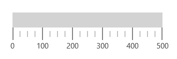

## Scale 

The [`MainScale`](https://help.syncfusion.com/cr/cref_files/uwp/Syncfusion.SfGauge.UWP~Syncfusion.UI.Xaml.Gauges.LinearScale.html) is a linear scale integrates ticks, labels, ranges, and pointers to customize the basic look and feel of the linear gauge.





     <gauge:SfLinearGauge>

        <gauge:SfLinearGauge.MainScale>

            <gauge:LinearScale     Interval="10" 
                                   MajorTickStroke="Gray" MajorTickSize="25" 
                                   MinorTickSize="12" LabelSize="15" ScaleBarSize="20"
                                   MinorTickStroke="Gray" LabelStroke="#424242"
                                   MinorTicksPerInterval="3" ScaleBarLength="300">

            </gauge:LinearScale>

        </gauge:SfLinearGauge.MainScale>

    </gauge:SfLinearGauge>





           SfLinearGauge sfLinearGauge = new SfLinearGauge();

            LinearScale linearScale = new LinearScale();

            linearScale.Interval = 10;

            linearScale.LabelSize = 15;

            linearScale.MajorTickStroke = new SolidColorBrush(Colors.Gray);

            linearScale.MinorTickStroke = new SolidColorBrush(Colors.Gray);

            linearScale.LabelStroke = new SolidColorBrush(Color.FromArgb(0xff, 0x42, 0x42, 0x42));

            linearScale.MajorTickSize = 25;

            linearScale.MinorTickSize = 12;

            linearScale.ScaleBarLength = 300;

            linearScale.MinorTicksPerInterval = 3;

            sfLinearGauge.MainScale = linearScale;





## Setting minimum and maximum values for a scale

To change the minimum and maximum values of a linear scale, use the [`Minimum`](https://help.syncfusion.com/cr/cref_files/uwp/Syncfusion.SfGauge.UWP~Syncfusion.UI.Xaml.Gauges.LinearScale~Minimum.html) and [`Maximum`](https://help.syncfusion.com/cr/cref_files/uwp/Syncfusion.SfGauge.UWP~Syncfusion.UI.Xaml.Gauges.LinearScale~Maximum.html) properties as shown in the following code snippet.





     <gauge:SfLinearGauge>

        <gauge:SfLinearGauge.MainScale>

            <gauge:LinearScale      Minimum="0" Maximum="200"
                                   MajorTickStroke="Gray" MajorTickSize="25" 
                                   MinorTickSize="12" LabelSize="15" 
                                   MinorTickStroke="Gray" LabelStroke="#424242"
                                   MinorTicksPerInterval="3" ScaleBarLength="300">

            </gauge:LinearScale>

        </gauge:SfLinearGauge.MainScale>

    </gauge:SfLinearGauge>





          SfLinearGauge sfLinearGauge = new SfLinearGauge();

            LinearScale linearScale = new LinearScale();

            linearScale.Minimum = 0;

            linearScale.Maximum = 200;

            linearScale.LabelSize = 15;

            linearScale.MajorTickStroke = new SolidColorBrush(Colors.Gray);

            linearScale.MinorTickStroke = new SolidColorBrush(Colors.Gray);

            linearScale.LabelStroke = new SolidColorBrush(Color.FromArgb(0xff, 0x42, 0x42, 0x42));

            linearScale.MajorTickSize = 25;

            linearScale.MinorTickSize = 12;

            linearScale.ScaleBarLength = 300;

            linearScale.MinorTicksPerInterval = 3;

            sfLinearGauge.MainScale = linearScale;





## Setting interval for a scale

The [`Interval`](https://help.syncfusion.com/cr/cref_files/uwp/Syncfusion.SfGauge.UWP~Syncfusion.UI.Xaml.Gauges.LinearScale~Interval.html) property allows to set intervals for scale. The default value of the `Interval` property is auto interval. Auto interval defines the count of the scale labels as 3 for 100 pixels.





       <gauge:SfLinearGauge>

        <gauge:SfLinearGauge.MainScale>

            <gauge:LinearScale      Minimum="0" Maximum="500" Interval="100"
                                   MajorTickStroke="Gray" MajorTickSize="25" 
                                   MinorTickSize="12" LabelSize="15" 
                                   MinorTickStroke="Gray" LabelStroke="#424242"
                                   MinorTicksPerInterval="3" ScaleBarLength="300">

            </gauge:LinearScale>

        </gauge:SfLinearGauge.MainScale>

    </gauge:SfLinearGauge>





             SfLinearGauge sfLinearGauge = new SfLinearGauge();

            LinearScale linearScale = new LinearScale();

            linearScale.Minimum = 0;

            linearScale.Maximum = 500;

            linearScale.Interval = 100;

            linearScale.LabelSize = 15;

            linearScale.MajorTickStroke = new SolidColorBrush(Colors.Gray);

            linearScale.MinorTickStroke = new SolidColorBrush(Colors.Gray);

            linearScale.LabelStroke = new SolidColorBrush(Color.FromArgb(0xff, 0x42, 0x42, 0x42));

            linearScale.MajorTickSize = 25;

            linearScale.MinorTickSize = 12;

            linearScale.ScaleBarLength = 300;

            linearScale.MinorTicksPerInterval = 3;

            sfLinearGauge.MainScale = linearScale;





## Scale customization

You can customize the color, length, size, and position of the [`LinearScale`](https://help.syncfusion.com/cr/cref_files/uwp/Syncfusion.SfGauge.UWP~Syncfusion.UI.Xaml.Gauges.LinearScale.html) using the [`ScaleBarStroke`](https://help.syncfusion.com/cr/cref_files/uwp/Syncfusion.SfGauge.UWP~Syncfusion.UI.Xaml.Gauges.LinearScale~ScaleBarStroke.html), [`ScaleBarLength`](https://help.syncfusion.com/cr/cref_files/uwp/Syncfusion.SfGauge.UWP~Syncfusion.UI.Xaml.Gauges.LinearScale~ScaleBarLength.html), [`ScaleBarSize`](https://help.syncfusion.com/cr/cref_files/uwp/Syncfusion.SfGauge.UWP~Syncfusion.UI.Xaml.Gauges.LinearScale~ScaleBarSize.html), [`ScaleBarBorderThickness`](https://help.syncfusion.com/cr/cref_files/uwp/Syncfusion.SfGauge.UWP~Syncfusion.UI.Xaml.Gauges.LinearScale~ScaleBarBorderThickness.html), and [`ScaleBarBorderBrush`](https://help.syncfusion.com/cr/cref_files/uwp/Syncfusion.SfGauge.UWP~Syncfusion.UI.Xaml.Gauges.LinearScale~ScaleBarBorderBrush.html) properties, respectively.





     <gauge:SfLinearGauge>

        <gauge:SfLinearGauge.MainScale>

            <gauge:LinearScale    ScaleBarBorderBrush="Red"  ScaleBarStroke="Blue" MajorTickStroke="Gray"
                                   MinorTickStroke="Gray" LabelStroke="#424242" ScaleBarBorderThickness="3"
                                   MinorTickSize="12" LabelSize="15" MajorTickSize="25" 
                                   ScaleBarSize="20" MinorTicksPerInterval="3" ScaleBarLength="300"/>

        </gauge:SfLinearGauge.MainScale>

    </gauge:SfLinearGauge>





            SfLinearGauge sfLinearGauge = new SfLinearGauge();

            LinearScale linearScale = new LinearScale();

            linearScale.ScaleBarStroke = new SolidColorBrush(Colors.Blue);

            linearScale.MajorTickStroke = new SolidColorBrush(Colors.Gray);

            linearScale.MinorTickStroke = new SolidColorBrush(Colors.Gray);

            linearScale.LabelStroke = new SolidColorBrush(Color.FromArgb(0xff, 0x42, 0x42, 0x42));

            linearScale.ScaleBarSize = 20;

            linearScale.ScaleBarBorderThickness = new Thickness(3);

            linearScale.ScaleBarBorderBrush = new SolidColorBrush(Colors.Red);

            linearScale.MajorTickSize = 25;

            linearScale.MinorTickSize = 12;

            linearScale.MinorTicksPerInterval = 3;

            linearScale.ScaleBarLength = 300;

            sfLinearGauge.MainScale = linearScale;





## Setting scale direction

You can set the scale position to its forward and backward using the [`ScaleDirection`](https://help.syncfusion.com/cr/cref_files/uwp/Syncfusion.SfGauge.UWP~Syncfusion.UI.Xaml.Gauges.LinearScale~ScaleDirection.html) property.





      <gauge:SfLinearGauge>

        <gauge:SfLinearGauge.MainScale>

            <gauge:LinearScale      ScaleDirection="Backward" Interval="10"
                                   MajorTickStroke="Gray" MajorTickSize="25" 
                                   MinorTickSize="12" LabelSize="15" 
                                   MinorTickStroke="Gray" LabelStroke="#424242"
                                   MinorTicksPerInterval="3" ScaleBarLength="300">

            </gauge:LinearScale>

        </gauge:SfLinearGauge.MainScale>

    </gauge:SfLinearGauge>





            SfLinearGauge sfLinearGauge = new SfLinearGauge();

            LinearScale linearScale = new LinearScale();

            linearScale.ScaleDirection = LinearScaleDirection.Backward;

            linearScale.Interval = 10;

            linearScale.LabelSize = 15;

            linearScale.MajorTickStroke = new SolidColorBrush(Colors.Gray);

            linearScale.MinorTickStroke = new SolidColorBrush(Colors.Gray);

            linearScale.LabelStroke = new SolidColorBrush(Color.FromArgb(0xff, 0x42, 0x42, 0x42));

            linearScale.MajorTickSize = 25;

            linearScale.MinorTickSize = 12;

            linearScale.ScaleBarLength = 300;

            linearScale.MinorTicksPerInterval = 3;

            sfLinearGauge.MainScale = linearScale;





## Setting position for a scale

You can set the scale position using the [`ScaleBarPositionFactor`](https://help.syncfusion.com/cr/cref_files/uwp/Syncfusion.SfGauge.UWP~Syncfusion.UI.Xaml.Gauges.LinearScale~ScaleBarPositionFactor.html) property. First, set the [`ElementsPositionMode`](https://help.syncfusion.com/cr/cref_files/uwp/Syncfusion.SfGauge.UWP~Syncfusion.UI.Xaml.Gauges.LinearScale~ElementsPositionMode.html) to custom, and then set [`ScaleBarPositionFactor`](https://help.syncfusion.com/cr/cref_files/uwp/Syncfusion.SfGauge.UWP~Syncfusion.UI.Xaml.Gauges.LinearScale~ScaleBarPositionFactor.html).





      <gauge:SfLinearGauge>

        <gauge:SfLinearGauge.MainScale>

            <gauge:LinearScale     ElementsPositionMode="Custom"
                                   ScaleBarPositionFactor="50" TickPositionFactor="0.443" Interval="10"
                                   MajorTickStroke="Gray" MajorTickSize="25" 
                                   MinorTickSize="12" LabelSize="15" 
                                   MinorTickStroke="Gray" LabelStroke="#424242"
                                   MinorTicksPerInterval="3" ScaleBarLength="300">

            </gauge:LinearScale>

        </gauge:SfLinearGauge.MainScale>

    </gauge:SfLinearGauge>





             SfLinearGauge sfLinearGauge = new SfLinearGauge();

            LinearScale linearScale = new LinearScale();

            linearScale.ElementsPositionMode = LinearScalePositionModes.Custom;

            linearScale.ScaleBarPositionFactor = 0.5;

            linearScale.TickPositionFactor = 0.443;

            linearScale.Interval = 10;

            linearScale.LabelSize = 15;

            linearScale.MajorTickStroke = new SolidColorBrush(Colors.Gray);

            linearScale.MinorTickStroke = new SolidColorBrush(Colors.Gray);

            linearScale.LabelStroke = new SolidColorBrush(Color.FromArgb(0xff, 0x42, 0x42, 0x42));

            linearScale.MajorTickSize = 25;

            linearScale.MinorTickSize = 12;

            linearScale.ScaleBarLength = 300;

            linearScale.MinorTicksPerInterval = 3;

            sfLinearGauge.MainScale = linearScale;





## Setting corner radius type for scale 

Corners of the LinearScale can be customized by setting the value to the [`CornerRadius`](https://help.syncfusion.com/cr/cref_files/uwp/Syncfusion.SfGauge.UWP~Syncfusion.UI.Xaml.Gauges.LinearScale~CornerRadius.html) property. 





      <gauge:SfLinearGauge>

        <gauge:SfLinearGauge.MainScale>

            <gauge:LinearScale     CornerRadius="10"
                                   MajorTickStroke="Gray" MajorTickSize="25" 
                                   MinorTickSize="12" LabelSize="15" 
                                   MinorTickStroke="Gray" LabelStroke="#424242"
                                   MinorTicksPerInterval="3" ScaleBarLength="300">

            </gauge:LinearScale>

        </gauge:SfLinearGauge.MainScale>

    </gauge:SfLinearGauge>





             SfLinearGauge sfLinearGauge = new SfLinearGauge();

            LinearScale linearScale = new LinearScale();

            linearScale.CornerRadius = new CornerRadius(10);

            linearScale.LabelSize = 15;

            linearScale.MajorTickStroke = new SolidColorBrush(Colors.Gray);

            linearScale.MinorTickStroke = new SolidColorBrush(Colors.Gray);

            linearScale.LabelStroke = new SolidColorBrush(Color.FromArgb(0xff, 0x42, 0x42, 0x42));

            linearScale.MajorTickSize = 25;

            linearScale.MinorTickSize = 12;

            linearScale.ScaleBarLength = 300;

            linearScale.MinorTicksPerInterval = 3;

            sfLinearGauge.MainScale = linearScale;





## Setting gradient color for scale

You can give smooth color transition to scale to specifying the different colors based on scale value by using [`GradientStops`](https://help.syncfusion.com/cr/cref_files/uwp/Syncfusion.SfGauge.UWP~Syncfusion.UI.Xaml.Gauges.LinearScale~GradientStops.html) property.





     <gauge:SfLinearGauge>

        <gauge:SfLinearGauge.MainScale>

            <gauge:LinearScale     
                                   MajorTickStroke="Gray" MajorTickSize="25" 
                                   MinorTickSize="12" LabelSize="15"
                                   MinorTickStroke="Gray" LabelStroke="#424242"
                                   MinorTicksPerInterval="3" ScaleBarLength="300">

                <gauge:LinearScale.GradientStops>
                    
                    <gauge:GaugeGradientStop Value="10" Color="#51c9e1"/>
                    <gauge:GaugeGradientStop Value="40" Color="#93e9e1"/>
                    <gauge:GaugeGradientStop Value="50" Color="#c5e692"/>
                    <gauge:GaugeGradientStop Value="60" Color="#fedd2b"/>
                    <gauge:GaugeGradientStop Value="100" Color="#e87813"/>

                </gauge:LinearScale.GradientStops>

            </gauge:LinearScale>

        </gauge:SfLinearGauge.MainScale>

    </gauge:SfLinearGauge>





           SfLinearGauge sfLinearGauge = new SfLinearGauge();

            LinearScale linearScale = new LinearScale();

            linearScale.LabelSize = 15;

            linearScale.MajorTickStroke = new SolidColorBrush(Colors.Gray);

            linearScale.MinorTickStroke = new SolidColorBrush(Colors.Gray);

            linearScale.LabelStroke = new SolidColorBrush(Color.FromArgb(0xff, 0x42, 0x42, 0x42));

            linearScale.MajorTickSize = 25;

            linearScale.MinorTickSize = 12;

            linearScale.ScaleBarLength = 300;

            GaugeGradientStop gaugeGradientStop = new GaugeGradientStop();

            gaugeGradientStop.Value = 10;

            gaugeGradientStop.Color = Color.FromArgb(0xff, 0x51, 0xc9, 0xe1);

            linearScale.GradientStops.Add(gaugeGradientStop);

            GaugeGradientStop gaugeGradientStop1 = new GaugeGradientStop();

            gaugeGradientStop1.Value = 40;

            gaugeGradientStop1.Color = Color.FromArgb(0xff, 0x93, 0xe9, 0xe1);

            linearScale.GradientStops.Add(gaugeGradientStop1);

            GaugeGradientStop gaugeGradientStop2 = new GaugeGradientStop();

            gaugeGradientStop2.Value = 50;

            gaugeGradientStop2.Color = Color.FromArgb(0xff, 0xc5, 0xe6, 0x92);

            linearScale.GradientStops.Add(gaugeGradientStop2);

            GaugeGradientStop gaugeGradientStop3 = new GaugeGradientStop();

            gaugeGradientStop3.Value = 60;

            gaugeGradientStop3.Color = Color.FromArgb(0xff, 0xfe, 0xdd, 0x2b);

            linearScale.GradientStops.Add(gaugeGradientStop3);

            GaugeGradientStop gaugeGradientStop4 = new GaugeGradientStop();

            gaugeGradientStop4.Value = 100;

            gaugeGradientStop4.Color = Color.FromArgb(0xff, 0xe8, 0x78, 0x13);

            linearScale.GradientStops.Add(gaugeGradientStop4);

            linearScale.MinorTicksPerInterval = 3;

            sfLinearGauge.MainScale = linearScale;





