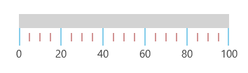
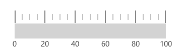
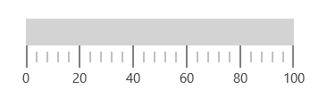

# Ticks in UWP Linear Gauge (SfLinearGauge)

Ticks are used to identify the gauge’s data value by marking the gauge scale in regular increments.

## Tick customization

By setting the [`MajorTickStroke`](https://help.syncfusion.com/cr/uwp/Syncfusion.UI.Xaml.Gauges.LinearScale.html#Syncfusion_UI_Xaml_Gauges_LinearScale_MajorTickStroke) and [`MinorTickStroke`](https://help.syncfusion.com/cr/uwp/Syncfusion.UI.Xaml.Gauges.LinearScale.html#Syncfusion_UI_Xaml_Gauges_LinearScale_MinorTickStroke) properties, the stroke of the major ticks and minor ticks can be customized. Using the [`MajorTickStrokeThickness`](https://help.syncfusion.com/cr/uwp/Syncfusion.UI.Xaml.Gauges.LinearScale.html#Syncfusion_UI_Xaml_Gauges_LinearScale_MajorTickStrokeThickness) and [`MinorTickStrokeThickness`](https://help.syncfusion.com/cr/uwp/Syncfusion.UI.Xaml.Gauges.LinearScale.html#Syncfusion_UI_Xaml_Gauges_LinearScale_MinorTickStrokeThickness), the stroke thickness of the major ticks and minor ticks can be customized. The size of the major ticks and minor ticks can be modified using the [`MajorTickSize`](https://help.syncfusion.com/cr/uwp/Syncfusion.UI.Xaml.Gauges.LinearScale.html#Syncfusion_UI_Xaml_Gauges_LinearScale_MajorTickSize) and [`MinorTickSize`](https://help.syncfusion.com/cr/uwp/Syncfusion.UI.Xaml.Gauges.LinearScale.html#Syncfusion_UI_Xaml_Gauges_LinearScale_MinorTickSize) properties.





     <gauge:SfLinearGauge>

        <gauge:SfLinearGauge.MainScale>

            <gauge:LinearScale     MajorTickStroke="SkyBlue"
                                   MinorTickStroke="Brown" LabelStroke="#424242"
                                   MinorTickStrokeThickness="1" MajorTickStrokeThickness="2" MajorTickSize="25" 
                                   MinorTickSize="12" LabelSize="15" ScaleBarSize="20" 
                                   MinorTicksPerInterval="3" ScaleBarLength="300">       

            </gauge:LinearScale>

        </gauge:SfLinearGauge.MainScale>

    </gauge:SfLinearGauge>





             SfLinearGauge sfLinearGauge = new SfLinearGauge();

            LinearScale linearScale = new LinearScale();

            linearScale.LabelSize = 15;

            linearScale.MajorTickStroke = new SolidColorBrush(Colors.SkyBlue);

            linearScale.MinorTickStroke = new SolidColorBrush(Colors.Brown);

            linearScale.MinorTickStrokeThickness = 1;

            linearScale.MajorTickStrokeThickness = 2;

            linearScale.LabelStroke = new SolidColorBrush(Color.FromArgb(0xff, 0x42, 0x42, 0x42));

            linearScale.MajorTickSize = 25;

            linearScale.MinorTickSize = 12;

            linearScale.ScaleBarLength = 300;

            linearScale.MinorTicksPerInterval = 3;

            sfLinearGauge.MainScale = linearScale;





## Setting position for tick

The ticks in the scale can be placed above, below, or in between the scale by choosing one of the following options available in the [`TickPosition`](https://help.syncfusion.com/cr/uwp/Syncfusion.UI.Xaml.Gauges.LinearScale.html#Syncfusion_UI_Xaml_Gauges_LinearScale_TickPosition) property:

1.	Above
2.	Below (Default)
3.	Cross





     <gauge:SfLinearGauge>

        <gauge:SfLinearGauge.MainScale>

            <gauge:LinearScale     TickPosition="Above"
                                   MajorTickStroke="Gray" MajorTickSize="25" 
                                   MinorTickSize="12" LabelSize="15" 
                                   MinorTickStroke="Gray" LabelStroke="#424242"
                                   MinorTicksPerInterval="3" ScaleBarLength="300">

            </gauge:LinearScale>

        </gauge:SfLinearGauge.MainScale>

    </gauge:SfLinearGauge>





            SfLinearGauge sfLinearGauge = new SfLinearGauge();

            LinearScale linearScale = new LinearScale();

            linearScale.TickPosition = LinearTicksPosition.Above;

            linearScale.LabelSize = 15;

            linearScale.MajorTickStroke = new SolidColorBrush(Colors.Gray);

            linearScale.MinorTickStroke = new SolidColorBrush(Colors.Gray);

            linearScale.LabelStroke = new SolidColorBrush(Color.FromArgb(0xff, 0x42, 0x42, 0x42));

            linearScale.MajorTickSize = 25;

            linearScale.MinorTickSize = 12;

            linearScale.ScaleBarLength = 300;

            linearScale.MinorTicksPerInterval = 3;

            sfLinearGauge.MainScale = linearScale;





## Setting minor ticks per interval

The [`Interval`](https://help.syncfusion.com/cr/uwp/Syncfusion.UI.Xaml.Gauges.LinearScale.html#Syncfusion_UI_Xaml_Gauges_LinearScale_Interval) property is used to calculate the tick counts for a scale. Like ticks, minor ticks can also be calculated by using the [`MinorTicksPerInterval`](https://help.syncfusion.com/cr/uwp/Syncfusion.UI.Xaml.Gauges.LinearScale.html#Syncfusion_UI_Xaml_Gauges_LinearScale_MinorTicksPerInterval) property.





       <gauge:SfLinearGauge>

        <gauge:SfLinearGauge.MainScale>

            <gauge:LinearScale     
                                   MajorTickStroke="Gray" MajorTickSize="25" 
                                   MinorTickSize="12" LabelSize="15" 
                                   MinorTickStroke="Gray" LabelStroke="#424242"
                                   MinorTicksPerInterval="4" ScaleBarLength="300">

            </gauge:LinearScale>

        </gauge:SfLinearGauge.MainScale>

    </gauge:SfLinearGauge>





               SfLinearGauge sfLinearGauge = new SfLinearGauge();

            LinearScale linearScale = new LinearScale();

            linearScale.LabelSize = 15;

            linearScale.MajorTickStroke = new SolidColorBrush(Colors.Gray);

            linearScale.MinorTickStroke = new SolidColorBrush(Colors.Gray);

            linearScale.LabelStroke = new SolidColorBrush(Color.FromArgb(0xff, 0x42, 0x42, 0x42));

            linearScale.MajorTickSize = 25;

            linearScale.MinorTickSize = 12;

            linearScale.ScaleBarLength = 300;

            linearScale.MinorTicksPerInterval = 4;

            sfLinearGauge.MainScale = linearScale;
            




