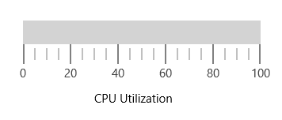

---

layout: post
title: Annotations in UWP Linear Gauge control | Syncfusion
description: Learn here all about Annotations support in Syncfusion UWP Linear Gauge (SfLinearGauge) control and more.
platform: uwp
control: SfLinearGauge
documentation: ug

---

# Annotations in UWP Linear Gauge (SfLinearGauge)

[`SfLinearGauge`](https://help.syncfusion.com/cr/uwp/Syncfusion.UI.Xaml.Gauges.SfLinearGauge.html)  supports [`Annotations`](https://help.syncfusion.com/cr/uwp/Syncfusion.UI.Xaml.Gauges.SfLinearGauge.html#Syncfusion_UI_Xaml_Gauges_SfLinearGauge_Annotations) , which is used to mark the specific area of interest in the gauge area with texts, shapes, or images. You can add any number of annotations to the gauge.

##  Annotation

By using the `ContentTemplate` property of annotation object, you can specify the new element that needs to be displayed in the gauge area.





    <gauge:SfLinearGauge>

    <gauge:SfLinearGauge.Annotations>

    <gauge:LinearGaugeAnnotation OffsetX = "0.5" OffsetY ="0.4">

    <gauge:LinearGaugeAnnotation.ContentTemplate>

    <DataTemplate>

    <TextBlock Text="CPU Utilization" Foreground="Black" Height="40" Width="120"/>

    </DataTemplate>

    </gauge:LinearGaugeAnnotation.ContentTemplate>

    </gauge:LinearGaugeAnnotation>

    </gauge:SfLinearGauge.Annotations>
        
    <gauge:SfLinearGauge.MainScale>

    <gauge:LinearScale      MajorTickStroke="Gray" MajorTickSize="25" 

     MinorTickSize="15" LabelSize="15" MinorTickStroke="Gray" LabelStroke="#424242"

     MinorTicksPerInterval="3" ScaleBarLength="300" />

    </gauge:SfLinearGauge.MainScale>

    </gauge:SfLinearGauge>





          SfLinearGauge linearGauge = new SfLinearGauge();

            LinearGaugeAnnotation linearGaugeAnnotation = new LinearGaugeAnnotation();

            linearGaugeAnnotation.OffsetX = 0.5;

            linearGaugeAnnotation.OffsetY = 0.4;

            var content = "<DataTemplate xmlns=\"http://schemas.microsoft.com/winfx/2006/xaml/presentation\">";

            content += "<Grid>";

            content += "<TextBlock Text=\"CPU Utilization\" Height=\"40\" Width=\"120\" Foreground=\"Black\">";

            content += "</TextBlock>" + "</Grid>";

            content += "</DataTemplate>";

            linearGaugeAnnotation.ContentTemplate = (DataTemplate)XamlReader.Load(content);

            linearGauge.Annotations.Add(linearGaugeAnnotation);

            LinearScale linearScale = new LinearScale();

            linearScale.ScaleBarLength = 300;

            linearScale.ScaleBarStroke =new SolidColorBrush(Color.FromArgb(0xff, 0xe0, 0xe0, 0xe0));

            linearScale.LabelStroke = new SolidColorBrush(Color.FromArgb(0xff, 0x42, 0x42, 0x42));

            linearScale.LabelSize = 15;

            linearScale.MajorTickSize = 25;

            linearScale.MajorTickStroke =new SolidColorBrush(Colors.Gray);

            linearScale.MinorTickStroke = new SolidColorBrush(Colors.Gray);

            linearScale.MinorTickSize = 15;

            linearGauge.MainScale = linearScale;





##  Positioning the annotation

You can place the annotation anywhere in gauge area by using the `Offset` or `ScaleValue` property.

### Change annotation position by using offset

You can position the annotation anywhere in the linear gauge by using the [`OffsetX`](https://help.syncfusion.com/cr/uwp/Syncfusion.UI.Xaml.Gauges.LinearGaugeAnnotation.html#Syncfusion_UI_Xaml_Gauges_LinearGaugeAnnotation_OffsetX)  and [`OffsetY`](https://help.syncfusion.com/cr/uwp/Syncfusion.UI.Xaml.Gauges.LinearGaugeAnnotation.html#Syncfusion_UI_Xaml_Gauges_LinearGaugeAnnotation_OffsetY)  properties. It ranges from 0 to 1.





    <gauge:SfLinearGauge>

    <gauge:SfLinearGauge.Annotations>

    <gauge:LinearGaugeAnnotation OffsetX = "0.5" OffsetY ="0.6">

    <gauge:LinearGaugeAnnotation.ContentTemplate>

    <DataTemplate>

    <TextBlock Text="CPU Utilization" Foreground="Black" Height="40" Width="120"/>

    </DataTemplate>

    </gauge:LinearGaugeAnnotation.ContentTemplate>

    </gauge:LinearGaugeAnnotation>

    </gauge:SfLinearGauge.Annotations>

    <gauge:SfLinearGauge.MainScale>

    <gauge:LinearScale      MajorTickStroke="Gray" MajorTickSize="25" 

     MinorTickSize="15" LabelSize="15"  MinorTickStroke="Gray" LabelStroke="#424242"

     MinorTicksPerInterval="3" ScaleBarLength="300" />

    </gauge:SfLinearGauge.MainScale>

    </gauge:SfLinearGauge>





            SfLinearGauge linearGauge = new SfLinearGauge();

            LinearGaugeAnnotation linearGaugeAnnotation = new LinearGaugeAnnotation();

            linearGaugeAnnotation.OffsetX = 0.5;

            linearGaugeAnnotation.OffsetY = 0.6;

            var content = "<DataTemplate xmlns=\"http://schemas.microsoft.com/winfx/2006/xaml/presentation\">";

            content += "<Grid>";

            content += "<TextBlock Text=\"CPU Utilization\" Height=\"40\" Width=\"120\" Foreground=\"Black\">";

            content += "</TextBlock>" + "</Grid>";

            content += "</DataTemplate>";

            linearGaugeAnnotation.ContentTemplate = (DataTemplate)XamlReader.Load(content);

            linearGauge.Annotations.Add(linearGaugeAnnotation);

            LinearScale linearScale = new LinearScale();

            linearScale.ScaleBarLength = 300;

            linearScale.ScaleBarStroke =new SolidColorBrush(Color.FromArgb(0xff, 0xe0, 0xe0, 0xe0));

            linearScale.LabelStroke = new SolidColorBrush(Color.FromArgb(0xff, 0x42, 0x42, 0x42));

            linearScale.LabelSize = 15;

            linearScale.MajorTickSize = 25;

            linearScale.MajorTickStroke =new SolidColorBrush(Colors.Gray);

            linearScale.MinorTickStroke = new SolidColorBrush(Colors.Gray);

            linearScale.MinorTickSize = 15;

            linearGauge.MainScale = linearScale;
          





###  Change annotation position by using scale value

You can also place the annotation by specifying the [`ScaleValue`](https://help.syncfusion.com/cr/uwp/Syncfusion.UI.Xaml.Gauges.LinearGaugeAnnotation.html#Syncfusion_UI_Xaml_Gauges_LinearGaugeAnnotation_ScaleValue) property.





    <gauge:SfLinearGauge>

    <gauge:SfLinearGauge.Annotations>

    <gauge:LinearGaugeAnnotation ScaleValue="60">

    <gauge:LinearGaugeAnnotation.ContentTemplate>

    <DataTemplate>

    <TextBlock Text="60%" Foreground="Black" />

    </DataTemplate>

    </gauge:LinearGaugeAnnotation.ContentTemplate>

    </gauge:LinearGaugeAnnotation>

    </gauge:SfLinearGauge.Annotations>

    <gauge:SfLinearGauge.MainScale>

    <gauge:LinearScale Minimum="0" Maximum="90" ScaleBarSize="30"   Interval="10"   MajorTickStroke="Gray" 
    
    MajorTickSize="25" MinorTickSize="15" LabelSize="15"  MinorTickStroke="Gray" LabelStroke="#424242"

    MinorTicksPerInterval="3" ScaleBarLength="300" >

    <gauge:LinearScale.Pointers>

    <gauge:LinearPointer  PointerType="BarPointer" Value="60" BarPointerStroke = "#f95c85" 
                    
    BarPointerStrokeThickness = "20"  CornerRadius ="0,10,10,0" />

    </gauge:LinearScale.Pointers>

    </gauge:LinearScale>

    </gauge:SfLinearGauge.MainScale>

    </gauge:SfLinearGauge>





             SfLinearGauge linearGauge = new SfLinearGauge();

            LinearGaugeAnnotation linearGaugeAnnotation = new LinearGaugeAnnotation();

            linearGaugeAnnotation.ScaleValue = 60;

            var content = "<DataTemplate xmlns=\"http://schemas.microsoft.com/winfx/2006/xaml/presentation\">";

            content += "<Grid>";

            content += "<TextBlock Text=\"60%\"  Foreground=\"Black\">";

            content += "</TextBlock>" + "</Grid>";

            content += "</DataTemplate>";

            linearGaugeAnnotation.ContentTemplate = (DataTemplate)XamlReader.Load(content);

            linearGauge.Annotations.Add(linearGaugeAnnotation);

            LinearScale linearScale = new LinearScale();

             linearScale.Minimum = 0;

            linearScale.Maximum = 90;

            linearScale.ScaleBarSize = 30;

            linearScale.Interval = 10;

            linearScale.ScaleBarLength = 300;

            linearScale.ScaleBarStroke =new SolidColorBrush(Color.FromArgb(0xff, 0xe0, 0xe0, 0xe0));

            linearScale.LabelStroke = new SolidColorBrush(Color.FromArgb(0xff, 0x42, 0x42, 0x42));

            linearScale.LabelSize = 15;

            linearScale.MajorTickSize = 25;

            linearScale.MajorTickStroke =new SolidColorBrush(Colors.Gray);

            linearScale.MinorTickStroke = new SolidColorBrush(Colors.Gray);

            linearScale.MinorTickSize = 15;

            LinearPointer linearPointer = new LinearPointer();

            linearPointer.PointerType = LinearPointerType.BarPointer;

            linearPointer.Value = 60;

            linearPointer.BarPointerStrokeThickness = 20;

            linearPointer.CornerRadius = new CornerRadius(0,10,10,0);

            linearPointer.BarPointerStroke = new SolidColorBrush(Color.FromArgb(0xff, 0xf9, 0x5c, 0x85));

            linearScale.Pointers.Add(linearPointer);

            linearGauge.MainScale = linearScale;
          





##  Set margin to the annotation

You can adjust the annotation by specifying the [`ViewMargin`](https://help.syncfusion.com/cr/uwp/Syncfusion.UI.Xaml.Gauges.LinearGaugeAnnotation.html#Syncfusion_UI_Xaml_Gauges_LinearGaugeAnnotation_ViewMargin)  property in pixel, which adjusts the annotation element from its current position. 





    <gauge:SfLinearGauge>

    <gauge:SfLinearGauge.Annotations>

    <gauge:LinearGaugeAnnotation ScaleValue="60" ViewMargin ="10,60">

    <gauge:LinearGaugeAnnotation.ContentTemplate>

    <DataTemplate>

    <TextBlock Text="60%" Foreground="Black"/>

    </DataTemplate>

    </gauge:LinearGaugeAnnotation.ContentTemplate>

    </gauge:LinearGaugeAnnotation>

    </gauge:SfLinearGauge.Annotations>

    <gauge:SfLinearGauge.MainScale>

    <gauge:LinearScale   Interval="10" Minimum="0" Maximum="90" ScaleBarSize="30"  MajorTickStroke="Gray" 
    
    MajorTickSize="25"  MinorTickSize="15" LabelSize="15"  MinorTickStroke="Gray" LabelStroke="#424242"

     MinorTicksPerInterval="3" ScaleBarLength="300" >

    <gauge:LinearScale.Pointers>

    <gauge:LinearPointer  PointerType="BarPointer" Value="60" BarPointerStroke = "#f95c85" 
                    
    BarPointerStrokeThickness = "20"  CornerRadius ="0,10,10,0" />

    </gauge:LinearScale.Pointers>

    </gauge:LinearScale>

    </gauge:SfLinearGauge.MainScale>

    </gauge:SfLinearGauge>





             SfLinearGauge linearGauge = new SfLinearGauge();

            LinearGaugeAnnotation linearGaugeAnnotation = new LinearGaugeAnnotation();

            linearGaugeAnnotation.ScaleValue = 60;

            linearGaugeAnnotation.ViewMargin = new Point(10, 60);

            var content = "<DataTemplate xmlns=\"http://schemas.microsoft.com/winfx/2006/xaml/presentation\">";

            content += "<Grid>";

            content += "<TextBlock Text=\"60%\"  Foreground=\"Black\">";

            content += "</TextBlock>" + "</Grid>";

            content += "</DataTemplate>";

            linearGaugeAnnotation.ContentTemplate = (DataTemplate)XamlReader.Load(content);

            linearGauge.Annotations.Add(linearGaugeAnnotation);

            LinearScale linearScale = new LinearScale();

             linearScale.Minimum = 0;

            linearScale.Maximum = 90;

            linearScale.ScaleBarSize = 30;

            linearScale.Interval = 10;

            linearScale.ScaleBarLength = 300;

            linearScale.ScaleBarStroke =new SolidColorBrush(Color.FromArgb(0xff, 0xe0, 0xe0, 0xe0));

            linearScale.LabelStroke = new SolidColorBrush(Color.FromArgb(0xff, 0x42, 0x42, 0x42));

            linearScale.LabelSize = 15;

            linearScale.MajorTickSize = 25;

            linearScale.MajorTickStroke =new SolidColorBrush(Colors.Gray);

            linearScale.MinorTickStroke = new SolidColorBrush(Colors.Gray);

            linearScale.MinorTickSize = 15;

            LinearPointer linearPointer = new LinearPointer();

            linearPointer.PointerType = LinearPointerType.BarPointer;

            linearPointer.Value = 60;

            linearPointer.BarPointerStrokeThickness = 20;

            linearPointer.CornerRadius = new CornerRadius(0,10,10,0);

            linearPointer.BarPointerStroke = new SolidColorBrush(Color.FromArgb(0xff, 0xf9, 0x5c, 0x85));

            linearScale.Pointers.Add(linearPointer);

            linearGauge.MainScale = linearScale;
          




##   Alignment of annotation

You can align the annotation using the [`HorizontalPosition`](https://help.syncfusion.com/cr/uwp/Syncfusion.UI.Xaml.Gauges.LinearGaugeAnnotation.html#Syncfusion_UI_Xaml_Gauges_LinearGaugeAnnotation_HorizontalPosition)  and [`VerticalPosition`](https://help.syncfusion.com/cr/uwp/Syncfusion.UI.Xaml.Gauges.LinearGaugeAnnotation.html#Syncfusion_UI_Xaml_Gauges_LinearGaugeAnnotation_VerticalPosition)  properties.

### Setting horizontal position





    <gauge:SfLinearGauge>

    <gauge:SfLinearGauge.Annotations>

    <gauge:LinearGaugeAnnotation ScaleValue="60" HorizontalPosition="Start">

    <gauge:LinearGaugeAnnotation.ContentTemplate>

    <DataTemplate>

    <TextBlock Text="CPU Utilization" Foreground="Black"/>

    </DataTemplate>

    </gauge:LinearGaugeAnnotation.ContentTemplate>

    </gauge:LinearGaugeAnnotation>

    </gauge:SfLinearGauge.Annotations>

    <gauge:SfLinearGauge.MainScale>

    <gauge:LinearScale   Interval="10" Minimum="0" Maximum="90" ScaleBarSize="30"
    
      MajorTickStroke="Gray" MajorTickSize="25" 

    MinorTickSize="15" LabelSize="15"  MinorTickStroke="Gray" LabelStroke="#424242"

    MinorTicksPerInterval="3" ScaleBarLength="300" >

    <gauge:LinearScale.Pointers>

    <gauge:LinearPointer  PointerType="BarPointer" Value="60" BarPointerStroke = "#f95c85" 
                    
    BarPointerStrokeThickness = "20"  CornerRadius ="0,10,10,0" />

    </gauge:LinearScale.Pointers>

    </gauge:LinearScale>

    </gauge:SfLinearGauge.MainScale>

    </gauge:SfLinearGauge>





             SfLinearGauge linearGauge = new SfLinearGauge();

            LinearGaugeAnnotation linearGaugeAnnotation = new LinearGaugeAnnotation();

            linearGaugeAnnotation.ScaleValue = 60;

           linearGaugeAnnotation.HorizontalPosition = ViewAlignment.Start;

            var content = "<DataTemplate xmlns=\"http://schemas.microsoft.com/winfx/2006/xaml/presentation\">";

            content += "<Grid>";

            content += "<TextBlock Text=\"CPU Utilization\"  Foreground=\"Black\">";

            content += "</TextBlock>" + "</Grid>";

            content += "</DataTemplate>";

            linearGaugeAnnotation.ContentTemplate = (DataTemplate)XamlReader.Load(content);

            linearGauge.Annotations.Add(linearGaugeAnnotation);

            LinearScale linearScale = new LinearScale();

            linearScale.ScaleBarLength = 300;

            linearScale.Minimum = 0;

            linearScale.Maximum = 90;

            linearScale.ScaleBarSize = 30;

            linearScale.Interval = 10;

            linearScale.ScaleBarStroke =new SolidColorBrush(Color.FromArgb(0xff, 0xe0, 0xe0, 0xe0));

            linearScale.LabelStroke = new SolidColorBrush(Color.FromArgb(0xff, 0x42, 0x42, 0x42));

            linearScale.LabelSize = 15;

            linearScale.MajorTickSize = 25;

            linearScale.MajorTickStroke =new SolidColorBrush(Colors.Gray);

            linearScale.MinorTickStroke = new SolidColorBrush(Colors.Gray);

            linearScale.MinorTickSize = 15;

            LinearPointer linearPointer = new LinearPointer();

            linearPointer.PointerType = LinearPointerType.BarPointer;

            linearPointer.Value = 60;

            linearPointer.BarPointerStrokeThickness = 20;

            linearPointer.CornerRadius = new CornerRadius(0,10,10,0);

            linearPointer.BarPointerStroke = new SolidColorBrush(Color.FromArgb(0xff, 0xf9, 0x5c, 0x85));

            linearScale.Pointers.Add(linearPointer);

            linearGauge.MainScale = linearScale;
          





### Setting vertical position





    <gauge:SfLinearGauge>

    <gauge:SfLinearGauge.Annotations>

    <gauge:LinearGaugeAnnotation ScaleValue="60" VerticalPosition="Center">

    <gauge:LinearGaugeAnnotation.ContentTemplate>

    <DataTemplate>

    <TextBlock Text="CPU Utilization" Foreground="Black"/>

    </DataTemplate>

    </gauge:LinearGaugeAnnotation.ContentTemplate>

    </gauge:LinearGaugeAnnotation>

    </gauge:SfLinearGauge.Annotations>

    <gauge:SfLinearGauge.MainScale>

    <gauge:LinearScale   Interval="10"  Minimum="0" Maximum="90" ScaleBarSize="30"
    
     MajorTickStroke="Gray" MajorTickSize="25" 

    MinorTickSize="15" LabelSize="15"  MinorTickStroke="Gray" LabelStroke="#424242"

    MinorTicksPerInterval="3" ScaleBarLength="300" >

    <gauge:LinearScale.Pointers>

    <gauge:LinearPointer  PointerType="BarPointer" Value="60" BarPointerStroke = "#f95c85" 
                    
    BarPointerStrokeThickness = "20"   CornerRadius ="0,10,10,0" />

    </gauge:LinearScale.Pointers>

    </gauge:LinearScale>

    </gauge:SfLinearGauge.MainScale>

    </gauge:SfLinearGauge>





             SfLinearGauge linearGauge = new SfLinearGauge();

            LinearGaugeAnnotation linearGaugeAnnotation = new LinearGaugeAnnotation();

            linearGaugeAnnotation.ScaleValue = 60;

           linearGaugeAnnotation.VerticalPosition = ViewAlignment.Center;

            var content = "<DataTemplate xmlns=\"http://schemas.microsoft.com/winfx/2006/xaml/presentation\">";

            content += "<Grid>";

            content += "<TextBlock Text=\"CPU Utilization\"  Foreground=\"Black\">";

            content += "</TextBlock>" + "</Grid>";

            content += "</DataTemplate>";

            linearGaugeAnnotation.ContentTemplate = (DataTemplate)XamlReader.Load(content);

            linearGauge.Annotations.Add(linearGaugeAnnotation);

            LinearScale linearScale = new LinearScale();

             linearScale.Minimum = 0;

            linearScale.Maximum = 90;

            linearScale.ScaleBarSize = 30;

            linearScale.Interval = 10;

            linearScale.ScaleBarLength = 300;

            linearScale.ScaleBarStroke =new SolidColorBrush(Color.FromArgb(0xff, 0xe0, 0xe0, 0xe0));

            linearScale.LabelStroke = new SolidColorBrush(Color.FromArgb(0xff, 0x42, 0x42, 0x42));

            linearScale.LabelSize = 15;

            linearScale.MajorTickSize = 25;

            linearScale.MajorTickStroke =new SolidColorBrush(Colors.Gray);

            linearScale.MinorTickStroke = new SolidColorBrush(Colors.Gray);

            linearScale.MinorTickSize = 15;

            LinearPointer linearPointer = new LinearPointer();

            linearPointer.PointerType = LinearPointerType.BarPointer;

            linearPointer.Value = 60;

            linearPointer.BarPointerStrokeThickness = 20;

            linearPointer.CornerRadius = new CornerRadius(0,10,10,0);

            linearPointer.BarPointerStroke = new SolidColorBrush(Color.FromArgb(0xff, 0xf9, 0x5c, 0x85));

            linearScale.Pointers.Add(linearPointer);

            linearGauge.MainScale = linearScale;
          





## Multiple annotations

You can add multiple annotations to the gauge as demonstrated below.





    <gauge:SfLinearGauge>

    <gauge:SfLinearGauge.Annotations>

    <gauge:LinearGaugeAnnotation  ScaleValue="15" ViewMargin ="0,30" >

    <gauge:LinearGaugeAnnotation.ContentTemplate>

    <DataTemplate>

    <Image Source="Low.png" Height="30" Width="30"/>

    </DataTemplate>

    </gauge:LinearGaugeAnnotation.ContentTemplate>

    </gauge:LinearGaugeAnnotation>

    <gauge:LinearGaugeAnnotation ScaleValue="45" ViewMargin ="0,30">

    <gauge:LinearGaugeAnnotation.ContentTemplate>

    <DataTemplate>

    <Image Source="Moderate.png" Height="30" Width="30"/>

    </DataTemplate>

    </gauge:LinearGaugeAnnotation.ContentTemplate>
                
    </gauge:LinearGaugeAnnotation>

    <gauge:LinearGaugeAnnotation ScaleValue="75" ViewMargin ="0,30">

    <gauge:LinearGaugeAnnotation.ContentTemplate>

    <DataTemplate>

    <Image Source="High.png" Height="30" Width="30"/>

    </DataTemplate>

    </gauge:LinearGaugeAnnotation.ContentTemplate>

    </gauge:LinearGaugeAnnotation>

    <gauge:LinearGaugeAnnotation ScaleValue="10" ViewMargin ="0,80">

    <gauge:LinearGaugeAnnotation.ContentTemplate>

    <DataTemplate>

    <TextBlock Text="Low" Foreground="#30b32d" FontSize="18" />

    </DataTemplate>

    </gauge:LinearGaugeAnnotation.ContentTemplate>
     
    </gauge:LinearGaugeAnnotation>

    <gauge:LinearGaugeAnnotation ScaleValue="40" ViewMargin ="0,80">

    <gauge:LinearGaugeAnnotation.ContentTemplate>

    <DataTemplate>

    <TextBlock Text="Moderate" Foreground="#ffdd00" FontSize="18" />

    </DataTemplate>

    </gauge:LinearGaugeAnnotation.ContentTemplate>

    </gauge:LinearGaugeAnnotation>

    <gauge:LinearGaugeAnnotation ScaleValue="70" ViewMargin ="0,80">

    <gauge:LinearGaugeAnnotation.ContentTemplate>

    <DataTemplate>

    <TextBlock Text="High" Foreground="#f03e3e" FontSize="18" />

    </DataTemplate>

    </gauge:LinearGaugeAnnotation.ContentTemplate>
                
    </gauge:LinearGaugeAnnotation>

    </gauge:SfLinearGauge.Annotations>

    <gauge:SfLinearGauge.MainScale>

    <gauge:LinearScale  Minimum="0" Maximum="90" ShowLabels="False" ScaleBarStroke="Transparent"

    ShowTicks="False"  ScaleBarSize="13"   ScaleDirection="Backward"

    MinorTicksPerInterval="1" ScaleBarLength="300" >

    <gauge:LinearScale.Ranges>

     <gauge:LinearRange StartValue="0" RangeStroke="#30b32d" EndValue="30" StartWidth="60" EndWidth="60" />

    <gauge:LinearRange StartValue="30" RangeStroke="#ffdd00" EndValue="60" StartWidth="60" EndWidth="60" />

    <gauge:LinearRange StartValue="60" RangeStroke="#f03e3e" EndValue="90" StartWidth="60" EndWidth="60" />

    </gauge:LinearScale.Ranges>

    <gauge:LinearScale.Pointers>

    <gauge:LinearPointer  PointerType="SymbolPointer" Value="35" SymbolPointerStyle="InvertedTriangle" 

    SymbolPointerStroke = "Red"  SymbolPointerHeight = "20"  SymbolPointerWidth="20" />

    </gauge:LinearScale.Pointers>

    </gauge:LinearScale>

    </gauge:SfLinearGauge.MainScale>
        
    </gauge:SfLinearGauge>





             SfLinearGauge linearGauge = new SfLinearGauge();

            LinearGaugeAnnotation linearGaugeAnnotation = new LinearGaugeAnnotation();

            linearGaugeAnnotation.ScaleValue = 75;

            linearGaugeAnnotation.ViewMargin = new Point(0, 30);

            var content = "<DataTemplate xmlns=\"http://schemas.microsoft.com/winfx/2006/xaml/presentation\">";

            content += "<Grid>";

            content += "<Image Height=\"30\" Width=\"30\" >";

            content += "<Image.Source>";

            content += "<BitmapImage UriSource = \"ms-appx:///" + "High.png" + "\"/>";

            content += "</Image.Source>" + "</Image>" + "</Grid>";

            content += "</DataTemplate>";

            linearGaugeAnnotation.ContentTemplate = (DataTemplate)XamlReader.Load(content);

            linearGauge.Annotations.Add(linearGaugeAnnotation);

            LinearGaugeAnnotation linearGaugeAnnotation1 = new LinearGaugeAnnotation();

            linearGaugeAnnotation1.ScaleValue = 45;

            linearGaugeAnnotation1.ViewMargin = new Point(0, 30);

            var content1 = "<DataTemplate xmlns=\"http://schemas.microsoft.com/winfx/2006/xaml/presentation\">";

            content1 += "<Grid>";

            content1 += "<Image Height=\"30\" Width=\"30\" >";

            content1 += "<Image.Source>";

            content1 += "<BitmapImage UriSource = \"ms-appx:///" + "Moderate.png" + "\"/>";

            content1 += "</Image.Source>" + "</Image>" + "</Grid>";

            content1 += "</DataTemplate>";

            linearGaugeAnnotation1.ContentTemplate = (DataTemplate)XamlReader.Load(content1);

            linearGauge.Annotations.Add(linearGaugeAnnotation1);

            LinearGaugeAnnotation linearGaugeAnnotation2 = new LinearGaugeAnnotation();

            linearGaugeAnnotation2.ScaleValue = 15;

            linearGaugeAnnotation2.ViewMargin = new Point(0, 30);

            var content2 = "<DataTemplate xmlns=\"http://schemas.microsoft.com/winfx/2006/xaml/presentation\">";

            content2 += "<Grid>";

            content2 += "<Image Height=\"30\" Width=\"30\" >";

            content2 += "<Image.Source>";

            content2 += "<BitmapImage UriSource = \"ms-appx:///" + "Low.png" + "\"/>";

            content2 += "</Image.Source>" + "</Image>" + "</Grid>";

            content2 += "</DataTemplate>";

            linearGaugeAnnotation2.ContentTemplate = (DataTemplate)XamlReader.Load(content2);

            linearGauge.Annotations.Add(linearGaugeAnnotation2);

            LinearGaugeAnnotation linearGaugeAnnotation3 = new LinearGaugeAnnotation();

            linearGaugeAnnotation3.ScaleValue = 70;

            linearGaugeAnnotation3.ViewMargin = new Point(0, 80);

            var content3 = "<DataTemplate xmlns=\"http://schemas.microsoft.com/winfx/2006/xaml/presentation\">";

            content3 += "<Grid>";

            content3 += "<TextBlock Text=\"High\" Height=\"40\" Width=\"120\" FontSize=\"18\" Foreground=\"Red\">";

            content3 += "</TextBlock>" + "</Grid>";

            content3 += "</DataTemplate>";

            linearGaugeAnnotation3.ContentTemplate = (DataTemplate)XamlReader.Load(content3);

            linearGauge.Annotations.Add(linearGaugeAnnotation3);

            LinearGaugeAnnotation linearGaugeAnnotation4 = new LinearGaugeAnnotation();

            linearGaugeAnnotation4.ScaleValue = 40;

            linearGaugeAnnotation4.ViewMargin = new Point(0, 80);

            var content4 = "<DataTemplate xmlns=\"http://schemas.microsoft.com/winfx/2006/xaml/presentation\">";

            content4 += "<Grid>";

            content4 += "<TextBlock Text=\"Moderate\" FontSize=\"18\"  Foreground=\"Yellow\">";

            content4 += "</TextBlock>" + "</Grid>";

            content4 += "</DataTemplate>";

            linearGaugeAnnotation4.ContentTemplate = (DataTemplate)XamlReader.Load(content4);

            linearGauge.Annotations.Add(linearGaugeAnnotation4);

            LinearGaugeAnnotation linearGaugeAnnotation5 = new LinearGaugeAnnotation();

            linearGaugeAnnotation5.ScaleValue = 10;

            linearGaugeAnnotation5.ViewMargin = new Point(0, 80);

            var content5 = "<DataTemplate xmlns=\"http://schemas.microsoft.com/winfx/2006/xaml/presentation\">";

            content5 += "<Grid>";

            content5 += "<TextBlock Text=\"Low\" FontSize=\"18\"  Foreground=\"Green\">";

            content5 += "</TextBlock>" + "</Grid>";

            content5 += "</DataTemplate>";

            linearGaugeAnnotation5.ContentTemplate = (DataTemplate)XamlReader.Load(content5);

            linearGauge.Annotations.Add(linearGaugeAnnotation5);

            LinearScale linearScale = new LinearScale();

            linearScale.Minimum = 0;

            linearScale.Maximum = 90;

            linearScale.ScaleBarSize = 30;

            linearScale.Interval = 10;

            linearScale.ShowLabels = false;

            linearScale.ScaleBarStroke = new SolidColorBrush(Colors.Transparent);

            linearScale.MinorTicksPerInterval = 1;

            linearScale.ScaleBarLength = 300;

            linearScale.ShowTicks = false;

            linearScale.ScaleDirection = LinearScaleDirection.Backward;

            linearGauge.MainScale = linearScale;

            LinearRange linearRange = new LinearRange();

            linearRange.StartValue = 0;

            linearRange.RangeStroke = new SolidColorBrush(Color.FromArgb(0xff, 0x30, 0xb3, 0x2d));

            linearRange.EndValue = 30;

            linearRange.StartWidth = 60;

            linearRange.EndWidth = 60;

            linearScale.Ranges.Add(linearRange);

            LinearRange linearRange1 = new LinearRange();

            linearRange1.StartValue = 30;

            linearRange1.RangeStroke = new SolidColorBrush(Color.FromArgb(0xff, 0xff, 0xdd, 0x00));

            linearRange1.EndValue = 60;

            linearRange1.StartWidth = 60;

            linearRange1.EndWidth = 60;

            linearScale.Ranges.Add(linearRange1);

            LinearRange linearRange2 = new LinearRange();

            linearRange2.StartValue = 60;

            linearRange2.RangeStroke = new SolidColorBrush(Color.FromArgb(0xff, 0xf0, 0x3e, 0x3e));

            linearRange2.EndValue = 90;

            linearRange2.StartWidth = 60;

            linearRange2.EndWidth = 60;

            linearScale.Ranges.Add(linearRange2);      





