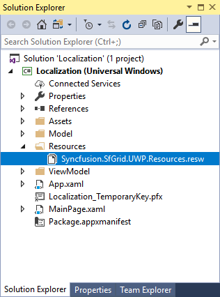
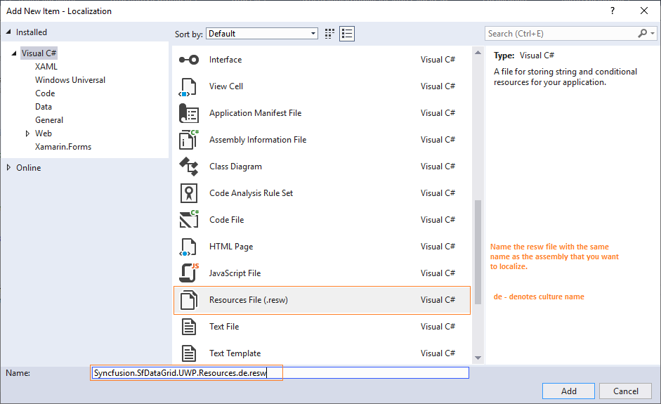
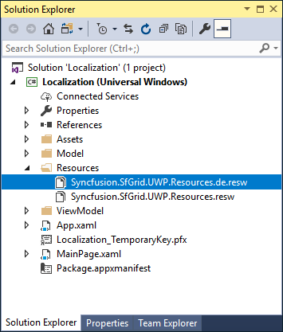
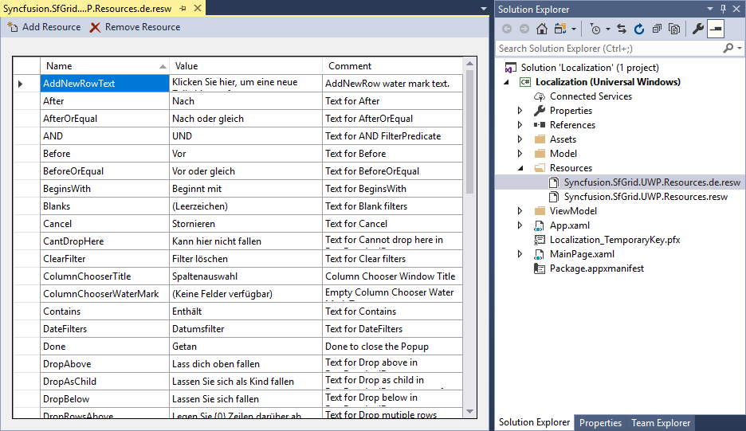

# Localization of Syncfusion&reg; UWP controls

Localization is the process of translating the application resources into different language for the specific cultures. You can localize the syncfusion&reg; UWP controls by adding resource file for each language.

## Changing application culture

When you are changing the application culture, then you can localize the application based on application culture by creating .resw file.





public sealed partial class MainPage
{
    public MainPage()
    {
        CultureInfo.CurrentUICulture = new CultureInfo("de");
        this.InitializeComponent();
    }
}





Public NotInheritable Partial Class MainPage
	Public Sub New()
		CultureInfo.CurrentUICulture = New CultureInfo("de")
		Me.InitializeComponent()
	End Sub
End Class





## Creating .resw files

You can create .resw files for any language by following steps,

N> You can get the default resource files of all Syncfusion&reg; UWP libraries from [GitHub](https://github.com/syncfusion/uwp-controls-localization-resource-files).

1) Right click your project and add new folder named `Resources`.

2) Add [default resource files](https://github.com/syncfusion/uwp-controls-localization-resource-files) of libraries you are using into `Resources` folder.

N> Consider you are using `SfDataGrid` control in your application. Then you need to copy and include `Syncfusion.SfGrid.UWP.Resources.resw` (since `SfDataGrid` present in `Syncfusion.SfGrid.UWP` library) file in your application under `Resources` folder. So, now you can know the key names and values of default strings used in `Syncfusion.SfGrid.UWP.dll` library.

3) Now, right click `Resources` folder and select `Add` and then `New Item`. In `Add New Item` wizard, select the Resources File option and name the file name as `Syncfusion.SfGrid.UWP.Resources.<culture name>.resw`. For example, you have to give name as `Syncfusion.SfDataGrid.UWP.Resources.de.resw` for `German` culture. In the same way, add new resource files for other libraries used in your application.

4) Now, select `Add` and add resource file for German culture in `Resources` folder.

5) Now, you can  copy the key names and from default resource files and assign value based on the culture, the resource file targets.

N> Download demo link from [GitHub](https://github.com/SyncfusionExamples/uwp-datagrid-localization).

## Editing default culture strings

You can change the default string of any control by adding the default .resw files ([from GitHub](https://github.com/syncfusion/uwp-controls-localization-resource-files)) to `Resources` folder of your application. Syncfusion&reg; UWP controls reads the default string from the .resw files of application if its added.
